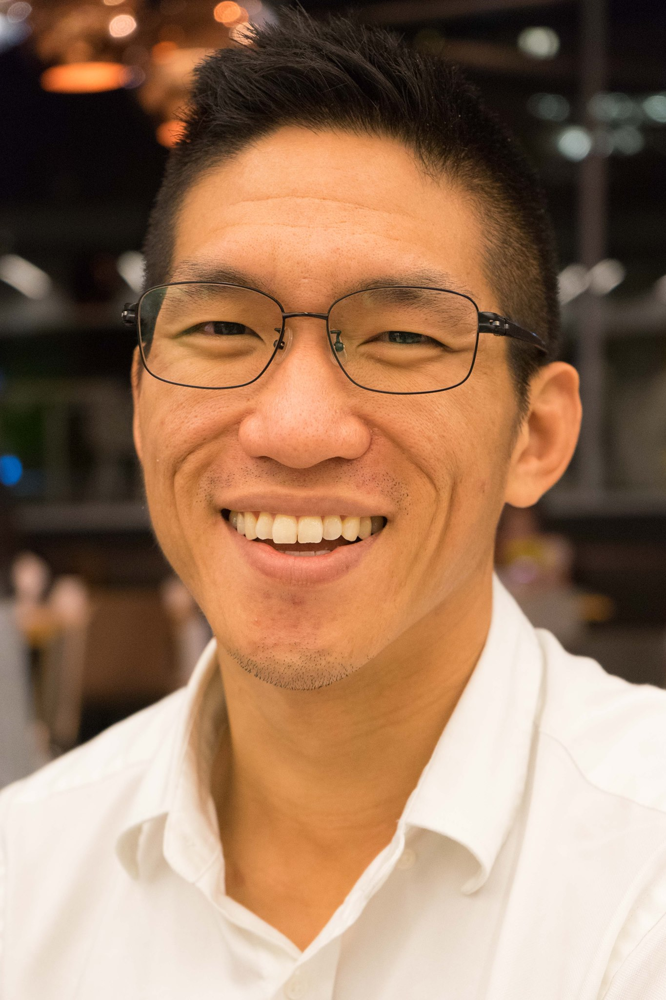

## README

I'm Wayne, a statistician with a huge passion in statistics education and modern dance.
I've worked as a professional data scientist in agriculture, social networks, and aerospace.

My current goals are to make useful statistics a mandatory subject in high school education.
There are many reasons why I think this will make the world a better place :)

#### Courses and Experiments
For course materials, please see the following:
- [Applied Statistical Computing](courses/stat_computing/README.md)
- [Linear Regression](courses/linear_regression/README.md)
- [Applied statistical methods beyond linear regression](courses/applied_methods/README.md)
- Interdisciplinary Seminar Ideas
- [Going virtual with recordings (in-progress)](courses/going_virtual.md)

There are three statistical concepts that I would like to teach to the world:
- There exist data and non-data problems
- Coming up with "What else"?
- What data can change my opinion?

I'm slowly compiling a statistics concept inventory overtime:
- [Intro Stat Concepts](stat_concept_inv/README.md)

## Applied Research Ideas With Students
- An App to tie problems and concepts together to help
  make problems
- Anything agriculture tech!
- Supply chain optimization with spatial statistics
- Finding experts within a field
- Dance + tech
- Practical scalable education

### Thoughts & Writing
I have several thoughts around statistics, data science, dance, and life if you care to read about them:
- [Dance Lessons for Data Scientists](https://towardsdatascience.com/dance-lessons-for-data-scientists-27510ba3257a)
- [3 Statistical Concepts to Save the World](https://medium.com/@leewtai/3-statistical-concepts-to-save-the-world-d8cdf0534f35)
- [Model like a model](https://medium.com/swlh/modeling-like-a-model-957933b55785)
- [What does "work on a real problem" mean for prospective data scientists?](https://towardsdatascience.com/what-does-work-on-a-real-problem-mean-for-prospective-data-scientists-5c91329c2487)

#### Manager/instructor philosophy
If you are my report or student, I want our relationship to be built on the understanding
that you could be my manager or instructor in the future.

Above all, I value curiosity, empathy, and integrity because I believe these qualities
lead to a creative, respectful, and robust future.  I am not an easy manager/instructor
because I have high expectations/hopes for you. If I give you any feedback, you should know what
evidence I'm basing those judgements on. If I am wasting your time, let me know.
Please know that it is my job to help you articulate problems that you might be struggling to articulate.

You should know what you're giving up to be on my team or in my class/team. I will help you find
and assess new opportunities if you decide to stay. The most important skill you should
aquire is a solid foundation and network that allows you to learn, investigate, and make mistakes and
I will always be your ally in this aspect.

