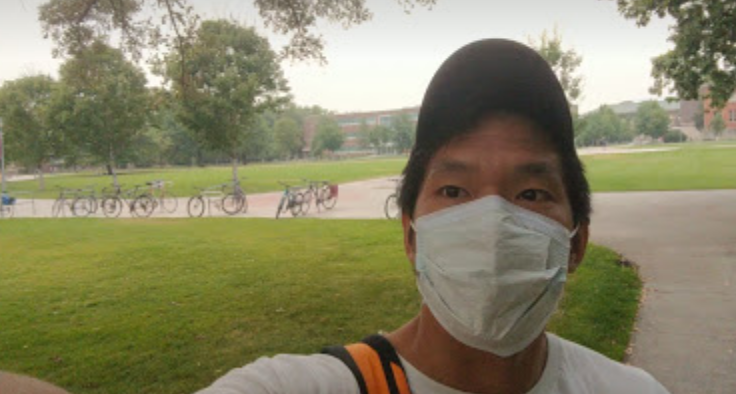

# Project 1: Trustworthiness Model (Still in draft form)

This project is meant to see how all the different ways of modeling the same dataset can be different/similar.

We will use the dataset from [Trustworthiness of crowds is gleaned in half a second](https://static1.squarespace.com/static/5daf65330e17a4220c7707ce/t/64378dd57efb4b7d3b265a54/1681362389720/ChweFreemanSPPS.pdf) by Chwe and Freeman. Make sure you read it fully!

The [original data is posted here](https://osf.io/nfgx9/) which we will post on CourseWorks shortly.

### Re-producing the dataset (can be time-consuming!)

The wrangling code is all written in Python. Please repeat their steps in R.
You are encouraged to use any AI technology for this step!

The raw data is stored in several separate files, here is the general description.
- `data/independent_raters/.../demo` contain the subjects' demographic information
- ...

You should name the output files `s1.csv`, `s2.csv`, and `s3.csv`.

Please submit the code in a .R file so we can run your code for validation.

### Reproducing the results

- For the **third study only**, please reproduce the overall demographic composition of the participants reported in the paper.
- Please replicate the key result from each study. It is part of the assignment to infer what is the most important key result from each study.

### Alternative models

We will fit seveal models

  
