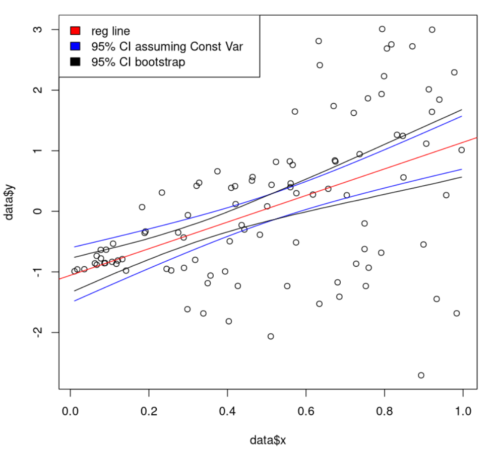
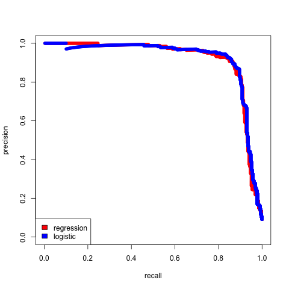

# Homework 5: Bootstrap and Logistic Regression

### Bootstrap vs Formula-based Confidence Intervals
For **Q1** to **Q5**, please create the following data set.
Let's set our parameter vector be `-1.89, 1.68` for the
features corresponding, respectively, to the $$X_0 = 1$$ and $$X_1 \sim Unif[1, 10]$$.
Let the sample size be 40.
For a change, $$\epsilon \sim N(0, \sigma^2 = (6X_1)^2)$$. In other words, if the feature value is 2, then the error term should be drawn from a normal distribution with mean 0 and standard deviation 12 (= 6 * 2).

#### Q1
Please calculate the regression line for this data. Please report your fitted values.

#### Q2
Please create the residual plot with a horizontal line marking the 0 value on the y-axis.

#### Q3
Which assumption in our usual linear regression set up is violated?

#### Q4
If we did not violate our usual linear regression assumptions, please show that $$Cov(X_{new}\hat{\beta}|X, X_{new}) = \sigma^2 X_{new} (X^T X)^{-1} X_{new}^T$$.
Hint, what is $$Cov(Y|X, X_{new})$$?

#### Q5
Reproduce the following graph by following the following steps:

- We will predict the values at different $$X_1$$ values so please derive 100, evenly spaced, values between the minimum and maximum value, let's call these $$X_1^*$$. Then predict the regression value at the 100 different values with $$X_1^* \hat{\beta}$$ where $$\hat{\beta}$$ is the regression estimate. This forms the red-line.
- Ignore the issues we noticed in **Q3**, then calculate the confidence intervals for the true line at each $$X_1^*$$ values. This forms the blue envelope.
- The black envelope are calculated using the bootstrap methodology, i.e.
  - Do the following 5000 times:
    - Sample, with replacement, the original data pairs until you have the same amount of data as before.
    - Fit a regression using this new data
    - Use this regression to predict the regression values at $X_1^*$
  - Then calculate, the percentiles at 2.5% and 97.5% across your 5000 simulations for each $$X_1^*$$ value. You should have a different pair of percentiles for each $X_1^*$ location.
To plot the legend, use the `legend()`.

### Categorical data
For Q6 and after, please read and use the dataset posted at 

https://www.kaggle.com/pavanraj159/predicting-a-pulsar-star

from Dr. Robert Lyon.
You should find a data set with 17898 records and 9 variables.

#### Q6
According to the problem description, which variable is our dependent variable?

#### Q7
Please calculate and report the percentage of Pulsars among the data.

#### Q8
To study our accuracy, we will perform a special cross validation described below.
Please write the code that would partition the positive cases and negative cases, separately, into 5 separate groups **randomly** and **evenly**. The resulting number of positive and negative cases across groups should be very similar (off by at most 1). This is unlike the case where we assign the records randomly into 5 groups while ignoring the positive vs negative labels (where it's possible that you don't have any positive cases in a group).

#### Q9
Please write the code that predicts the response variable for group 5, using the regression model trained from group 1, 2, 3, and 4, let's call these predicted values $$\tilde{p}(X)$$. Your regression should be regressing the dependent variable on all other variables. Please take the prediction mentality to this problem and do not worry about the violations of our usual linear regression model or the fact that $$\tilde{p}(X)$$ can be outside of $$[0,1]$$.

#### Q10
Let's approach the problem from a logistic regression perspective, i.e. $$Y|X \sim Bernoulli(p(X))$$.
Under the generalized linear model set-up, what is the expression for $$p(X)$$ if we're using the logit link?

#### Q11
Please write the code that would calculate a different version of $$\hat{p}(X)$$ for group 5, using the data from group 1, 2, 3, and 4 by implementing logistic regression.

#### Q12
Please plot the scatter plot between $$\hat{p}(X)$$ and $$\tilde{p}(X)$$ for group 5 with the appropriate axis labels.

#### Q13
Please write the code that could reproduce the following graph by following the steps:

To calculate the precision and recall, we need a rule to convert $$\hat{p}(X)$$ and $$\tilde{p}(X)$$ to
binary values. Given the probability interpretation, a natural rule for both cases is to classify all predicted
probabilities above some threshold $$\alpha$$ as 1 and 0 otherwise, i.e.

$$
\hat{Y_i}|X = \begin{cases}
1 & \text{if } p(X_i) \geq \alpha\\
0 & \text{otherwise}\\
\end{cases}
$$

for every $$i$$. Changing $$\alpha$$ would then lead to different precision and recall values.
You only need to calculate the precision and recall for one group for this assignment but you should think about
benefits from calculating precision/recall over all groups.

Please recall, precision = $$\frac{\sum 1[Y=1 \cap \hat{Y} =1] }{\sum 1[\hat{Y}=1]}$$ and 
recall = $$\frac{\sum 1[Y=1 \cap \hat{Y} =1] }{\sum 1[Y=1]}$$ where $$1[]$$ is the indicator function.

Warning, your graph will likely be different given the random assignments.

Side comment: please think about which model is more correct and the difference in usefulness between the two models.


