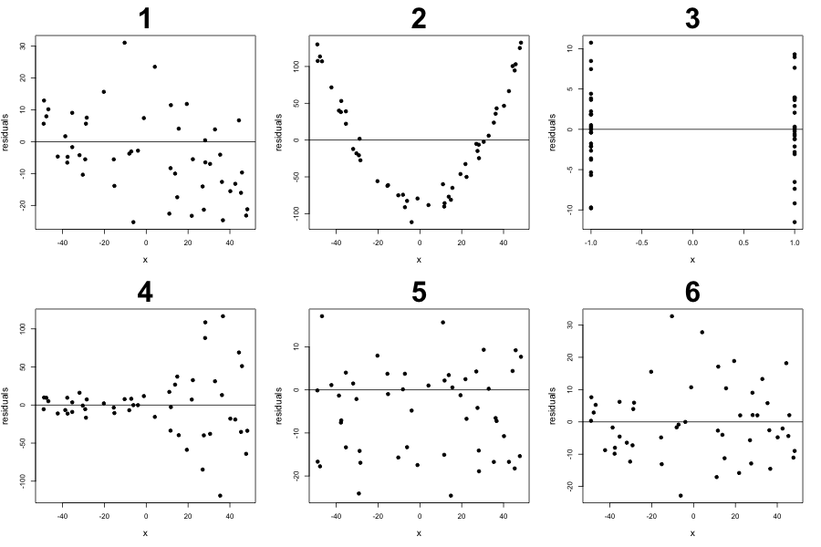

# Homework 3: Simple Linear Regression

#### Q1 - properties of the regression
Let $$\hat{y}_i = \hat{\beta}_0 + \hat{\beta}_1 * x_i$$ where $$\hat{\beta}_0, \hat{\beta}_1$$ are the coefficients fitted from regression.
Please show mathematically that the following is true:

$$\sum_i (y_i - \hat{y}_i) = \sum_i e_i = 0$$

Side comment: what might this result imply?


#### Q2 - the intercept in the regression
Please generate some data as below:

```r
n <- 50
x <- runif(n, 1, 5)
y <- 1.2 * x + rnorm(n, sd=0.4)
```

- Please calculate the $$r^2$$ value from fitting the SLR and show the code that does so. Please calculate this using the residuals, the fitted values, and the original `y` values. You can verify your answer with `summary.lm()` (Applying summary() on an "lm()" object will call summary.lm()). Please assume you do not know the data generation model has $$\beta_0=0$$.
- Please fit the model without an intercept using `lm(y ~ x - 1)`, please show, numerically, that $$\sum_i e_i \not = 0$$ in this case. Training the regression without the intercept means we are forcing $$\hat{\beta}_0=0$$.
- Is the $$r^2$$ higher with or without an intercept? (side note: we will show why the $$r^2$$ calculation is not sensible in the future without an intercept)
- We want to understand if "fitting the intercept" can hurt. Please simulate from the true data generation process above with `B=1000` but fit the regression in 2 ways: with an intercept and without an intercept. Each simulation should generate 2 estimates for $$\beta_1$$ (the slope parameter), one estimate with the intercept and one without. Please plot the respective histograms for the different estimates then comment which results is better?

#### Q3 - directionality in regression
Imagine that the data from Q2, $$x$$ is actually data from a well-calibrated machine (essentially 0 error) and $$y$$ is the output from an uncalibrated machine measuring the same object (noisy and potentially biased). If you were asked to use statistics to "de-bias" the machine that produced $$y$$, should you fit a regression with $$y$$ or $$x$$ as the dependent variable (please explain!)? De-bias here means that they've given up on calibrating the machine that generates $$y$$ and wish that your regression model will act as a second stage process to correct any systematic bias in the data. So they'll use the uncalibrated machine to obtain biased measurements, then wish to obtain values that look like they're calibrated.

Hint: what is the objective of the regression?

#### Q4 - violating the regression assumption
We will work with the data generation process as below:

```r
n <- 200
x <- runif(n, 1, 5)
y <- 0.1 + 1.2 * x + rnorm(n, mean=-1)
```

- Which regression assumption is being violated?
- If we were to regress `y` on `x`, please demonstrate the property that is lost from the violation above using a graph and a short paragraph explaining the visualization.
  - Hint: write down the mathematical property that is lost first.

#### Q5 - violating the regression assumption
Please generate data as below

```r
n <- 200
x <- runif(n, 1, 5)
y <- 0.1 + 1.2 * x + rnorm(n, sd=x)
```

- Which regression assumption is being violated?
- Please report the SE from `summary.lm()` but also comment on why the R output from `summary.lm()` may not be appropriate. 
- Estimate $$SE(\hat{\beta}_1\mid X)$$ by simulating from the true data generation and fitting `B=1000` different $$\hat{\beta}_{(1,j)}$$ (the $$j$$ index just indicate different the estimates from different simulations). Please do not overwrite your original data from above. Please do this 2 ways:
  - Calculate this using $$\sqrt{\frac{1}{B} \sum[(\hat{\beta}_{(1,j)} - \beta_1]^2} \approx \sqrt{E([\hat{\beta}_{(1,j)} - \beta_1]^2\mid X)}$$. 
  - Calculate this by simply using `sd()` in R over the simulated coefficients.
- Please calculate the "percent error" for each of these estimates above. Percent error is often calculated as $$\frac{\lvert new-base\rvert }{base}$$. Please determine what's the most sensible "base" value in this problem.


#### Q6 - Evaluating residual plots
For each of the following residual plots, please comment on which of the statements are likely true and explain with at most 2 sentences. Please assume the residuals are from fitting a "linear line that may not be the regression line" to the data (e.g. no curves were used to obtain residuals) and there is only one independent variable $$x$$.
- is the relationship between $$x$$ and $$y$$ linear?
- is $$E(\epsilon_i\mid X)=0, \forall i$$?
- is $$E(e_i\mid X)=0, \forall i$$?
- is $$Var(\epsilon_i\mid X)=\sigma^2$$?
- is the residual plot possible from fitting a regression line? (hint: if you are stuck, try to simulate data that will have residual plots as shown then fit a regression to it)



#### Q7 - Translating assumptions

In the paper [Global Economic Preference]():

- Which linear model assumption is being made with this quote?
  "Although the evidence is correlational, the previous literature has proposed various mechanisms, ranging from biological to purely social, through which gender, age, and cognitive ability might determine preferences."
- In Table V, there are many examples of low $$R^2$$ values corresponding to highly significant values. Please explain why this is possible then provide one toy simulation example that demonstrates this phenomenon.


