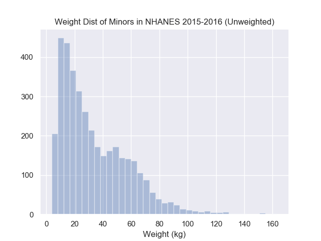
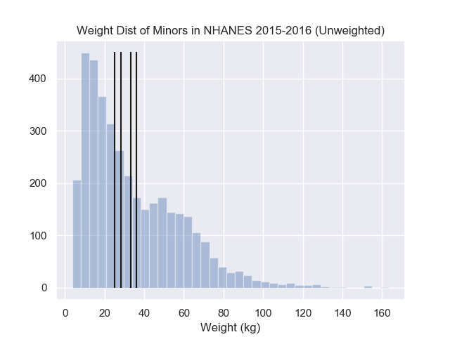
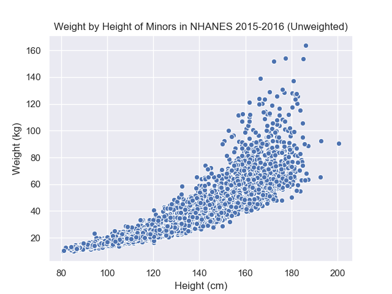
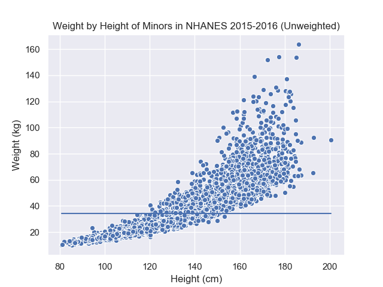
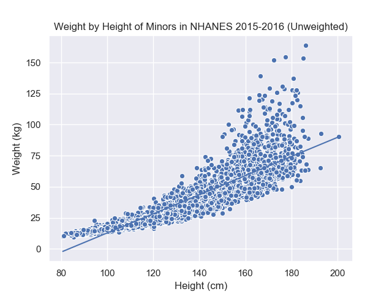

# Formalizing Intuition into an Equation

One of the key skills of an applied statistician or data scientist is the
ability to formalize, mathematically and programmatically, people's intuition.

This sounds complicated but its application is quite familiar
to the general public. When we go for a physical exam, there's an abstract concept of health that
we often formalize into statistics like Body-Mass-Index, blood pressure,
lung capacity, etc. In gymnastics, there are judges who score the
completion of the different routines. In a tech company, there are metrics
like pageviews, likes, numebr of followers etc. The goal of these
metrics is to provide guidance for monitoring and optimization for various
problems. The formalization of these applications often require a partnership
between domain expert with a quantitatively minded person. Here we will focus
mostly on the quantitative side of topics.


## How is this related to regression?
One of the most familiar applications of regression is when people use the
"best fit line" functionality in Excel or Google Spreadsheets. Behind the scenes,
a regression calculation is being performed. But have you wondered what
does "best fit" mean? We will explain this below.

## Starting with histograms and summary statistics
Below is a histogram of some people's weights over a wide range of ages.
What would you say is the typical person's weight?



To plot this data yourself, please find the data from
[HERE](../../../usecases_data/health_nutrition_survey/README.md)

Most people would eyeball this hisrogram and be able to point to roughly the same
region but likely not same exact location. Ultimately, ten different people would
have ten different answers, which one should we choose? Without a formal framework
to choose a location, reproducing the same choice in other applications is near
impossible which makes automation difficult, reproducing the same choice
at a later time (same dataset) is also difficult which would cast doubt in
the confidence in your original choice. This is why mathematical formalism is necessary.

If you ask people how they arrived at their answer, the immediate answer is likely
they did not think much about it. But once you start asking about alternatives
to their chosen answer, people will often start explaining their intuition. A
common one for histograms is that they're trying to balance the points to
the left and right of the chosen answer.



How would we define "the points to the left"? Let's start with programming first:
```python
import pandas as pd

nhanes = pd.read_csv("nhanes_2015_2015_demo.csv")
nhanes.head(3)

chosen_location <= 150

left_of_choice = nhanes.weight < chosen_location
records_to_left = left_of_choices.index
```
There are a few choices that we made above:
- `chosen_location` was arbitrarily set to some plausible value
- For "points to the left", we actually used the "indices"
- By convention, we assumed "to the left" meant "smaller". But for later reasons,
  we will define this as "smaller or equal"

Let's now translate that into math!
To formalize this concept, we would need to first define some notation:
- Let $$i$$ be the index of the subject and $$i$$ could take any value within the set $${1, 2, \dots, n}$$.
  You can imagine that we assigned everyone a number starting at $$1$$ and exhausted our data at $$n$$, i.e.
  $$n$$ is the sample size.
  - The $${}$$, curly bracket notation is just indicating that this is a collection of values.
    Similar to programming, a single scalar is different from a collection of values. 
- Let $$W_i$$ be the weight of subject $$i$$
- Let $$a$$ be the arbitrary chosen location

Given this notation, the simplest form to describe all the records with weight smaller than $$a$$ would be

$${j: W_j <= a}$$

Do not worry too much if you do not understand this expression immediately. In words, it represents the collection
of indices such that (i.e. $${j: CONDITION}$$) the weight associated with that index (i.e. $$W_j$$) is smaller or
equal to (i.e. $$<=$$) the chosen location (i.e. $$a$$).

Notice the similarities between the mathematical and programming translation, both had
to separate the definition of a single scalar vs a collection of values, both had to
separate the concept of the subject vs the weight of the subject, also both had to represent
the potential solution. These are important concepts to know before continuing with this course.

Seeing this mathematical translation, we could also avoid choosing a value for `chosen_location`
if we rewrote our programming translation using a function. In other words, we want to write a function
that takes in a chosen location, then returns the indices to the left.

```python
def record_on_left(a, values):
    left = values <= a
    return left.index
```

Now we have defined "points to the left", let's continue translating the idea of "balancing the
points to the left and right". The word "balance" can be interpreted in multiple ways which
again requires some formalism. Does balancing imply the number of data points are equal, does a point
far to the right balance out 2 closer points to the left?

A popular choice here is to balance the squared distances to the left to the squared
distances to the right. To express this mathematically, this would look
like, the optimal value $$a^*$$ could be expressed as the point where the following is true:

$$\sum_{j \in {j: j\leq a^*}} (W_j - a^*)^2 = \sum_{j \in {j: j> a^*}} (W_j - a^*)^2$$

In words, we are squaring both the negative errors and positive errors and ensuring that
the error on both sides are the same. To code this idea up, we could compute the squared
distances then return whether the right and left values equal.
```python
import pandas as pd


def left_equal_right(a, weights):
    left = weights <= a
    sq_dist_left = (weights[left] - a)**2
    sq_dist_right = (weights[~left] - a)**2
    diff = sq_dist_right - sq_dist_left
    
    return abs(diff) <= .Machine.double_precision


nhanes = pd.read_csv("nhanes_2015_2015_demo.csv")
left_equal_right(150, nhanes.weights)
left_equal_right(160, nhanes.weights)
left_equal_right(170, nhanes.weights)
```

The above code is not incorrect but notice that most of your attempts will return `False`.
Hopefully you felt a slight irritation in the lack of information whether your current guess
is close or far from the optimal choice.

Mathematically, it turns out that the optimal $$a^*$$ that obtains the same left and right squared distances
is equivalent to minimizing the total squared error from both sides. In other words, 
for any other location, $$a$$:

$$\sum_{j=1}^{n} (W_j - a^*)^2 <= \sum_{j=1}^{n} (W_j - a)^2$$

Another way to express this is

$$a^* = \arg\min_a \sum_{j=1}^{n} (W_j - a)^2$$

From your introduction statistics course, you might recall that this means $$a^*$$ satisfies the "least squares"
property! In other words, all possible location choices will result in a different squared error but $$a^*$$
will have the smallest total squared error. Turns out $$a^*$$ is the mean of the weight values, i.e.
$$\bar{W} = \frac{1}{n}\sum_j W_j$$.

It requires a little calculus to show that $$a^* = \bar{W}$$
but the key is to realize that the mean minimizes a certain objective. If we changed
the objective, the mean may not be the optimal location anymore. Recall that we had choices
when we were defining the concept of balancing, another popular objective is to replace the squaring
operation with the absolute value operation:

$$a^* = \arg\min_a \sum_{j=1}^{n} |W_j - a|$$

An objective achieved by the median.

These formalized expressions allow us to understand why the mean is more
sensitive to outliers than the median. This is because the squaring operation will
penalize outliers more than the absolute value so the mean will change more relative to the
median if you introduce outliers.

To wrap up this subsection, the mean and median are both valid choices that "balancing the data
to the left and right" under different objectives. These formalized objectives are
necessary to avoid any confusion in the final answer. From an academic standpoint,
these formalisms also allow us to derive many other properties.

## From the mean to the regression line
Before we were summarizing the histogram with a mean, now what if we are trying to
summarize a scatter plot?



Imagine drawing a line through the scatter plot, many people would draw similar yet
different lines through this point cloud. To capture each of these possible alternatives,
we need a general expression for lines. If you recall
from geometry, all lines can be written as $$Y = a + b * X$$ where $$a$$ represents
the intercept ($$X=0 \Rightarrow Y=a$$) and $$b$$ represents the slope (if $$X$$ increases
by $$\delta$$, then $$Y$$ will increase by $$b * \delta$$). This general expression,
without committing to any particular value of $$a$$ and $$b$$, is equivalent to 
our arbitrary location before in the histogram example.

Once we have a general expression that can capture all the different possible solutions,
we now need to formalize an objective to unify all the different choices.
A good starting place is to compare your intuitive answer with an obvious bad choice
then start articulating formally the reason why your initial answer is better.
In the graph below, we have plotted the average weight $$\bar{W}$$ on the scatter
plot, i.e. the line $$W = \bar{W} + 0 * H$$.



The average is an interesting choice because it satisfies the condition that
it "balances the data" over the weight values. At different values of the height,
however, the balance is not preserved because shorter people tend to weigh less
as well. In other words, the simple average is unsatisfactory because it balances
the data **over all values of height** but not at most given height values.
This implies that we would like the balancing property to hold over
different segments of the x-axis. However, our problem also restricted us to use
line which means we cannot have a perfect answer (since the graph is curved).

With a similar arguments as the "best location" above, a similar candidate objective
is the least square objective applied to arbitrary line:

$$\arg\min_{(a, b)} \sum_{j=1}^{n} (W_j - (a + b * H_j))^2$$

Here $$H_j$$ is the height of subject $$j$$, and $$(a, b)$$ are arbitrary intercept
and slope values. Intuitively, $$a + b * H_j = \hat{W}_j$$ is the **estimated weight**
for subject $$j$$ (denoted as $$\hat{W}_j$$) derived from the height of subject $$j$$.
The further $$\hat{W}_j$$ is from $$W_j$$, the larger the squared value, and the
objective would grow as well. Thus the intercept and slope that results in the smallest
objective should result in a line that "fits" the data. The line resulting from this
particular intercept and slope is the regression line so you'll heard the regression
line referred as the "least square line" in other texts. Below is the regression
line from minimizing the objective:



Commpared to our expression before, we simply substituted the
arbitrary location with an arbitrary line. This requires us to have the height
data, $$H_j$$, available and search over the 2 parameters, $$a$$ and $$b$$.
Before, we only needed the weight information and searched over 1 parameter.
So from a data perspective, we need more data. From an optimization
perspective, we have more parameters to consider and balance.

What other objectives are sensible? We will explore some of these in the homework.

## Did you notice?

#### The regression is an extension of the average
The average and the regression line can both be
derived as answers that minimize the same squared error objective.

$$\arg\min_{\text{parameters}} \sum_j (W_j - \hat{W}_j(\text{\parameters}))^2$$

The only difference
is whether we restrict $$\hat{W}_j$$, our guess for $$W_j$$, to an arbitrary point or arbitrary line.
By this argument, the average is a special case of the regression if we forced
the intercept term to be 0.

#### Errors were defined relative to the response/dependent/Y variable
Bad solutions are characterized as those
that result in large errors with respect each $$W_j$$. Difference between
the line in the "X" direction do not contribute to the error or objective function.

#### The line summarize the data poorly
Notice that even though our data has a slight curvature in the scatter plot,
this does not prevent us from finding a best-fit line. This is similar to
summarizing an entire chapter with 2 sentences, you will not capture all the
major pieces of information but you are still able to produce those
sentences. A similar poor fit for the average is if we were to use it to summarize
a bimodal distribution.

## Problems
- What condition will make the regression squared objective equal to the average one?
- Which of the following are valid objectives that would help find better values?
- Wind turbine objective
- Medical 

## Concepts
- indices vs values
- collection of values vs scalar values
- formalism as mathematical equations
- objective functions (least squares)
- Wrong model for data


