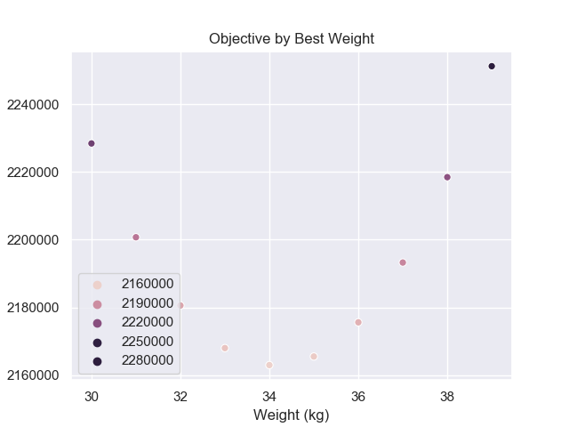

# Getting the optimal value

We talked a lot about finding the best line or best location for summarizing
data so here we will dive a bit deeper into **how** do we do that.

#### Brute Force Search (parameter sweep)
Once we have narrowed down a particular objective function like the squared
loss, we could literally write this function using programming. As an example,
we will continue with the weights from [NHANES](../../../usecases_data/health_nutrition_survey/README.md)
and again start with just finding the best location:

```python
import pandas as pd

nhanes = pd.read_csv("nhanes_2015_2015_demo.csv")
nhanes.head(3)


def weight_sqloss(parameters, data):
    est_weights = parameters
    error = data.weight_kg - est_weights
    sq_error = error**2
    return sq_error.sum(skipna=True)

weight_sqloss(35, youth)
# Out[90]: 2165512.88
weight_sqloss(40, youth)
# Out[91]: 2291555.88
In [93]: weight_sqloss(30, youth)
# Out[93]: 2228419.88
```

Different parameters will output different values for the objective. To find the smallest
square loss value, we could try to search over reasonable weight values to see which
value will return the smallest squared loss.

```python
import seaborn as sns

sns.set()

vals_to_seed = [30 + i for i in range(10)]
obj = [weight_sqloss(i, youth) for i in vals_to_seed)
sns.scatter_plot(vals, obj)
plt.title('Evaluating Squared Loss at Equal Intervals')
plt.xlabel('Weights (kg)')
plt.ylabel('Objective (kg^2)')
plt.show()
```


Notice that the minimum is likely around 34kg but we were lucky because we know roughly
the range of people's weights. Let's try to repeat this process for the optimal line.

To do this, we'll have to first create a range of values to search over. The example
below is created by a few tries to highlight 
```python
from itertools import product
import numpy as np


def weight_sqloss(parameters, data):
    # \hat{W}_j = a + b * H_j
    est_weights = parameters[0] + parameters[1] * data.height_cm
    error = data.weight_kg - est_weights
    sq_error = error**2
    return sq_error.sum(skipna=True)


num_cands = 10
params = {
    'intercept': (-300, 200),
    'slope': (-2, 4)}
param_sweep = {
    par: np.linspace(low, high, num_cands)
    for par, (low, high) in params.items()}

xyz = np.empty((num_cands**2, 3))
for i, (x, y) in enumerate(product(param_sweep['intercept'],
                                   param_sweep['slope'])):
    z = weight_sqloss([x, y], youth)
    xyz[i, :] = x, y, z

sns.scatterplot(xyz[:, 0], xyz[:, 1], hue=xyz[:, 2])
plt.xlabel('Intercept')
plt.ylabel('Slope')
plt.savefig('../graphs/obj_2D_parameter_sweep.png')
plt.close()
```


