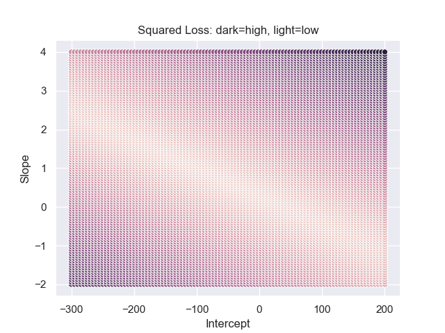

# Getting the optimal value

We talked a lot about finding the best line or best location for summarizing
data so here we will dive a bit deeper into **how** do we do that.

#### Brute Force Search (parameter sweep)
Once we have narrowed down a particular objective function like the squared
loss, we could literally write this function using programming. As an example,
we will continue with the weights from [NHANES](../../../usecases_data/health_nutrition_survey/README.md)
and again start with just finding the best location:

```python
import pandas as pd

nhanes = pd.read_csv("nhanes_2015_2015_demo.csv")
nhanes.head(3)


def weight_sqloss1d(parameters, data):
    est_weights = parameters
    error = data.weight_kg - est_weights
    sq_error = error**2
    return sq_error.sum(skipna=True)

weight_sqloss1d(35, youth)
# Out[90]: 2165512.88
weight_sqloss1d(40, youth)
# Out[91]: 2291555.88
In [93]: weight_sqloss1d(30, youth)
# Out[93]: 2228419.88
```

Different parameters will output different values for the objective. To find the smallest
square loss value, we could try to search over reasonable weight values to see which
value will return the smallest squared loss.

```python
import seaborn as sns

sns.set()

vals_to_seed = [30 + i for i in range(10)]
obj = [weight_sqloss1d(i, youth) for i in vals_to_seed)
sns.scatter_plot(vals, obj)
plt.title('Evaluating Squared Loss at Equal Intervals')
plt.xlabel('Weights (kg)')
plt.ylabel('Objective (kg^2)')
plt.show()
```


Notice that the minimum is likely around 34kg but we were lucky because we know roughly
the range of people's weights. Let's try to repeat this process for the optimal line.

To do this, we'll have to first create a range of values to search over. The example
below is created by a few tries to highlight 
```python
from itertools import product
import numpy as np

def weight_sqloss2d(parameters, data):
    # \hat{W}_j = a + b * H_j
    est_weights = parameters[0] + parameters[1] * data.height_cm
    error = data.weight_kg - est_weights
    sq_error = error**2
    return sq_error.sum(skipna=True)


num_cands = 100
params = {
    'intercept': (-300, 200),
    'slope': (-2, 4)}
param_sweep = {
    par: np.linspace(low, high, num_cands)
    for par, (low, high) in params.items()}

xyz = np.empty((num_cands**2, 3))
for i, (x, y) in enumerate(product(param_sweep['intercept'],
                                   param_sweep['slope'])):
    z = weight_sqloss2d([x, y], youth)
    xyz[i, :] = x, y, z
```

Lighter colors correspond to smaller values from the square loss
where darker colors correspond to larger values. Notice how the change in the
objective function changes at a different rate for the different parameters.
Also notice that extreme values in one parameter can be somewhat compensated
by adjusting the other parameters.

Through this brute force search, we would simply look up the smallest
parameter that yields the smallest squared loss. However, this solution would
then be constrained by the resolution of our grid. For example, if we only
sampled 10 different slope and intercept values, our solution from this brute
force search (also called a parameter sweep) would likely be far from the 
best answer.

#### Numerical optimization
Modern optimization techniques can efficiently find the optimal
values that do not naively search over the grid. Comparing to our brute
force method above, these algorithms require a starting point, i.e. a reasonable guess
for the optimal parameters, instead of the range of possible optimal parameters.
Instead of defining the resolution of the grid, these methods often have
default cap for the number of times the objective function will be evaluated.
However, these algorithms still require you to define and provide the objective function.

Using our best location example again, here is how we could use numerical optimization
to find the best location.

```python
from scipy.optimize import minimize

reasonable_start = 35
opt_out = minimize(lambda x: weight_sqloss1d(x, youth), # Objective function
                   reasonable_start) # starting value
opt_out 
#      fun: 2162875.8368033916
# hess_inv: array([[0.00013231]])
#      jac: array([0.])
#  message: 'Optimization terminated successfully.'
#     nfev: 9
#      nit: 2
#     njev: 3
#   status: 0
#  success: True
#        x: array([34.16464564])
```
To understand this output, you should start with the `success` flag. If `success`
is `False`, the algorithm basically has failed to find an answer. In these cases,
you should analyze your objective function or choose a better starting
value. Objective functions from these lessons should rarely produce those cases.
The next important value is `x` which is the optimal parameter value. The
corresponding value for your objective function evaluated with `x` is the value that follows `fun`. 

At a very intuitive level, the algorithm is searching for the best parameter starting
at the starting value you provided and proposing new parameter values according to some
heuristics. It will stop proposing new values when the improvement in the objective function falls below
some threshold (this is the `tol` value if you read the documentation).

To apply this to the best line case, we have to make sure the starting value is aligned
with what the objective function expects, i.e. a list rather than a single scalar.
```python
reasonable_start = [0, 0.5]
opt_out = minimize(lambda x: weight_sqloss2d(x, youth), # Objective function
                   reasonable_start) # starting value
opt_out.success
# True
opt_out.x
# array([-63.98327126,   0.7684696 ])
```

These numerical optimization algorithms work quite well out of the box in general.
Each algorithm (see `method` in the documentation) works with a different heuristic and can
have varying levels of success depending on your objective function. We will not dive into the
cases when the optimization will fail but the key effort should be devoted to
formulating an objective function where you leave the search for its optimal parameters
to these numerical optimization libraries.

#### Analytical Solutions
The numerical methods above are now extremely easy to implement given modern computers.
However, these numerical methods can sometimes be slow and they are harder to verify.
It turns out that certain objective functions have nice
mathematical formulas for their optimal parameter in terms of the data.
This sounds complicated but in fact is quite intuitive what we have seen before.

First, recall the square loss objective function when we're finding the best location only.
The square loss objective ultimately is just a quadratic function with respect to $$a$$ because
we can repress $$\sum_j (W_j - a)^2 = \alpha * a^2 + \beta * a + \gamma$$. This also
agrees with what we have visualized before:


Notice how there is a clear **dip** where the objective function is minimized. One way to
mathematically describe the minimum is that it is where the objective function
swithces from a decreasing to an increasing behavior (when we increase $$a$$).
Given the curve is smooth, a mathematical way
to describe this is that the derivative equals to 0 at the dip. To formally write
this out, we would first write out the derivative:

$$ \frac{\partial}{\partial a} \sum_j (W_j - a)^2 = \sum_j \frac{\partial}{\partial a} (W_j - a)^2 = -2 \sum_j (W_j - a) = 2an - 2\sum_j W_j = function(a)$$

To express this derivative in terms of a function in Python, this would look like this:

```python
def sqloss_deriv(parameter, data):
    n = data.shape[0]
    return 2 * parameter * n - 2 * data.weight_kg.sum()    
```
Notice that the data is still part of the function's input but given the data is
collected for this study, you may consider the data given as fixed values.

At the minimum, the derivative is 0 can be expressed as:

$$2a^*n - 2\sum_j W_j = 0$$
Notice that we changed the expression from the arbitrary $$a$$ to the optimal parameter $$a^*$$.
With some algebra, you should be able to see that $$a^* = \sum_j W_j / n$$ which is the average.
Therefore, before when we mentioned that the average minimizes the squared loss objective for
the best location, mathematically we are saying:

$$a^* = \arg\min_a \sum_j (W_j - a)^2 = \frac{1}{n}\sum_j W_j$$

The average body mass, a simple operation based on the data, is around `34.1646467`kg
and this agrees quite well with our answer from the numerical optimization before.

Overall, we solved for the optimal parameter by leveraging the intuition that the minimum
would occur when objective function changed from decreasing to increasing. Calculus helped
us formalize this intuition as the derivative function equalling to 0 and algebra helped us
obtain the final answer. Together this resulted in an analytical answer for the optimal parameter.

Notice that the squared loss objective was easy to differentiate which made the calculations
possible. The absolute loss objective, $$\sum_j |W_j - a|$$, is not differentiable which could
not leverage the same techniques as above. However, some numerical optimization libraries do not
require differentiable objectives and therefore can solve a wider class of problems.

We will see later how these analytical solutions help us **study** these parameters further.

#### Analytical solution for regression
So what about regression? Following the same logic and steps as above, we could show that
the optimal intercept and slope would have the analytical form of:

$$a^* = \bar{Y} - \bar{X} * b^*$$
$$b^* = \frac{SD_y}{SD_x} * Corr_{x, y}$$

where the "bar" notation implies the average, e.g. $$\bar{Y} = \frac{1}{n}\sum_i Y_i$$.
$$SD_y$$ represent the sample standard deviations, e.g. $$SD_y = \sqrt{\frac{1}{n-1} (Y_i - \bar{Y})^2}$$,
and $$Corr_{x, y}$$ is the sample correlation, i.e. $$Corr_{x, y}=\frac{\sum_i (X_i - \bar{X})(Y_i - \bar{Y})}{SD_x SD_y}$$.

#### Summary
Overall, we've shown 3 ways to look for the optimal parameters, each with their pros and cons:
- Brute force search:
  - Pro: easy to understand and visualize
  - Con: accuracy is low and very inefficient
- Numerical optimization libraries:
  - Pro: can work on a wide variety of objective functions
  - Con: can be slow depending on the data size, hard to analyze later
- Analytical solution
  - Pro: most accurate and facilitates further analysis (not shown yet)
  - Con: does not always exist

The biggest requirement for us to compute these solutions is to have an objective
function and some data.

#### Problems
- Try starting `minimize` at 80, i.e. a much less reasonable value, how does the output change?
- Apply `minimize` with the least absolute error objective on weights
- Show second derivative is positive to show global optimum.
- calculate the smallest distance between point and a given line. 
- verify the formula
