# Statistical Computing for non-programmers

Draft [syllabus](syllabus.md) for the class

#### What is statistical computing?
If you are reading this, I probably do not need to convince you about the
importance of statistics, data, and coding. However, I believe
that statistics is best learned by constantly translating problems
between abstract concepts, mathematical formalism, and programming.
An example is like "health of a nation" is a concept, infant mortality
per 1000 births is one way to formalize a measure for a nation's health,
where automating this report would require us to think about practical
data collection, graphics, and reproducability.

To gain a better understanding of programming, we will cover the main
concepts behind statistical computing that
- focuses on data wrangling and simulations
- less on data structures and algorithmic efficiency

For example, we will introduce random numeric vectors relatively early on to reinforce
concepts like the law of large numbers but we will not differentiate between
integers, longs, vs doubles.

#### My assumptions
My assumption is that you have been exposed to
- basic statistical concepts like the average, sample standard deviation (vs population variance),
  and histograms.
- calculators and Excel (Google Spreadsheets)

#### Setting up
I encourage you to set up [Jupyter Notebooks on your computer](../../setup/conda_and_navigator_setup.md)
so you could use R or Python for this in the future.

In the current version, I'll focus on **R programming** for now.

## Problem 1, How to simulate Law of Large Numbers?
We will use the law of large numbers to motivate the following content
in statistical computing.

The law of large numbers says that sample averages based on a larger
sample size will have a smaller standard error than a sample average
based on a smaller sample size. Standard error here means the expected
error of the sample average as an estimate for the population average.

To accomlish this, you'll need to be able to
- Create a collection of random data from a population
- Assign the data to variables
- Apply the average function over the data
- Simulate the sample average multiple times
- Collect the outcome from each simulation

The following steps should lead you to that final step.

#### Using programming as a calculator
I'm assuming you've used a calculator before. Try out a few of the following
calculations in the Jupyter Notebook. To run the code, highlight the cell,
then hit "Shift+Enter" or there's a "Run |>" button in the tab area as well.
- `1`
- `2*3`
- `3 +4`
- `3 + 4 * -1`
- `(3 + 4) * -1`
- `3 + 4 * -    1`
- `log(1)`

[Exercises](exercises/r_calculators.md)

#### Intentinoally making mistakes
Please make mistakes early on!

I highly encourage you to make mistakes. The more you do so, and learn,
the better at coding you will become. In general, when you are intentionally
trying to break the code, it is important that you
- read the code
- anticipate the error/warning (or lack of error/warning)
- run the code
- read the error message or lack of error message
- make sense of the error message

For example:
If I were to run the following code:

```r
1  1
```

- read the code
  - I see two `1`s are separated by a few white spaces
- anticipate the error/warning (or lack of error/warning)
  - I expect R to not return a warning and just print out two 1's separated by the same number of white spaces
- run the code
  - copy/paste the `1  1` into the Notebook and run it
- read the error message
  - `Error: unexpected numeric constant in "1  1"`
- make sense of the error message
  - This is not obvious! Ask the instructor/TA for an explanation.
  - Instructor's attempt at explaining:
    When R is interpreting that command, the error is referring to the second 1  being unexpected. After typing in the first 1 followed by spaces, R is anticipating you to operate with it like + , *, /, etc. However, it encounters the second 1 instead of what it was anticipating. R decided it could not interpret the intent of the command so it throws an error and does not run the command. You can verify by running `1  "a"` and see how the error message changes.

[Exercises](exercises/r_make_mistakes.md)

#### Calculator-like functions
Just like your algebra class where $$y=f(x)$$, R has functions.

Similar to our mathematical notation, the most common method
to refer to functions are used by typing out their "name" followed
by the parentheses `()`, e.g. `log(1)`

The simplest example are functions that manipulate a single number. 
- `log(1)`
- `sin( 90 / 180 * pi)`
- `2^3`

Notice how the third example does not follow the convention for calling functions
yet its similarity to the mathematical notation makes it easy to understand. 

[Exercises](exercises/r_calc_functions.md)

#### Variables in programming
In R, you can assign values to variables so you can refer to them later and increase readability of your code
(very important!).

To do assign a value to a variable name, you can use the `<-` or `=` symbol with the variable name on the left and the value on the right.

- ```r
  demo_num <- 2
  print(demo_num * 3)
  print(demo_num - 4)
  ```
- `demo.char <- "hello"`
- ```r
  demo_num2 = -0.2
  abs(demo_num2)
  ```

This allows you to refer to them later when you have repeated use of the same variable (e.g. think about the sample size **n** in intro statistics that appears in the mean and sample variance calculation).

Later, if you forget what's assigned to the variable, usually you can use the `print()` function or simply type in the variable name at the end of the cell to get the value returned.

```r
print(demo_num)
demo.char
```

[Exercises](exercises/r_variables.md)

#### Overwriting variables
What if I want to update a variable? You simply assign a new value to it.

I recommend running these 3 chunks separately but in order:
```
my_name <- 'Wayne Lee'
print(my_name)

my_name <- 'Wayne Tai Lee'
print(my_name)

my_name <- 0
print(my_name)
```

A few things to note:
- The **last** assignment will dictate the value in `my_name` (try playing with the order and find out)
- We were able to assign numbers to something that was a character string before
- One of the biggest source of error in beginner coders is that you forget what order your code was ran in
  and you recycle the same variable name which causes issues in the code later.
- Good naming is considered one of the hardest tasks in programming :)


#### What is a function?
A function in programming is similar to a function in mathematics.
Given inputs, it performs some operations and (usually) returns an output.

We've introduced calculator-like functions before like `log()` and `sin()`
but functions can be more complex:
- The inputs can be more complex than a single number (e.g. a matrix!)
- They can take in multiple inputs
- Functions can have defaults, i.e. if you do not specify a significance level,
  we often default to 5%.
- Outputs can be more complex than a single number as well

#### Creating data with functions
Besides the usual calculator-like functions, the most basic functions
are those that create a **collection of values**, this is how we will
represent "data" in programming. 

For example, to make a dice with the 6 sides or a coin with the 2 sides,
we can use the `c()` function to combine the different values into
one variable. This type of data is called a **vector**.
```r
dice <- c(1, 2, 3, 4, 5, 6)
coin <- c("Head", "Tail")
empty_vec <- c()
print(dice)
print(coin)
print(empty_vec)
```

A few things to note:
- The inputs can be numbers or characters
- The inputs are separated by `,`
- There are multiple inputs
- `c` is the function name
- Functions that create data tend to be able to take in arbitrary number of inputs

This is not the only way to create vectors. There are two other common alternatives:
- Creating a sequence of numbers, incremented by `1` using the `:` example
  ```r
  1:4
  ```
- Creating a vector by repeating another vector.
  ```r
  rep(1, 5)
  ```

[Exercises](exercises/r_vectors_basic.md)

#### Why do we care about vectors in statistical computing?
In statistics, we often talk about a sample of data, $$y_1, \dots, y_n$$ where
$$n$$ is the sample size.

In statistical computing, the corresponding equivalent is a numeric vector
of length n where the first element in the vector is $$y_1$$, second element is $$y_2$$, etc.

The most basic random variable is the outcome of $$n$$ coin tosses where
heads correspond to 1 and tails correspond to 0.

To generate this kind of data, you could use the following commands:
```r
n <- 20
coin <- c(0, 1)
coin_tosses <- sample(coin, n, replace=TRUE)
print(coin_tosses)
```

In the code above:
- We've assigned the value 20 to the variable `n`
- We've created a vector named `coin`, with 2 values, `0` and `1`.
- We've then used the function `sample()` to generate `n` random numbers (each 0 or 1).
  (Not important yet: the `replace=TRUE` statement just means that each random number
  is drawn from `coin` with replacement
  so we can have a sample size that is larger than the total possible numbers.)
  - We will talk more about this function later.
- The key here is to know that vectors are the most basic form of data!

#### Properties of vectors
It's important to know the properties of vectors because these
properties limit how different functions can interact with them.

Before continuing below, first define a variable called `dice <- c(1, 3, 5, 2, 4, 6)`

- The number of elements within a vector is called its **length**
  - Try running the code: `length(dice)`
- The type of the elements within a vector is the vector's **type** (implication
  of this statement is that elements within a vector must all share the same type).
  - `class(dice)`
- You can subset different elements within the vector using `[]` (we will cover the idea of subsetting later)
  - `dice[3]` grabs the 3rd element within the vector `dice`
  - `dice[c(2, 3)]` grabs the 2nd and 3rd element within the vector, `dice`
- You can change elements within a vector
  - ```r
    dice[1] <- 6
    print(dice)
    ```
[Exercises](exercises/r_vector_properties.md)

#### Biggest confusion in R
The most confusing thing about R is that a single value (e.g. a single number) is a vector of length 1.
```r
num_vec <- 1.96
num_vec1 <- c(1.96)
num_vec == num_vec1
class(num_vec) == class(num_vec1)
print(num_vec[1])
print(num_vec1[1])
```

If you come from a classic programming background, `num_vec` is a single number (scalar),
where `num_vec1` should be a vector with single element, the element being a scalar. 

The analogy is similar to an individual (`num_vec`) vs a team with only one member (`num_vec1`).
These are 2 conceptually different things.

However, **in R**, given its focus on data, the most basic element is a vector
which can cause some unintuitive behaviors sometimes.


#### Functions on vectors
A popular operation we perform on data is to take the average.
To do this in R, we can use the `mean()` function

```r
n <- 20
coin <- c(0, 1)
coin_tosses <- sample(coin, n, replace=TRUE)
mean(coin_tosses)
```

A few things to note:
- Given each value is a 0 or 1, the average is also the fraction of 1's
  in the vector.
- `coin_tosses` is a collection of values that are all passed as **one input**
  into the function `mean()`. This is different from how `c()` took in multiple
  inputs that were separated by `,`.

#### Elements of functions (big picture)
We will use our previous example with `sample()` to elaborate on the elements of a function.
```r
coin <- c(0, 1)
coin_tosses <- sample(coin, 10, replace=TRUE)
coin_tosses
```

`sample()` here is a function that is tossing the coin 10 times, it has a few components that you should be aware of
- **Function name**: `sample`
- **Inputs/arguments**: all inputs are separated by `,` within the `()`. These inputs to the function `sample`
  often have names to help you understand their purpose.
  - The first 2 values are passed in "by order" where the third value is passed in "by name". The function has a default order of how inputs are entered which is why the first 2 inputs do not need to be given a name explicitly. To know the order or the names, you would **need** to read the documentation for the function by running the code `?sample` in R.
- **How inputs are passed to the function**: this is done via the `()` and the different inputs are separated by `,`.
- The **consequence and/or output** of the function:
  - In the example above, an output is generated and assigned into `coin_tosses`, by examining `coin_tosses`, you'll see that the output is a numeric vector of 0 and 1 values.
  - Some functions do not produce "output" but have a consequence on the environment. For example, deleting a variable, changing your working directory (we will explain this more later), etc. 

[Exercise](exercises/r_function_elements.md)

#### Inputs/arguments to functions

Same example as before:

```r
n <- 20
coin <- c(0, 1)
coin_tosses <- sample(coin, n, replace=TRUE)
```

If you want to look into the documentation, run the code `?sample`.
You should notice the order and names of the inputs/arguments:

`sample(x, size, replace = FALSE, prob = NULL)`
- Since multiple inputs exist, you can pass inputs into a function by name or by order. 
  If we want to change the order of inputs for the code above, we can simply pass the
  inputs in by name
  ```r
  coin_tosses <- sample(size=n, x=coin, replace=TRUE)
  ```
- Inputs with an `=` within the documentation often mean they have **default values**.
  In other words, if we do not specify those inputs, the defaults will be used.
  ```r
  dice <- 1:6
  # Notice that replace=FALSE guaratees no repeats!
  sample(dice, size=4)
  ```

#### How to read documentation in R
Documentation is often not well written but here are a few tips:
- Pay attention to the variable names. Most functions are written
  so the meaning of the variables can help you understand the function.
- Look at examples: at the bottom of the R documentaiton often has examples.
  Pay attention to what what is entered (vector of what type?), what is outputed. Most functions
  are meant to be simple so a few examples can often help you decipher
  different functions.

#### More detailed explanations on sample()
Again from the documentation:
`sample(x, size, replace = FALSE, prob = NULL)`

- `x`: here is either a single number OR a vector with length greater than 1 (notice
  this vector can contain numbers or other values), the function will behave
  differently in these 2 cases.
- `size`: this is the sample size which will determine the length of the
  output (i.e. `coin_tosses` will be length `n` in this example)
- `replace`: this can only take on 2 possible values: `TRUE` or `FALSE`.
  If `TRUE`, the sampling from the vector `x` will be done **with replacement**
  where `FALSE` means the sampling is done **without placement**. The implication
  is that if `replace=FALSE` then `size` cannot be larger than the length of `x`
- `prob`: prob is vector that indicates the probability for each element
  in `x` (in order) to be picked. If `prob` is not specified, each element within
  `x` will have the same probability of being picked.

In general, only very popular functions will have good documentation and explanations.
You should get comfortable "testing" functions to see what will happen vs not.


#### Avoiding repetitive tasks: for-loops
In statistics, we often talk about probability as something happening over repeated trials.
To emulate that, we can use **for-loops**.

First, run a simple for-loop example in R:
```r
values_to_loop_over <- c(1, 5, 8)
for(i in values_to_loop_over){
    print(i)
}
```

At this level, it's fine to think about the for-loop above as condensing this code:
```r
values_to_loop_over <- c(1, 5, 8)
i <- values_to_loop_over[1]
print(i)
i <- values_to_loop_over[2]
print(i)
i <- values_to_loop_over[3]
print(i)
```
Notice how the repeated code is `print(i)`. This repeated piece will often
become the body of the for-loop. On the otherhand, `i` is simply taking on
the next value within `values_to_loop_over` for each loop/iteration. This
slight change is controlled by whatever you provide in `values_to_loop_over`.

[Exercise](exercises/r_forloop1.md)

#### Elements of the for-loop
```r
values_to_loop_over <- c(1, 5, 8)
for(i in values_to_loop_over){
    print(i)
}
```

The above loop has a few elements to consider:
- First, the "body" of the loop are enclosed in `{}`
- The `i` will be a the varaible that changes from loop to loop
- The `values_to_loop_over` will control which values
  `i` can take from loop to loop.
- `for(? in ?){???}` is the basic structure that clarifies
  the different roles within the code.


#### Common for-loops mistake - overwriting your variables
For example, if we wanted to simulate 3 coin tosses but
you were restricted to only using `sample(c(0, 1), 1)`, i.e.
your function could only toss one coin at a time.

A natural instinct is to write a loop like the following:
```r
arbitrary_vec <- 1:3
for(i in arbitrary_vec){
    coin_toss <- sample(c(0, 1), 1)
}
```

The issue with this loop is that `coin_toss` is over-written from
loop to loop because you can re-imagine the code as:
```r
arbitrary_vec <- 1:3
i <- arbitrary_vec[1]
coin_toss <- sample(c(0, 1), 1)
i <- arbitrary_vec[2]
coin_toss <- sample(c(0, 1), 1)
i <- arbitrary_vec[3]
coin_toss <- sample(c(0, 1), 1)
```
- Notice that `coin_toss` will only take on the final result for
  `sample(c(0, 1), 1)` and the 2 previous coin_toss values are
  essentially discarded.
- Notice also that `i` in this case does not serve any purpose
  but is simply a side effect from the for-loop.

#### Collecting outputs over each loop
The issue above was that any variable **defined within the
loop** will get overwritten in each loop.

There are 2 strategies to overcome this issue (recall our goal is to
create 3 coin tosses using a for-loop).
- When overwriting a variable, the variable will do so by including
  the output from the loop AND the variable itself.
- Update a variable that was defined outside the loop.

Below are examples for the 2 strategies using the same example before.
At the end of the loop, notice how a variable `coin_tosses` will be
created that will contain the results from the coin_tosses across
each loop.

First strategy:
```r
arbitrary_vec <- 1:3
coin_tosses <- c()
for(i in arbitrary_vec){
    coin_toss <- sample(c(0, 1), 1)
    coin_tosses <- c(coin_tosses, coin_toss)
}
```
- Notice in this case, we are leveraging `c()` to combine
  the results from previous `coin_tosses` (notice plural!)
  with the newest `coin_toss`
- Notice how `coin_tosses` is being overwritten in each loop
- Notice that we needed to define `coin_tosses` before the loop
- Notice how `i` still serves no purpose here!

Second strategy:
```r
sequential_integers <- 1:3
coin_tosses <- c()
for(i in sequential_integers){
    coin_toss <- sample(c(0, 1), 1)
    coin_tosses[i] <- coin_toss
}
```
- Notice in this case, we are leveraging the "subset" operation
  to update `coin_tosses` in each loop. 
- Notice we needed to define `coin_tosses` before the loop!
- Notice that, in R, you can subset for an index that is longer than the length of the vector. 
  This is observable from the fact that `coin_tosses` start with length 0 then we update
  the first element by **assigning** the output from `coin_toss` to the empty vector. Subsequence
  updates are also subsetting indices longer than the vector to extend the vector.
- To do this, we had to make sure that `i` is no longer looping
  over arbitrary values but should be sequential integers to
  update different values within `coin_tosses`
- Notice how `i` now serves a purpose!

[Exercises](exercises/r_forloop2.md)

#### Special note on `c()`
Above, we used the fact that given two vectors, `c()` will
combine the inputs into a single vector. 

This is logically consistent with how `c(1, 2, 6)` behaves
because each number is also considered a vector of length 1.

Given this, you need to think about `c()` as a function that
combines multiple vectors into a single vector.

#### First Statistical Simulation!
We've learned:
- How to create vectors that represents data, e.g. `sample()`
- How to write a for-loop
- How to apply functions on vectors, e.g. `mean()`

Now we can run simulations for the Law of Large Numbers!

The Law of Large Numbers says that sample averages with larger sample
sizes will be "closer" to the population average. Instead of the standard
error, however, we will use the mean absolute error for simplicity.

To demonstrate this, we will use the following template. I encourage you to
- Read the comments, code, variable names to get an overall understanding of the code
- Update `sample_size` to 100 see the impact on the final result, this should align with
  your understanding of the law of large numbers.
- THEN go back and make sure you understand each line
  - What operation is being done:
    - assigning a new variable?
    - subsetting?
    - applying a function to a vector?
    - is the output a vector of length 1 (single number) or more?

```r
# Creating the unknown population mean
fair_coin <- c(0, 1)
biased_coin <- sample(fair_coin, 7, replace=TRUE)
population_avg <- mean(biased_coin)

# We will change the sample size to see the impact on the final result
sample_size <- 10

# The loop contains the repeated process of calculating different samples,
# calculating their corresponding sample averages, then calculating the
# the absolute error from the true population average.
abs_errors <- c()
num_simulation <- 1000
for(i in 1:num_simulation){
    sim_sample <- sample(biased_coin, sample_size, replace=TRUE)
    sample_avg <- mean(sim_sample)
    abs_error <- abs(sample_avg - population_avg)
    abs_errors[i] <- abs_error
}

# Finall, to evaluate "closeness" we will simply take the average
# across all absolute errors, a smaller value here would indicate
# "closer"
mean(abs_errors)
```

Comment on the code: the code above is intentionally written in a very
verbose fashion. 

[Exercise](exercises/r_law_large_num.md)

#### Best practices on writing for-loops for beginners
In general, when you are about to write a for-loop, the **last thing**
you want to write is the `for(){}` statement. 

Given the law of large number example, the first things that should be
written is the final result, the mean absolute error.
```r
mean_abs_error <- mean(abs_errors)
```

This line won't run because `abs_errors` is not defined yet. `abs_errors`,
however, is a collection of different values of `abs_error`, otherwise
the average operation wouldn't make sense.
```r
abs_errors <- c()
i <- 1

abs_errors[i] <- abs_error
mean_abs_error <- mean(abs_errors)
```

Following the same logic, `abs_error` has not been defined yet.
```r
abs_errors <- c()
i <- 1

abs_error <- abs(sample_avg - population_avg)
abs_errors[i] <- abs_error
mean_abs_error <- mean(abs_errors)
```

Now `sample_avg` and `population_avg` are not defined.
But both of these require us to define a population. This would
normally be provided to you or defined by the problem context:
```r
fair_coin <- c(0, 1)
biased_coin <- sample(fair_coin, 7, replace=TRUE)
population_avg <- mean(biased_coin)

sample_size <- 10

abs_errors <- c()
i <- 1

sample_data <- sample(biased_coin, sample_size, replace=TRUE)
sample_avg <- mean(sample_data)
abs_error <- abs(sample_avg - population_avg)
abs_errors[i] <- abs_error
mean_abs_error <- mean(abs_errors)
```

Now we need to repeat the calculation with a for-loop.
This requires us to replace the `i=1` since that will
be defined by the for-loop instead.
```r
fair_coin <- c(0, 1)
biased_coin <- sample(fair_coin, 7, replace=TRUE)
population_avg <- mean(biased_coin)

sample_size <- 10

abs_errors <- c()
for(i in 1:1000){
    sample_data <- sample(biased_coin, sample_size, replace=TRUE)
    sample_avg <- mean(sample_data)
    abs_error <- abs(sample_avg - population_avg)
    abs_errors[i] <- abs_error
}
mean_abs_error <- mean(abs_errors)
```

By fixing the naming afterwards, the code is finished!

## Problem 2 - data visualization
The next task we need to learn is how to plot the data. Data visualization
is a powerful technique that often highlights useful patterns in the data.
We will specifically try to plot the different trajectory of
corn production for different states over the years.

To do this, we will need to learn about
- Boolean vectors
- Character vectors
- Vectorized operations
- Subsetting
- Data frames
- Plotting functions

#### Subsetting
Before, we taught about subsetting vectors using numerical vectors, e.g.
```r
arbitrary_data <- 10:15
print(arbitrary_data[2])
print(arbitrary_data[2:4])
```

But turns out you can subset using boolean vectors and character vectors.
We show some examples below:
```r
arbitrary_data <- 10:15
names(arbitrary_data) <- c("a", "b", "x", "y", "z")
print(arbitrary_data)

# Subsetting with character vectors
print(arbitrary_data['a'])
print(arbitrary_data[c('b', 'x', 'z')])

# Subsetting with boolean vectors
bool_vec <- c(FALSE, TRUE, TRUE, FALSE, TRUE)
print(arbitrary_data[bool_vec])
```
Things to notice:
- The same "subset" operation could be achieved via different means.
- To subset using character vectors, we had to change the "name"
  for the different elements in the vector.
- To subset using boolean vectors, the boolean vector needs
  to be the same length as the original vector.

#### Quick note on data types
It is important to know data types in programming because
- Many functions behave differently when it interacts with different types of data
- Data types will help you understand many errors. 
  The general philosophy in programming is to trigger errors/warnings early on
  before it's too hard to find the mistake. So operations that are not sensible,
  e.g. `1 + "a"`, will often produce an error to act as an enforcer of writing
  logical code.
- Certain data types are capable of different operations and wrangling
  the data into the most suitable type will increase your efficiency.

#### What are character vectors?
Character vectors are composed of character strings like `"a"`,
`"hello"`, `c("statistical", "computing")`, etc

Characters values can be used to change axis labels, create file
names dynamically, or find keywords in job descriptions.

A common function we'll use with characters is `paste0()` that
combines different characters together.
```r
alphas <- c('a', 'b', 'c')
paste0('file_', alphas, '.csv')
```

You can also give names to different elements
```r
num_rolls <- 5
coin_tosses <- sample(c(1, 0), num_rolls, replace=TRUE)
names(coin_tosses) <- paste0('toss', 1:num_rolls)
print(coin_tosses)
print(coin_tosses['toss5'])
```

[Exercises](exercises/r_char_vectors.md)

#### What are boolean vectors?
Boolean values are `TRUE` or `FALSE` values.

These are often created as a result of a logical statements like `1 < 2`

Boolean values can be used to identify outliers, filter data that belongs
to a particular group (e.g. country), or control the flow of code (we'll
explain this later).

When using booleans to subset another vector, only the elements corresponding
to the TRUE values will be kept
```r
nums <- 1:5
nums[c(FALSE, FALSE, TRUE, TRUE, TRUE)]
```

One important feature about boolean values is that they behave like 0 or 1 values
when we perform **arithmetic** with them.
```r
TRUE + FALSE
TRUE * FALSE
FALSE + FALSE
TRUE * 3
sum(c(TRUE, TRUE, FALSE))
```

[Exercises](exercises/r_boolean.md)

#### Vectorized operations with vectors
It is common to operate between a vector and a single value.
For example, checking which numbers are larger than a certain value.
```r
nums <- 1:5
larger_than_3 <- nums > 3
print(larger_than_3)
```
In the code above, `nums` is a vector of length 5. When compared
to `3`, a constant, the comparison was carried out between **each
element** in `nums` and the value `3` as in the following code:
```r
larger_than_3 <- c(1 > 3, 2 > 3, 3 > 3, 4 > 3, 5 > 3)
print(larger_than_3)
```

The distribution of the operation across the vector is a form
of the vectorized operation. This can happen with other operations too:
```r
nums <- 1:5
print(nums - 3)
print(nums * -1)
```

#### Why bother with vectorized operations?
- We can subset specific elements from a vector using the boolean vector created. This is common
  in data cleaning or when you want to analyze a sub-population more closely.
  ```r
  nums <- 1:5
  larger_than_3 <- nums > 3
  print(nums[larger_than_3])
  ```
- We can create transformed data much faster, imagine the task of subtracting the mean from
  a vector of data using a loop vs using vectorized operations:
  ```r
  data <- sample(c(0, 1), 10, replace=TRUE)
  avg <- mean(data)

  # Using vectorized operations (1 line!)
  mean_0_data_vecop <- data - avg

  # Using a for-loop (2-4 lines!)
  mean_0_data_forloop <- c()
  for(i in 1:length(data)){
      mean_0_data_forloop[i] <- data[i] - avg
  }

  print(mean_0_data_vecop)
  print(mean_0_data_forloop)
  ```

[Exercises](exercises/r_vectorized_ops.md)

#### Other Boolean Operators
The most common logical statements are:

Code|Operation|Example
----|---------|-------
`!`|negation of|`!TRUE`
`>`|greater|`vec_demo <- 1:5`<br>`vec_demo > 2`
`==`|equal|`vec_demo <- c("A", "B", "B")`<br>`vec_demo == "A"`
`>=`|greater or equal|`vec_demo <- 1:5`<br>`vec >= 2`
`<=`|less or equal|`vec_demo <- 1:5`<br>`vec <= 2`
`!=`|Not equal|`vec_demo <- c("A", "B", "B")`<br>`vec_demo != "A"`
`&`|and|`vec_demo <- 1:5`<br> `(vec_demo > 2) & (vec_demo >= 2)`
`|`|or|`vec_demo <- 1:5`<br> `(vec_demo > 2) | (vec_demo >= 2)`

For the `&` and `|` operation, it's especially important to understand:
- Order of operations. Notice how we added `()` to ensure that the expressions
  are evaluated into boolean terms between the `&` and `|` operation. Although
  your code would run fine in R, it's best to be explicit in these cases.
- The behavior with with different inputs:
  - For the "and" operation, you'll get TRUE only if all the inputs
    are TRUE, the outcome of `x&y` is:
    `x & y`  | `y=TRUE` | `y=FALSE`
    ---------|----------|----------
    `x=TRUE` |`TRUE`    | `FALSE`
    `x=FALSE`|`FALSE`   | `FALSE`
  - For the "or" operation, you'll get TRUE as long as one input is TRUE,
    the outcome of `x|y` is:
    `x | y`  | `y=TRUE` | `y=FALSE`
    ---------|----------|----------
    `x=TRUE` |`TRUE`    | `TRUE`
    `x=FALSE`|`TRUE`    | `FALSE`

[Exercises](exercises/r_boolean_ops.md)


#### Vectors again!
Recall that vectors are a collection of data with a type and length.
We mentioned that the data within a vector had to all belong to the
same type before. We show that again here
```r
num_demo <- 1
demo_vec <- c(num_demo, 'hello')
class(num_demo) == class(demo_vec[1])
```
- Please examine the class of `demo_vec`
- Why? Intuitively, vectorized operations only make
  sense if we can perform the same operation on each element. Therefore
  restricting each element to be the same in a vector is important for
  us to be able to carry out efficient vectorized operations.

[Exercises](exercises/r_vectors_same_class.md)

#### Special data types - missing values
A very special type of data is the missing data type and data types
that are easily mistaken as missing values.

The missing value data type is `NA` in R. Properties of `NA` include:
- It can be any other data type
  ```r
  na_demo <- NA
  num_vec <- c(na_demo, 1:5)

  print(na_demo + 1)
  print(mean(num_vec))
  ```
- Most operations with NA will propagate the NA downstream
  ```r
  na_demo <- NA
  num_vec <- c(na_demo, 1:5)
  char_vec <- c(na_demo, "hello")
  
  NA values can be any data type
  print(class(na_demo))
  print(class(num_vec[1]))
  print(class(char_vec[1]))
  ```
- To check if a value is `NA`, you need to use the `is.na()` function
  ```r
  na_demo <- NA
  num_vec <- c(na_demo, 1:5)

  # is.na() with NA 
  print(na_demo == NA)
  print(is.na(na_demo))
  
  # is.na() is vectorized!
  print(num_vec == NA)
  print(is.na(num_vec))
  ```

#### What's the point of missing values?
Missing values are **great defaults** because no data can be better than bad data.

For example
- When reporting rain data from weather stations,
  defaulting data to 0 (i.e. no rain) seems sensible at times but then you lose the ability
  to differentiate a confirmed 0 rain event or simply a loss in data.
- When examing surveys with minorities, there can sometimes be missing
  or only one respondent, in either case, "margin or error" calculations
  are not possible and an NA is more appropriate than estimating the data.
- When handling surveys with "non-response", you often want to be notified
  if there are missing values. For example,
  imagine a psychology survey where you have 3 questions asking about
  people's well-being, and some people do not answer your question with
  10% chance. Then you may want to know how many complete surveys you'll have.
  ```r
  sim_num <- 100
  # Let 0 be disagree and 1 be agree to the survey question
  survey_answers <- c(NA, 0, 1)
  sim_avgs <- rep(NA, sim_num)
  for(i in 1:sim_num){
      sim_data <- sample(survey_answers,
                         size=3,
                         replace=TRUE,
                         prob=c(0.1, 0.45, 0.45))
      sim_avgs[i] <- mean(sim_data)
  }
  # Calculate the percentage of cases that are NA
  mean(!is.na(sim_avgs))
  ```

#### Next most common collective data type - Data Frames
Data frames are most often thought of a collection of vectors,
each capable of being a different type.
```r
student_roster <- data.frame(
    student_id = 1:3,
    family_name = c("Doe", "Lee", "Liang"),
    given_name = c("John", "Billy", "Sally"),
    dropped = c(TRUE, FALSE, FALSE),
    stringsAsFactors=FALSE)
print(student_roster)
print(class(student_roster))
print(colnames(student_roster)) # colnames = column names
print(dim(student_roster)) # dim = dimension
print(length(student_roster))
```
Above, we create a data frame named `student_roster` with 4 different
columns, 1 numeric, 2 character, and 1 boolean vector. The argument
`stringsAsFactors=FALSE` was made to ensure character values remained
characters because the default in R is to convert them into factors
a different type of data we will introduce later.

Some things to note:
- Unlike vectors, data frames can hold different types of data which is
  very convenient like Excel Spreadsheets.
- Notice that the `length()` argument corresponds to the number of columns,
  we will learn why this is the case in the future.
- Data frames have 2 dimensions, rows and columns

[Exercises](exercises/r_data_frames.md)

#### Subsetting different columns and rows
Similar to vectors, you can subset data frames using the `[]` 
operator but with some modifications.

As a practice, try walking through the code below, line by line,
to guess what's happening before being told what's happening!
```r
student_roster <- data.frame(
    student_id = 1:3,
    family_name = c("Doe", "Lee", "Liang"),
    given_name = c("John", "Billy", "Sally"),
    dropped = c(TRUE, FALSE, FALSE),
    stringsAsFactors=FALSE)

# To get the 2nd column with integers
student_roster[, 2]
# To get the 2nd row with integers
student_roster[2, ]

# To subset by column with character vectors
student_roster[, c('family_name', 'given_name')]
# A common alternative if you only need one column is to use "$" followed
# by the column name without quotes
student_roster$family_name

# To subset using booleans, e.g. those who have NOT dropped the class
dropped_class <- student_roster[, "dropped"]
student_roster[!dropped_class, ]
```
Things to notice:
- Notice that similar rules apply to data frames as vector subsetting
  - you can use different data types to subset, e.g. integers, characters, booleans
  - booleans should share the same length as the number of rows or columns
  - you can subset using a single value or a vector
- To specify subsetting row vs column, you use the `,` within `[]` to differentiate the two cases.

[Exercises](exercises/r_data_frames2.md)

#### Reading data from existing files
The most common way to get a data frame is actually by reading in
an existing file like [fisher_1927_grain.csv](data/fisher_1927_grain.csv) that
contains the data from 1927 harvests with different treatments.

Download the [fisher_1927_grain.csv](data/fisher_1927_grain.csv) file.
The function to read in this data is `read.csv()`
```r
df <- read.csv("~/Downloads/fisher_1927_grain.csv")
```
A few things to know:
- If you get an error, don't worry yet, we'll cover most cases later.
- The code above assigns the data into a variable named `df`.
- The input to `read.csv()` is a character that describes the path and name of the file.
- `csv` stands for "comma separate value" which means each value in the file
  is separated by a comma. If you read the file successfully though, notice
  that you don't see any commas in the data.

#### Common errors when loading data
If you encoutered an issue when you tried to read in the file, here are
some common mistakes that beginners do:

- Typo in function or file name, notice the error produced when the file
  name or function name is misspelled
  ```r
  # Using "_" instead of "." in the function name
  df <- read_csv("fisher_1927_grain.csv")
  
  # Misspelling the name has a different error!
  df <- read.csv("fisher_1927_straw.csv")

  # ODDLY, the filename is NOT case sensitive with R
  df <- read.csv("FISHER_1927_grain.csv")
  ```
- Not knowing "where" the file is stored or R's working directory.
  When you download a file, it is stored in a certain folder on your computer.
  You need to be able to specify how R can find that file from its working folder.
  - If R's working directory is in `"/Users/wayne/Documents/School/Spring2020/UN2102"`
    and the data is under a folder called `"/Users/wayne/Documents/School/Spring2020/data"`
    then in R, you could use 2 approaches:
    1. The relative path: `df <- read.csv("../data/fisher_1927_grain.csv")`.
       The relative path is the file's location relative to R's working directory.
       The examples specifies "go up one folder, then find a folder named data, then find
       a file called fisher_1927_grain.csv"
    2. The absolute path: `df <- read.csv("/Users/wayne/Documents/School/Spring2020/data/fisher_1927_grain.csv")`.
       The absolute path is the path from the root of your computer. This
       can be used without knowing where R's working directory is.
  - To know what your current directory is, you can use the following functions
    (warning, the same folder name can appear under different branches of your
    computer so be sure the path is aligned):
    - `getwd()`, running this without any arguments will tell you where R's working directory is
      - The working directory is like "the folder" that R is working from
    - `list.files()`, this will show you which files can be observed in R's working directory.
    - `setwd('THE_PATH_YOU_WANT_TO_MOVE_TO')`, running this with the proper string
      will help you move your working directory to the desired "folder"

#### Arguments in read.csv()
You should look at `?read.csv` to see the type of arguments that can change
how the program reads your file. The function relies on the file to be properly
formatted in a certain way to help differentiate different data values,
numbers vs characters, and column headings etc. But if the file is formatted
incorrectly, usually you can change a few settings by changing some arguments.

The most popular arguments are:
- `stringsAsFactors`: should strings be interested as factors? The default is `TRUE` but you
  usually want this to be `FALSE` these days.
- `sep`: the symbol that "separates" the data values, e.g. csv means the values are separated by `","`.
  The common alternative is tab delimited values which would be `"\t"`.
- `na.strings`: all strings that should be interested as missing values, the default is `"NA"`. Popular
  alternatives include `-9999` or `""` (the empty string).
- `header`: should the first line be interested as column names, default is `TRUE`

#### Exploring Larger Data Frames
In general, it's never good practice to "see all the data" as we do in Excel.
With large datasets, I recommend you to use these functions:
- `names(df)` to see the column names
- `head(df)` or `tail(df)` to see the first or last few rows
- `dim(df)` to see the dimension of the data frame
- `class(df[, 1])` to see the class of different columns

These are usually sufficient for you to start plotting for better understanding of the data.

#### The dataset - corn yields
We will plot the corn yields over time. First, we need the data
by downloading the file: [usda_i_state_corn_yields_cleaned.csv](data/usda_i_state_corn_yields_cleaned.csv).

Follow the code below to get the recent (after year 2000) corn yields from Idaho.
```r
df <- read.csv("usda_i_state_corn_yields_cleaned.csv")
states <- df$state_name
years <- df$year
is_idaho <- states == "IDAHO"
after_2000 <- years > 2000

idaho <- df[is_idaho & after_2000, ]
dim(idaho)
```

A quick summary of the code above is:
- We read in the corn yields into a variable called `df`
- We create 2 boolean vectors, one that has TRUE for records from IDAHO and one that has TRUE for records
  after the year 2000.
- We use the 2 booleans to subset `df` by rows to get the records that were from Idaho and after 2000.

#### Plotting 
Data visualization is a field in itself so we will only cover the basics for scatter plots, using
the `plot()` function.

```r
plot(idaho$year, idaho$yield_bu_per_ac)
```
The code above generates a scatter plot where each point's
x value is the year of the record and its y value is the
`yield_bu_per_ac` of the record. Yield is the amount of
corn produced (in units of bushels, shortened as `bu`) over
the area required to produce it (in units of acres, shortened
as `ac`). This should produce a plot like below:

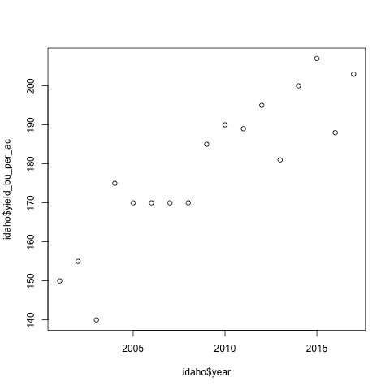

What to notice:
- There is a positive trend between the yield and years
- The x-axis label was inherited from the code passed into `plot()`
- The y-axis label was inherited from the code passed into `plot()`
- The range for x and y were automatically inferred from the data passed to `plot()`

[Exercises](exercises/r_plot1.md)

#### Axis labels and titles
The first thing to modify about a plot is the axis labels and title.
```r
plot(idaho$year, idaho$yield_bu_per_ac,
     xlab='Year', ylab='Yield (bu/ac)',
     main='Idaho Corn Yields have Increased Since 2000')
```
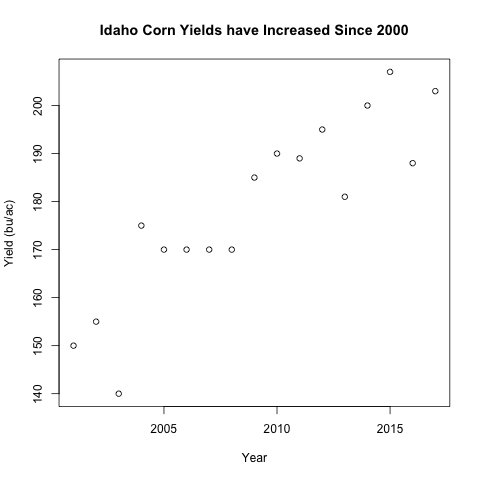

What to notice:
- The arguments: `xlab`, `ylab`, and `main` each take a character value
- It is best practice to have units on your axis labels
- Notice the title is larger than the axis labels by default

#### Overlaying data with points()
A common operation is to compare data across different sources on the same plot.
We will add the data from Illinois to our plot above using `points()`
```r
is_illinois <- states == "ILLINOIS"
after_2000 <- years > 2000

illinois <- df[is_illinois & after_2000, ]

plot(idaho$year, idaho$yield_bu_per_ac,
     xlab='Year', ylab='Yield (bu/ac)',
     main='Idaho Corn Yields have Increased Since 2000',
     col="blue")
points(illinois$year, illinois$yield_bu_per_ac,
       col="red")
```
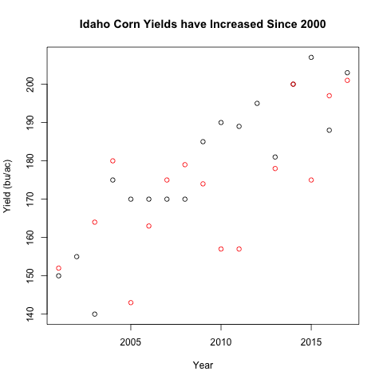

What to notice?
- The new argument `col` assigns the same color to all points in the same
  function and the color can be specified using a character vector.
- `points()`, similar to `plot()` take in similar arguments (x, y coordinate
  for the points plotted)
- Notice that some years are missing for Illinois relative to Idaho. This
  could be missing data for yields or the data could be out of the range of
  Idaho. Again, the range of the plot is determined by the `plot()` function.
  The `points()` function only adds points to the existing canvas.

[Exercises](exercises/r_points.md)

#### Range of data
If you quickly check the range of the Illinois data, you'll notice that
its lowest value is much lower than the Idaho values. This suggests that
the plot above is censoring some of the data because its range is limited
by the Idaho data.

Turns out `plot()` allows you to tweak the range of the plot with arguments
`xlim` and `ylim`:
```r
all_y_data <- c(idaho$yield_bu_per_ac, illinois$yield_bu_per_ac)
y_range <- range(all_y_data) # This is a vector of length 2

plot(idaho$year, idaho$yield_bu_per_ac,
     xlab='Year', ylab='Yield (bu/ac)',
     main='Idaho Corn Yields have Increased Since 2000',
     col="blue", ylim=y_range)
points(illinois$year, illinois$yield_bu_per_ac,
       col="red")
```

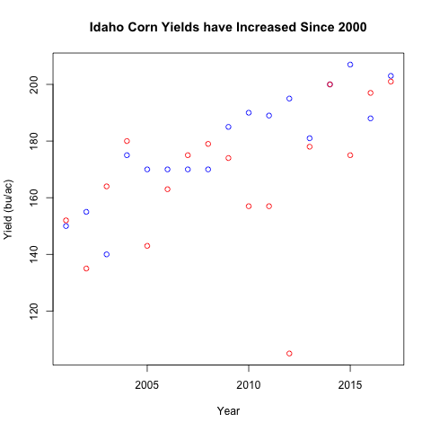

What to notice?
- We only used the `ylim` argument because the years are the same
- `ylim` expects a numeric vector of length 2, the first indicating the lower bound and the second indicating the upper bound.
- Notice that we had to had to set the `ylim` argument with the `plot()` function call.
- Notice that a viewer seeing out graph have no idea which the different colors represent.

#### Starting with an empty plot
A common plot strategy is to start with an empty plot, then
add points() from different sources. 

```r
x_range <- range(idaho$year)

plot(1, type="n",
     xlab='Year', ylab='Yield (bu/ac)',
     main='Idaho Corn Yields have Increased Since 2000',
     xlim=x_range, ylim=y_range)
points(idaho$year, idaho$yield_bu_per_ac,
       col="blue", pch=16)
points(illinois$year, illinois$yield_bu_per_ac,
       col="red", pch=15)
```
Notice that the function call to `points()` is slightly repetitive
which can be done with a for-loop later.

Breaking the calls this way makes `plot()` handle the shared
properties across data where `points()` will handle the
point locations, colors, and plotting characters for different
groups of the data. This division of responsibility for
different functions is a good way to think about structuring your code.


#### Legends
To label the different points, we will use a legend.
```r
plot(1, type="n",
     xlab='Year', ylab='Yield (bu/ac)',
     main='ID/IL Corn Yields have Increased Since 2000',
     xlim=x_range, ylim=y_range)
points(idaho$year, idaho$yield_bu_per_ac,
       col="blue", pch=16)
points(illinois$year, illinois$yield_bu_per_ac,
       col="red", pch=15)
legend("bottomright", legend=c("Idaho", "Illinois"),
       col=c("blue", "red"), pch=1)
```

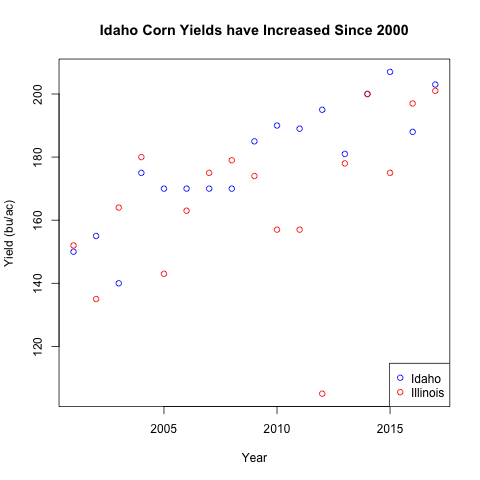

Here we introduced several arguments within the `legend()` function
- The first argument is the location of the legend, choices are `bottomright`, `topright`, `bottomleft`, or `topleft`.
- The `legend` argument is the text that should be displayed, this is often a character vector
- `pch` is the plotting character for the different legend values, `0` happens to correspond
  to a hollow point, this **can be a vector** so the different legends can take on
  different plotting characters.
- The `col` here is the color for the different plotting characters. This is usually a character
  vector.
- Notice that the order of `legend`, `pch`, and `col` need to align. A single value will be "recycled"
  to match the other values passed to the function.

#### Changing the property for each point with vectors
Just like how each point can have its location specified using a vector,
we can also use vectors to change each point's color and plotting character.

For the example, we are switching away from real data for clarity
```r
plot(1:20, 1:20, pch=1:20)
```
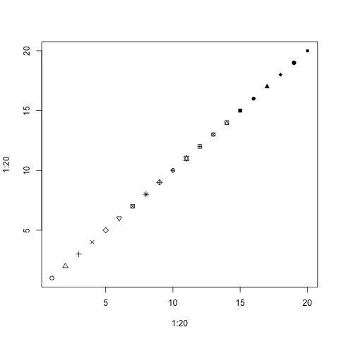

Notice how each point has a different plotting character starting from 1 to 20.
The same can be done with colors. Instead of using the usual character strings,
we're going to use the `rgb()` function that specifies the amount of red, green,
vs blue coloring.
```r
plot(1:5, 1:5, pch=16, col=c(rgb(0, 0, 0),
                             rgb(1, 0, 0),
                             rgb(0, 1, 0),
                             rgb(0, 0, 1),
                             rgb(0.9, 0.9, 0.9))
    )
```
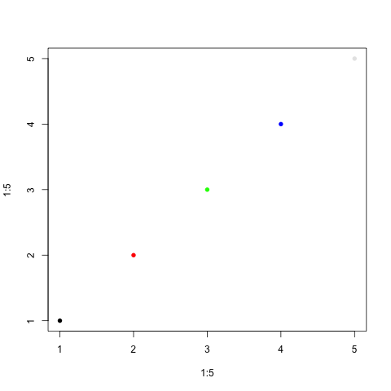

And you can change both at the same time:
```r
plot(1:5, 1:5, pch=c(1, 15, 16, 3, 17),
     col=c(rgb(0, 0, 0), rgb(1, 0, 0),
           rgb(0, 1, 0), rgb(0, 0, 1),
           rgb(0.9, 0.9, 0.9))
    )
```
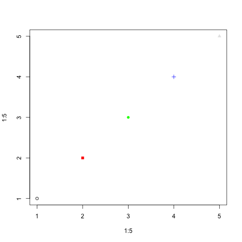


#### Plotting different states with different colors: for-loops
Imagining carrying out the example above for the different
states in our original dataset for [historical USDA corn yields](data/usda_i_state_corn_yields_cleaned.csv).
Our example above was slightly tedious to type out so
we will use the for-loop to handle the different states.

```r
df <- read.csv("usda_i_state_corn_yields_cleaned.csv")
states <- df$state_name
years <- df$year
uniq_states <- unique(states)
colors <- c("red", "blue", "black", "purple")

x_range <- range(years)
y_range <- range(df$yield_bu_per_ac)
plot(1, type="n",
     xlab='Year', ylab='Yield (bu/ac)',
     main='Corn Yields Increased across all i-States',
     xlim=x_range, ylim=y_range)
for(i in seq_along(uniq_states)){
    is_target_state <- states == uniq_states[i]
    # Subset only the records that correspond to the state of interest
    sub_df <- df[is_target_state, ]
    points(sub_df$year, sub_df$yield_bu_per_ac,
           col=colors[i], pch=16)
}
legend('bottomright', legend=uniq_states,
       col=colors, pch=16)
```

#### Factors
There's another strategy that can plot quickly for different subgroups
using a special data type called factors.

To give you an idea about the properties of factors:
```r
char_demo <- c("red", "yellow", "yellow", "green", "red")
fac_demo <- as.factor(char_demo)
class(fac_demo)
# [1] "factor"

# Property 1, factors have levels
levels(fac_demo)
# [1] "green"  "red"    "yellow"

# Factors can be turned into numbers or characters
print(fac_demo)
print(as.numeric(fac_demo))
print(as.character(fac_demo))
```
Notice how the numbers from `as.numeric` correspond to the order of the
output from `levels()`. 

Levels are a unique attribute of factors!

A very special behavior in R is that if we try to subset with factors,
it's like subsetting with numeric values (in particular, the value
corresponding to the different levels)!
```r
levels(fac_demo)
# Notice the actions are intentionally chosen
# to be in order of the levels!
traffic_actions <- c('go', 'stop', 'yield')
print(traffic_actions[fac_demo])
print(fac_demo)
```

You can imagine that what happened in the subsetting above is that
the factors were turned into numbers (according to the order of their level),
then they were used to subset the vector.

What's new is that, before, we have not subsetted the same value multiple
times. Here, we will use this behavior to help us assign the different points
different colors according to a factor.

[Exercises](exercises/r_factors.md)

#### Corn trajectories
Below we re-write the code from the for-loop above using factors.
```r
df <- read.csv("usda_i_state_corn_yields_cleaned.csv")
states <- df$state_name
print(class(states))
colors <- c("red", "blue", "black", "purple")
plot(df$year, df$yield_bu_per_ac,
     pch=16,
     xlab='Year', ylab='Yield (bu/ac)',
     main='Corn Yields Increased across all i-States',
     col=colors[states])
legend('bottomright', legend=levels(states),
       col=colors, pch=16)
```
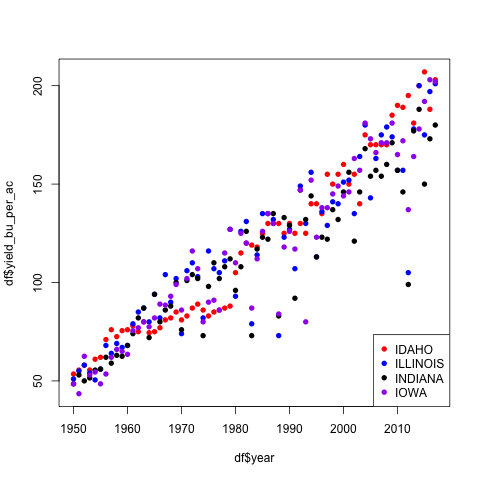

What to notice:
- Notice that all the data was used in `plot()` so we did not need to
  specify the xlim or ylim values.
- Notice that `colors[states]` is a character vector with the same length
  as `states`
- The code is much shorter this way!

#### Saving plots with png()
If you want to save an image file using code, you can surround the
plotting code between a `png("FILE_NAME.png")` call and a `dev.off()` call.

Warning, the code below will create 3 ".png" files in your working directory!
```r
colors <- c('red', 'blue', 'black')
for(i in seq_along(colors)){
    file_name <- paste0('test_plot_', colors[i], '.png')
    png(file_name)
    plot(1:4, 1:4, pch=1:4, col=colors[i])
    dev.off()
}
list.files()
```
You do not need to have a for-loop to save the for-loops but this is 
an example for you to create similar plots over different iterations.

Note that a common mistake is that people forget the `dev.off()` call.

[Exercise](exercise/r_png.md)

## Problem 3 - Data Wrangling
Notice that a lot of our functions above rely on having the vectors
having the same length and same element in different vectors corresponded
to the same records.

Sadly, data rarely comes in this format because this is rarely the most
efficient format for storage or recording.

For example, imagine my dental visits over several years. These are
often done twice yearly and each visit would have a record of my dental health.
However, my name, health insurance, phone number, address, etc would unlikely
change over these visits. In this case, storing data in the data frame format would be
wasteful because the columns corresponding to non-dental records would be repeated. 
Because of these reasons, the raw data is rarely in a "rectangular" format
(where the number of rows per column is the same).

The task that converts the data between these non-rectangular formats (efficient for storage
and measurement) into the rectangular formats (easy for analysis) is called
data wrangling.

#### Joining Data Frames
There is a special type of wrangling that simply requires combining
2 rectangular forms of data (tables) according to one or more columns of
data. 

For example, imagine the 2 tables below could be a small subset of
your online start-up's data: one containing your users' more permanent information
and one containing their activity information.

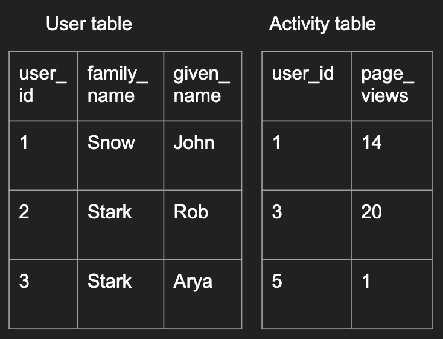

You can imagine different analysis questions that require you to 
combine the two tables together in different ways which we'll elaborate below.

To create this data in R, you could run the following code:
```r
user <- data.frame(
    user_id=c(1, 2, 3),
    family_name=c("Snow", "Stark", "Stark"),
    given_name=c("John", "Rob", "Arya"))
activity <- data.frame(
    user_id=c(1, 3, 5),
    page_views=c(14, 20, 1))
```

#### Left/Right Joins
This first type is a left join, where all 

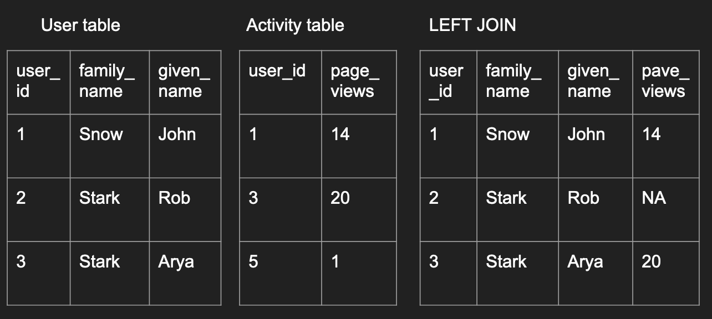

```r
left_join_df <- merge(user, activity,
                      by='user_id', all.x=TRUE)
left_join_df
```
What to notice:
- If you tweaked the code around, you would have realized that
  we didn't need to specify `by`. The default is to use the
  overlapping column names between the 2 data frames to join
  the data. But it is good practice to be explicit in these
  cases. 
- `all.x=TRUE` implies that you want to preserve all records
  in the left data frame.
- Notice that the record missing in the right data frame had
  `NA` values filled in its place.

A right join is simply the opposite, where you preserve all
the records in the second data frame.
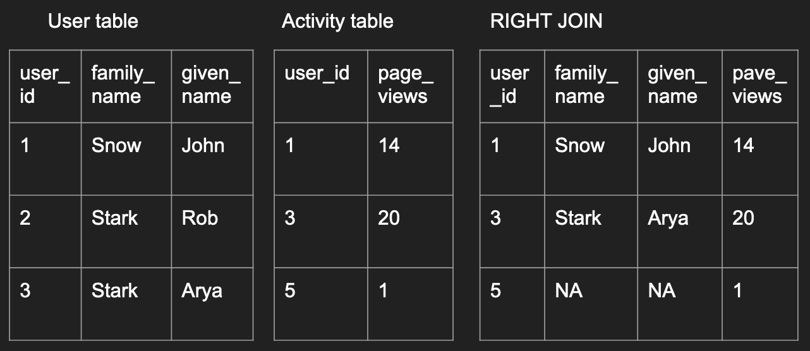

```r
right_join_df <- merge(user, activity,
                       by='user_id', all.y=TRUE)
right_join_df
```

#### Inner/Outer Join
An inner join is where only records existing in both data frames
are preserved like below:

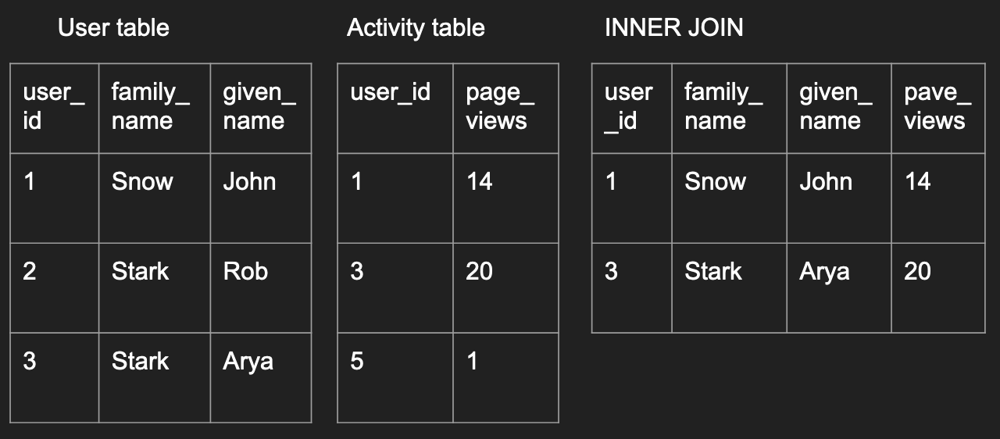

```r
inner_join_df <- merge(user, activity, by='user_id')
inner_join_df
```

An outer join is the opposite, as long as a record exists in
one of the data frames, the final outcome will have have it.
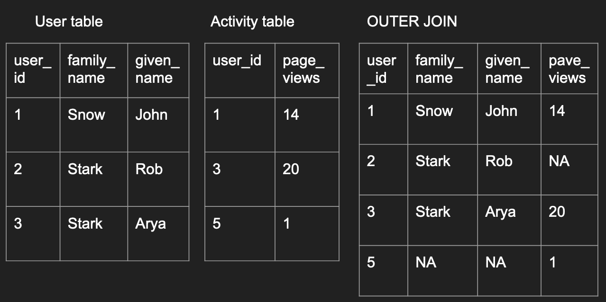

```r
outer_join_df <- merge(user, activity,
                       by='user_id', all=TRUE)
outer_join_df
```

#### Repeated values when joining
One common issue when joining is when there are repeated values.

Imagine an example with individual donations and individual voting
patterns where some individuals have the same name.
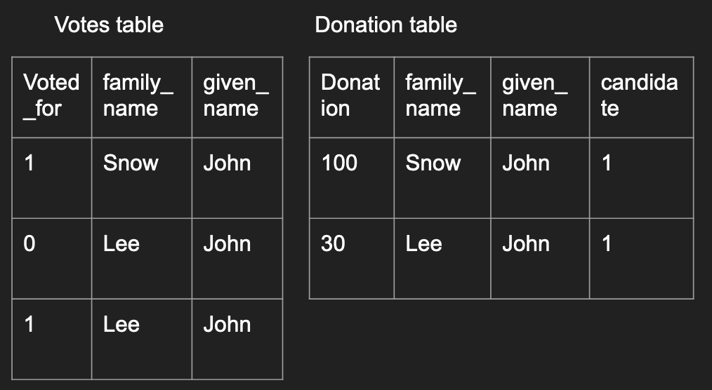

```r
votes <- data.frame(
    voted_for=c(1, 0, 1, 3),
    family_name=c("Snow", "Lee", "Lee", "Lee"),
    given_name=c("John", "John", "John", "John"))
donations <- data.frame(
    donation=c(100, 30),
    FAMILY_NAME=c("Snow", "Lee"),
    given_name=c("John", "John"),
    candidate=c(1, 1))
df <- merge(votes, donations,
            by.x = c("family_name", "given_name"),
            by.y = c("FAMILY_NAME", "given_name"))
df
```
What to notice:
- With no specifications with the `all`, `all.x`, or `all.y` arguments,
  the default is to perform an inner join.
- Read the output, notice that John Lee's donation is matched to both records
  in the `votes` data frame.
- If you do not want all possible matches to be joined together, you have to
  de-duplicate the data before the merge.
- One common way to notice if a repeated value was matched in your join is
  when the number of rows from the inner join is larger than the number of rows
  from either data frames that were used as inputs to `merge()`

[Exercises TBW]()

#### Most flexible data type - list()
Back to the case where the data do not follow a rectangular format, data
is often stored in a hierarchical format. In R, the most common format to 
store this type of data is in a list.

Lists are the most flexible data type that can contain other types of data.
A list can contain different different types of data in each element, even another list.
Moreover, unlike data frames, each element within a list does not have
to have the same length as another element. This allows lists to be
flexible but also relatively hard to work with as well.

To construct a list, here's an example:
```r
dat <- list(
  students=list(
    list(name="wayne", school="CC", graduation=2020),
    list(name="wayne", school="ENG", graduation=2021)
  ),
  class_title="UN2102",
  class_cap=120
)

class(dat)
length(dat)
names(dat)
```

I personally visualize a list like a sequence of packages with possible labels on them.
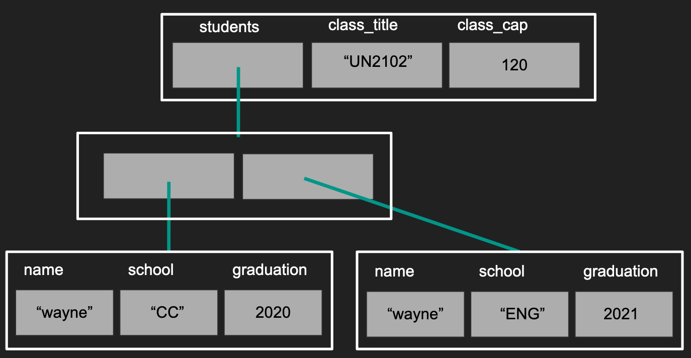

What to notice?
- Not all lists need to be given names (second layer)
- Notice our first layer has a list, a character, and a numeric value in each of its elements
- Notice that the different elements do not need to have the same length.

#### Subsetting lists
Continuing from the previous example, there are many ways to subsets the elements within a list.

```r
# Subset by integers
dat_element1 <- dat[[1]]
# Subset by character
dat_element2 <- dat[['class_title']]
dat_element3 <- dat$class_cap

class(dat_element1)
class(dat_element2)
class(dat_element3)
```
This is the first time you've seen the double square bracket `[[]]`. 
It's not clear what the difference until you compare this to subsetting a list using `[]`.
For clarity, we will focus on the second element with the name of `"class_title"`

```r
dat_second_slice <- dat['class_title']

print(dat_element2)
print(dat_second_slice)

class(dat_second_slice)
```
Notice how `[]` returned a list with the original name/tag of `"class_title"`,
like a slice of the original list, where `[[]]` returned the character, the
element within the list, and no longer has the name `"class_title"` associated with it.

To continue our analogy to a "sequence of packages with possible labels", you
can consider subsetting with `[]` returns a subset of the packages with their
labels intact where subsetting with `[[]]` or `$` returns the contents **within** the package.

To give a visual perspective, subsetting with `[]` returns the data like in the "red"
box. Subsetting with `[[]]` and `$` returns the data in the "blue" box.
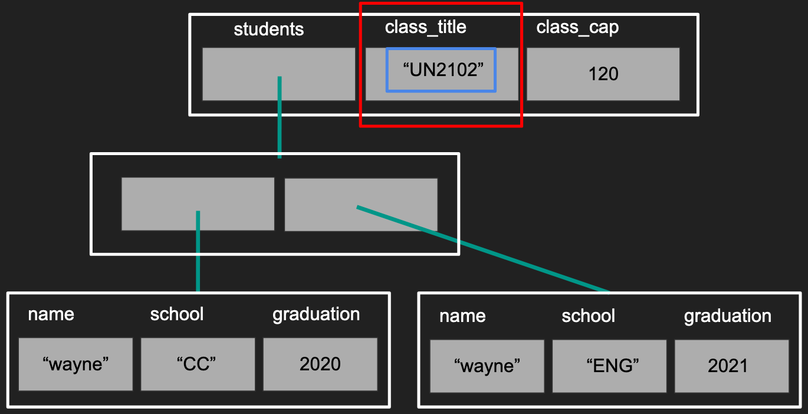

#### How is this different from subsetting with vectors?
You might be wondering how does this align with your understanding of
vector subsetting.

I hope you tried some code like below:
```r
demo_vec <- 1:5
print(demo_vec[3])
print(demo_vec[[3]])
```
Notice that the output from both cases are identical. However,
the understanding that `[]` returns a **slice** of the original
vector is still quite correct. The exception is that R does not
really have a data type as a single number (recall the smallest element is
a vector of length 1) so subsetting with `[[]]` returns the smallest
possible type of data allowed.

#### How is this different from subsetting with data frames?
Again, let's try to create an example
```r
df <- data.frame(a=1:3, b=4:6, c=7:9)
class(df[, 2:3])

class(df[, 2])

class(df[2:3, ])

class(df[2, ])
```
Notice how subsetting with `[]` in all but one case returned a
slide of the original data frame. The one exception is when we
subset the columns using a vector of length 1. This is an example
of R's user-friendly yet inconsistent behavior that bothers many programmers.
This can actually be avoided with a simple argument `drop` in `[]`

```r
df <- data.frame(a=1:3, b=4:6, c=7:9)
class(df[, 2, drop=FALSE])
```

#### Data frames are a special case of lists
If you ever played around with subsetting data frames before, you
might have noticed that columns in a data frame behave like elements
within a list.

```r
df <- data.frame(a=1:3, b=4:6, c=7:9)
df['b']
df[['b']]
df$b
```
In the above code, we are subsetting as if `df` is a list but
the behavior is identical to how a list behaves. This is because
data frames are a special case of lists where each element has the
same length where lists do not have this restriction.

#### Exploring a list with real Twtter data
Here's an [example of data](data/twitter_standard_api_results.json)
from [Twitter's Standard Search API](https://developer.twitter.com/en/docs/tweets/search/api-reference/get-search-tweets)
You can read this in using a library called `jsonlite`. Download
the data like you did with the CSV, then try the code below:
```r
library(jsonlite)
twitter <- read_json("twitter_standard_api_results.json")

class(twitter)
names(twitter)
length(twitter)
```
If you see an error, make sure you noticed the `_` instead of `.` in
`read_json`.

Keeping the same analogy, you can tell that `twtiter` is a sequence
of 2 packages, one labeled `"statuses"` and the other as `"search_metadata"`.
To explore further, iterate between subsetting and functions that
explore the type of data.

```r
class(twitter$search_metadata)
names(twitter$search_metadata)
length(twitter$search_metadata)

class(twitter$search_metadata$query)
length(twitter$search_metadata$query)
twitter$search_metadata$query
```

In the code above, we notice that `twitter` is at least a list with
2 layers, we have found that the query used to create this dataset is "coronavirus".
By repeating the process above, you can figure out the general 
structure of the data without needing to print out all of the data at once.

In general, the structure would be documented within a document.
However, these are not always easy to understand unless you have been
working with data for some time.

#### Exploring a list with real Twtter data - continued
If you explored further above, you would likely have deduced that the different
"statuses" correpsond to the different tweets. So you can imagine that if we
wanted to study tweets, we could want to create a data frame where the rows
correspond to different tweets and the columns correspond to different features
of the tweet like followers or retweets, etc.

Here's some code to grab some features out of a tweet.
```r
tweet <- twitter$statuses$text
retweet_count <- twitter$statuses[[1]]$retweet_count
screen_name <- twitter$statuses[[1]]$user$screen_name
follower_count <- twitter$statuses[[1]]$user$followers_count
favorite_acount <- twitter$statuses[[1]]$favorite_count
```
Notice how under "user", there are many attributes associated with the user
as well where tweets themselves have a different set of attributes.

However, as the amount of data you want to extract increases, it might be
better to create a function that extracts the data given an individual "status".

#### Writing your own function
Here we will talk about how to write a function so you can use it
like `mean()` and `log()` etc.

A common calculation in machine learning and physics is to calculate the
percent error when you are prediction a quantity (e.g. the wind speed
in the next hour, the demand for toilet paper in the next month, etc):

$$100*\left|\frac{y - \hat{y}}{y}\right|$$

In general, $$\hat{y}$$ would be what your algorithm/model predicted
and $$y$$ would be the realized outcome (the actual data point).

To translate this into code:
```r
perc_error <- function(prediction, data){
    err <- prediction - data
    abs_err <- abs(err / data) * 100
    return(abs_err)
}

# Test out your function
perc_error(90, 100)
perc_error(-90, -100)
```

What to notice:
- `perc_error` is the function name. You should not overwrite existing
  functions like `c()`, `mean()`, etc.
- `function( ){      }` is the skeleton for defining the extent of the
  function.
  - Values that go into `()` are the inputs/arguments to the function
  - Code going between the `{}` will be ran everytime the function is called,
    using the inputs provided.
- `return()` is a special function that can only be run within a function.
  In general, it's best to be explicit what value is being returned. This
  will also terminate the function at hand.
- Keep functions simple!
- Test out the function, it's always best to test out the function on a small
  example to make sure things behave as you expected.

[Exercises](exercises/r_func1.md)

#### do.call()

#### Apply family functions

## Problem 4 Data cleaning



