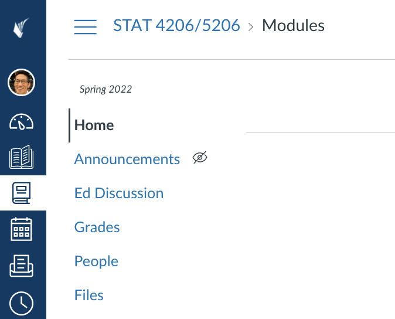
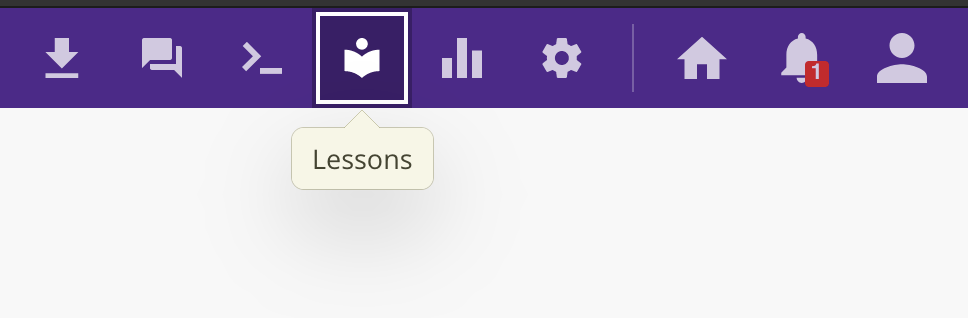
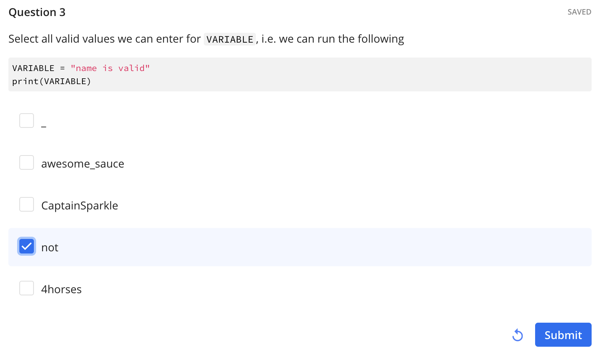
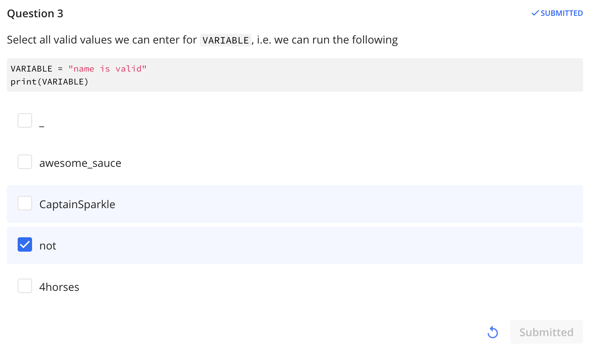
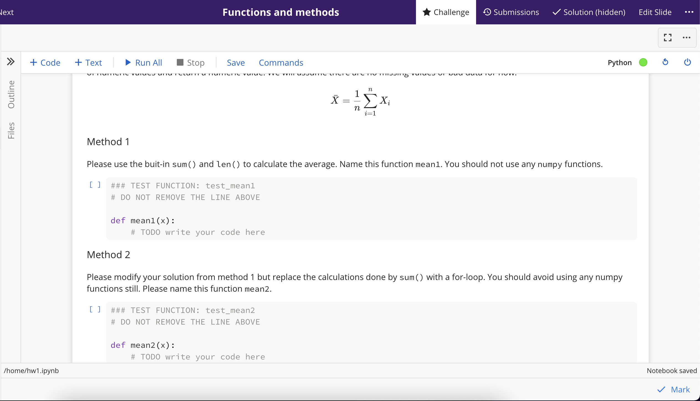
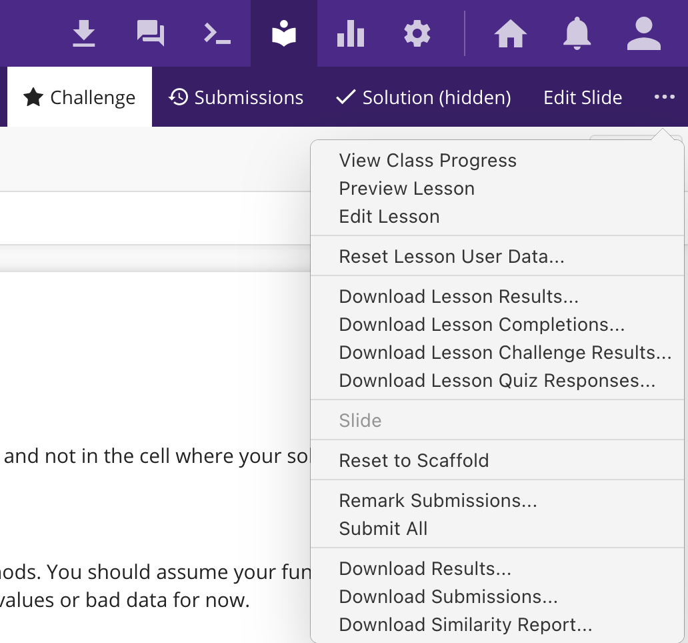

# FAQ for Homeworks on Ed

In this class, we will use [Ed](us.edstem.org) to give out and grade all
homeworks.

#### Where is Ed?

Ed is a education software company with many modern and awesome features for
a coding class.
You can log into Ed via your CourseWorks authentication simply by clicking on
the "Ed Discussion" tab in CourseWorks



#### Where are the homeworks?

Once you log onto Ed, the right-top corner will have a book icon that corresponds
to **Lessons**.



#### Non-coding questions

For non-coding questions on the homework, they tend to be easily verifiable. 
Once you make your selection, make sure to click "Submit" and make sure
the button appears as a grayed out "submitted".




You may re-submit by simply re-clicking the options or hitting the "reset" button.

#### Coding questions

For this class we'll be using the Jupyter Notebooks for coding questions.


A few things to know
- All your code on the Jupyter Notebook will be ran by the autograder except cells with
  `### SKIP` at the top.
- Your solutions must stay entirely inside the cell with
  ```python
  ### TEST FUNCTION: *
  # DO NOT REMOVE THE LINE ABOVE
  ```
  since this is what will be graded.
- You can write code or notes to yourself by creating a new cell using the `+ Code`
  and `+ Text` options.
- The `Mark` button on the right bottom is what will trigger the auto-grader.
  - You must hit `Mark` at least once to receive credit.
  - You can regrade this as many times as you wish in Spring 2022.
  - You must **save the notebook before marking**! Ctrl-S or Cmnd+S should work.
- If you wish to Download the notebook, you can find the `>>` on the left of the `+ Code`
  button. You should be able to right-click to Download the notebook.
- If you wish to work on a later problem before answering an earlier one, simply comment
  out all the code by adding `#` at the front of line.

#### Resetting Scaffold

Occasionally we will make an adjustment to the existing assignment due to typos or
bad tests. In these events, you may need to "reset" the coding challenge. This will
erase all of your progress and start fresh. Please **download your solutions before resetting**!

To do this, find the `Reset to Scaffold` from the drop down menu on the top right.

