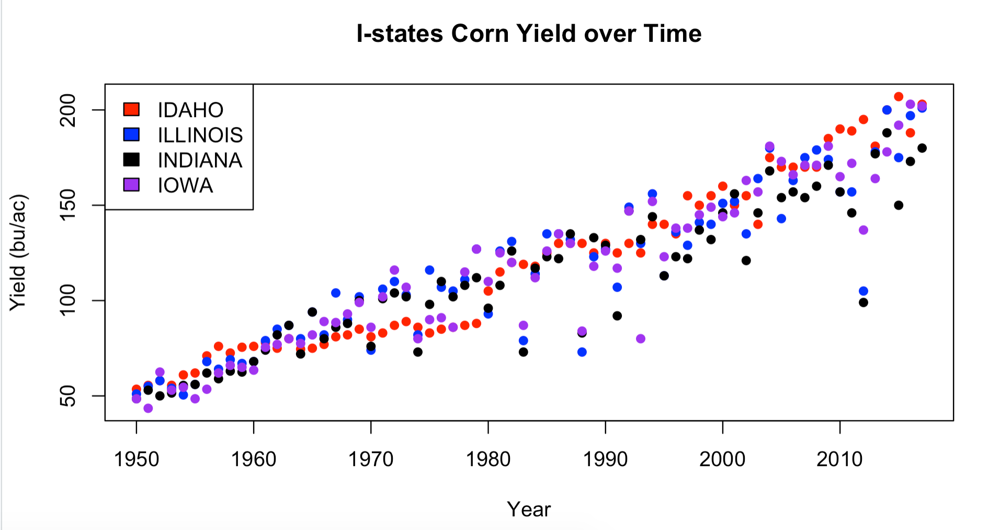

# HW3 - More programming with statistics

CHANGE IN FORMAT:

For ease of grading, we're switching to html or pdf files from RMarkdown OR Jupyter Notebooks.
You can research this online for now but I'll be adding instructions how to do this soon.

#### Q1 Creating a multi-modal random variable
"Mixing" random variables is an easy way to create multi-modal distributions with well known distributions.
The most common version is the Gaussian Mixture that can be generated by:
- For each sample, roll a dice with `k` sides
- If the j-th side appears from the roll, draw a sample from Normal(mu_j, sd_j) where mu_j and sd_j are the
  mean and standard deviation for the j-th Normal distribution respectively. This means you should have
  k different Normal distributions to choose from.
- The resulting sample from this Normal is then from a Gaussian Mixture.
- Repeat the first 2 steps for another sample


Please write a function `rgaussmix` that can generate sample from a mixture gaussian distribution.
The inputs (in order) should be:
- `n`, an integer that represents the number of indepdendent samples you want from this random variable
- `mus`, a numeric vector with length `k`
- `sds`, a numeric vector with length `k`
- `prob`, a numeric vector with length `k` that indicates the probability of choosing the different Gaussians. This should have a default to `NULL`.

What should be returned is:
- a numeric vector of length `n` where each element is a realization from the Gaussian mixture specified.


Requirements for the function:
- Please check that the length of `mus` matches the length of `sds`. If not, please use `stop()`
    to return an Error message saying "mus and sds have different lengths".
- If given `n=0`, the function should return an empty vector, please AVOID using `if()` to address this issue. Hint: `seq_len()`
- If `prob` is NULL (hint: `is.null()`), each side of the dice should be equally likely to appear.
- For the dice roll, please use `sample()` combined with the `prob` input value.
- Pleaes leverage `rnorm()` in your code.


Please submit the code for this quesiton.


#### Q2 Testing out the function
Please apply your function above with the following inputs and show the desired output:
- `rgaussmix(10, 1:3, 1:4)`
  - Please show that this should return an error
- `rgaussmix(mus=1:3, sds=rep(0.1, 3), n=300)`
  - Please show the histogram for this.
- `rgaussmix(300, mus=1:3, sds=rep(0.1, 3), prob=c(0.5, 0.4, 0.1))`
  - Please show the histogram for this.
- `rgaussmix(0, mus=1:3, sds=rep(0.1, 3), prob=c(0.5, 0.4, 0.1))`
  - This should return an empty vector
- `rgaussmix(300, mus=1:3, sds=c(0.2, -1, 0.5))`
  - If you leveraged `rnorm()`, you should have `NA` values for some with a warning message, please show these messages.
  - Please plot the histogram from this command.
- Please comment how `hist()` addresses NA values in your data:
  - Does it warn you that NA values were detected?
  - Does the histogram function throw an error or warning?


#### Q3 Central Limit Theorem
Here we are going to simulate the central limit theorem.

We want to demonstrate that the CLT works on complicated distributions, like a Gaussian mixture. Imagine we had a Gaussian mixture where the first and second components are Normal(10, sd=2) and Normal(18, sd=2) respectively, and the first component is 4 times more likely to appear than the second component.
By demonstrate, we mean that the sample averages will follow a bell curve and the width of the bell curve will decrease with larger sample sizes.

You are expected to leverage your function from Q1.

Please demonstrate the CLT works by showing the following:
- Choose 2 appropriate sample sizes where samples from the Gaussian mixture with the respective sample sizes can produce histograms that clearly show the bimodal pattern (e.g. n > 10). Please plot 2 histograms with their sample sizes in the title of the graph where each histogram has the sample distribution from the Gaussian mixtures.
- (this is worded intentionally more statistically) Please simulate 2500 different sample averages for both sample sizes and plot the simulated distribution for the 2 different sample averages separately. Please make sure the plots are comparable so a reader can observe (without reading the x-axis units, e.g. if I hid the tick marks) that the distribution with the larger sample size has a tighter distribution.
  - You should not hide the tick marks!

Please show all code and all graphs.


#### Q4
Please use the dataset on `Canvas/Files/homeworks/usda_i_state_corn_yields_cleaned.csv` and and the template below to reproduce the following plot.



Buggy template:
```r
corn <- read.csv("YOUR_PATH/usda_i_state_corn_yields_cleaned.csv")

states <- levels(corn[, 'state_name'])
colors <- c("black", "blue", "red", "purple")
yields <- corn[, 'yield_bu_per_ac']
years <- corn[, 'year']

plot(1, 1, type="n", ylim=c(0, 50), xlim=range(years))
for(i in seq_along(states)){
  is_target_state <- corn[, 'state_name'] == states[i]
  state_corn <- corn[is_target_state, ]
  # Something?
}
```
Please make sure:
- Your axis labels are the same
- Your title is the same
- Your legends are roughly the same
- Your colors are aligned with the same states
- No data points are hidden/lost
