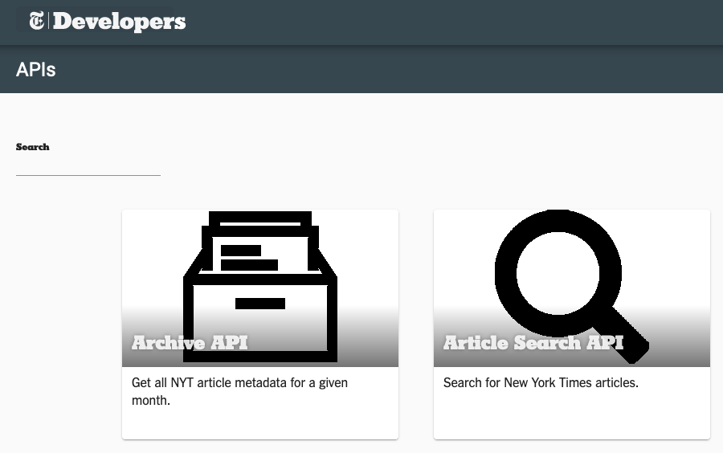

# HW7 - Calling APIs and Text Manipulation


## Q0 Getting NYTimes Data
This problem is focused on using `httr` to call the NYTimes API to grab data.

Please find the New York Times API documentation for their "Article Search API".


Please register/login to obtain your credentials (do not share these with people).
See "Get Started" to obtain your API key.

For those who cannot access NYTimes, please see the special note in the `()` for each question.

- According to the documentation, what is the maximum number of results that can be
  returned per call?
  if you cannot access NYTimes).
- What is the `status code` if you do not provide your API key when making the call? (Please inform the grader that you cannot complete this part)
- What does `content()` return if you fail to provide your API key when making the call? (Please inform the grader that you cannot complete this part)
  Side comment: notice how the code does not "error out" which can be good or bad depending on if you want to
  identify issues sooner or have a robust system.
- Please write the code that would call this API (To write the code, you only need the API
  documentaion page. If you really want to test it out, please send your code to us and we can run it
  for you during office hours, we will grade this generously) with the following specifications:
  - We want the 21st to 30th result from NYTimes (hint: Pagination)
  - The query should be `college`
  - Your API key should not be visible in your homework submission. Create a separate
    .R file that assigns your API key to a variable (e.g. `cred<-"7Hkwoghiq"`), then `source()` in that
    file as done in the recorded lecture.
  HINT: `list('quotes'= "can allow", "weird-names"="be", names='.')`
- Please create a **file name** with the format of: `'nytimes_YYYYMMDD.json'` where `YYYYMMDD` should
  be the year, month, and day of the day you ran your code. Please use `strftime()`
  and `Sys.time()` in your code to produce `"YYYYMMDD"`. The final answer is simply a length 1 character string.
- Please write the NYTimes output from the API into a JSON file using the file name above
  (please just write the code since we are not checking output) hint: `write_json()` from `jsonlite`

## Q1 Text manipulation to create the first midterm!
On Canvas, you'll find a zipped file titled `indeed_job_descriptions.zip`, this problem will walk you through how we generated the dataset
for the first midterm (mostly). Ultimately, we want to know the number of job descriptions that have python vs R listed.

- Please read in one file and create a character vector for all of the job descriptions, i.e. the vector should have
  the same length as the number of job descriptions.
- Please split each job description such that each job description is now a character vector with length equally
  to its word count rather than one single character value as before.
  - Please answer what is the appropriate data type that can hold multiple job descriptions after we do this transformation?
  - Please split the words by non-alpha-numeric-underscore values (underscore is `_`), you should use
    `strsplit()` and `gsub()` in your solution.
- Please create a data frame where each row is a job description and each column corresponds to a different word, and each
  element within the data frame is the **total occurrence** of the word in the job description specified by the column and row.
  - This should NOT be case sensitive so "hello" and "Hello" should be counted together
  - We will ignore the difficult question of lemmatization so "runs", "run", and "ran" will be counted as **different** words
  - Hints but not required:
    - `table()` can count
    - `as.data.frame()` can convert objects into data frames
    - `rbind.fill()` from the the package `plyr` can combine different data frames by column names when some columns are missing
    - you might want to convert the counts into a list to preserve the names.
- Please repeat the processes above to create a single data frame that contains the word count across all files. Each row is still
  a job description and each column is still a word.
- Are some job descriptions repeated across the data? Yes/No, please show the code that demonstrates this. You can assume that
  if the word counts are identical across all words, they are the same job description.
- Please report the number of job description that mention 'r' and the number of job descriptions that mention 'python'


## Q2 Debugging
The goal of this question is to debug the following code a fake student wrote for an assignment!
You should hand in the corrected code!

Before you start, you should know:
- There are a few operations and concepts that are slightly foreign to you, this is intentional because we often debug
  functions we may not completely understand, but I strongly encourage you to ask "what should I expect at this stage?"
- The bugs may or may not create an error message.
- The final `p_value` should be 0
- Some bugs may required you to rewrite parts of the code rather than fixing simple syntax errors
- What is a "permutation test"? This will be covered on 4/21's lecture

#### Context for the code
We wanted to understand if the business licenses expire at the same rate between "Sightseeing Guide" vs "Ticket Seller"?

The assignment to the student was:
- Please use the [Legally Operating Business dataset from NYC OpenData](https://data.cityofnewyork.us/Business/Legally-Operating-Businesses/w7w3-xahh)
  dataset to answer this question, please get the data and read it into your R console.
- Please filter out the data such that only businesses in the sightseeing guide or ticket seller industries are included.
  Warning, "ticket seller business" is a different industry from "ticket seller".
- Please calculate the number of days between the expiration date and the creation date of the license, note that these values should be non-negative values.
- Please calculate the difference in average between the two industries for their license duration.
- Please perform a permutation test to see if the two industries have drastically different license durations.
  Note that the differences from each permutation are likely different from one another.

```r
bus <- read.csv("~/Downloads/Legally_Operating_Businesses.csv")
targets <- c("Sightseeing", "Ticket Seller")
target_reg_expr <- paste0('(', paste(targets, collapse='|'), ')')
sub_bus <- bus[grepl(target_reg_expr, bus$Industry), ]

char_to_date <- function(char){
    date_val <- strptime(char, "%m/%d/%y", tz='EST')
    return(date_val)
}
get_license_length <- function(row){
    date_names <- c("License.Creation.Date", "License.Expiration.Date")
    date_char <- row[date_names]
    dates <- lapply(date_names, char_to_date)
    days_diff <- diff(do.call(c, dates))
    return(as.numeric(days_diff))
}
diffs <- apply(sub_bus, 2, get_license_length)

avgs <- tapply(diffs, sub_bus$Industry, mean)
avg_diff <- diff(avgs[targets])

# This is the permutation test
B <- 1000
perm_avg_diffs <- rep(NA, B)
for(i in seq_len(B)){
    permuted_industry <- sample(sub_bus$Industry)
    perm_avgs <- tapply(diffs, sub_bus$Industry, mean)
    perm_avg_diffs[i] <- diff(perm_avgs[target])
}
more_or_equally_extreme <- (perm_avg_diffs - 0) >= abs(avg_diff - 0)

p_val <- mean(more_or_equally_extreme)
p_val < 0.05
# If p_val is less than 0.05, we would reject the null hypothesis
# that the two industries have the same license duration and
# fail to reject the hypothesis if the p-value is above 0.05.
```
