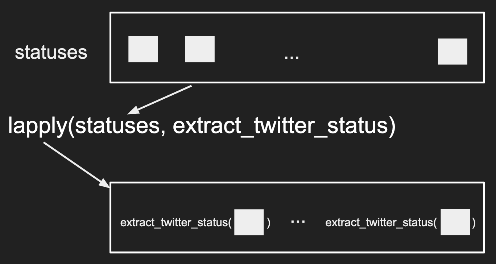
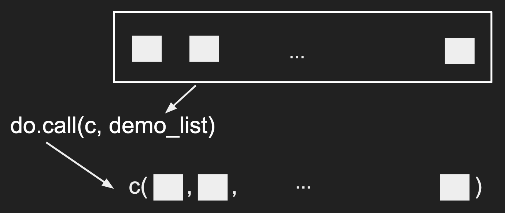

# Problem 3 - Data Wrangling
Notice that a lot of our functions above rely on having the vectors
having the same length and same element in different vectors corresponded
to the same records.

Sadly, data rarely comes in this format because this is rarely the most
efficient format for storage.

For example, imagine my dental visits over several years. These are
often done twice yearly and each visit would have a record of my dental health.
However, my name, health insurance, phone number, address, etc would unlikely
change over these visits. In this case, storing data in the data frame format would be
wasteful because the columns corresponding to non-dental records would be repeated. 
Because of these reasons, the raw data is rarely in a "rectangular" format
(where the number of rows per column is the same).

The task that converts the data between these non-rectangular formats (efficient for storage
and measurement) into the rectangular formats (easy for analysis) is an example of
data wrangling. The broader definition is simply getting data into the desired
format that facilitates later analyses.

#### Joining Data Frames
There is a special type of wrangling that simply requires combining
2 rectangular forms of data (tables) according to one or more columns of
data. 

For example, imagine the 2 tables below could be a small subset of
your online start-up's data: one containing your users' more permanent information
and one containing their activity information.


You can imagine different analysis questions that require you to 
combine the two tables together in different ways which we'll elaborate below.

To create this data in R, you could run the following code:
```r
user <- data.frame(
    user_id=c(1, 2, 3),
    family_name=c("Snow", "Stark", "Stark"),
    given_name=c("John", "Rob", "Arya"))
activity <- data.frame(
    user_id=c(1, 3, 5),
    page_views=c(14, 20, 1))
```

#### Left/Right Joins
This first type is a left join, where all 


```r
left_join_df <- merge(user, activity,
                      by='user_id', all.x=TRUE)
left_join_df
```
What to notice:
- If you tweaked the code around, you would have realized that
  we didn't need to specify `by`. The default is to use the
  overlapping column names between the 2 data frames to join
  the data. But it is good practice to be explicit in these
  cases. 
- `all.x=TRUE` implies that you want to preserve all records
  in the left data frame.
- Notice that the record missing in the right data frame had
  `NA` values filled in its place.

A right join is simply the opposite, where you preserve all
the records in the second data frame.


```r
right_join_df <- merge(user, activity,
                       by='user_id', all.y=TRUE)
right_join_df
```

#### Inner/Outer Join
An inner join is where only records existing in both data frames
are preserved like below:


```r
inner_join_df <- merge(user, activity, by='user_id')
inner_join_df
```

An outer join is the opposite, as long as a record exists in
one of the data frames, the final outcome will have have it.


```r
outer_join_df <- merge(user, activity,
                       by='user_id', all=TRUE)
outer_join_df
```

#### Repeated values when joining
One common issue when joining is when there are repeated values.

Imagine an example with individual donations and individual voting
patterns where some individuals have the same name.


```r
votes <- data.frame(
    voted_for=c(1, 0, 1, 3),
    family_name=c("Snow", "Lee", "Lee", "Lee"),
    given_name=c("John", "John", "John", "John"))
donations <- data.frame(
    donation=c(100, 30),
    FAMILY_NAME=c("Snow", "Lee"),
    given_name=c("John", "John"),
    candidate=c(1, 1))
df <- merge(votes, donations,
            by.x = c("family_name", "given_name"),
            by.y = c("FAMILY_NAME", "given_name"))
df
```
What to notice:
- With no specifications with the `all`, `all.x`, or `all.y` arguments,
  the default is to perform an inner join.
- Read the output, notice that John Lee's donation is matched to both records
  in the `votes` data frame.
- If you do not want all possible matches to be joined together, you have to
  de-duplicate the data before the merge.
- One common way to notice if a repeated value was matched in your join is
  when the number of rows from the inner join is larger than the number of rows
  from either data frames that were used as inputs to `merge()`

[Exercises TBW]()

#### Joining a data frame with itself
Some people like to talk about a data frame joining with itself to be a
special case, it isn't. 

This is common when you want to calculate the number of friends who are within
2 degrees of separation away given a data frame that records the friendships,
i.e. each row corresponds to a friendship (measured by Facebook status) and
the 2 columns corresponding to 2 user IDs.

#### Data frames are not efficient at storage
Data does not need to be stored in a table format where there are columns and
rows! In fact, it's quite efficient to do so so many internet companies never
store raw data in this format.

For example, imagine a supermarket's tracking your purchases. Your different
visits would likely be tagged with the total amount you spent, the time of that visit,
then the detail items information (like item name, brand, cost, units purchased, etc).
Storing all this data in a table is not very efficient because you would have to repeat
the summarized data (total amount and time of visit) for each detailed item.
Try to draw this table out if you cannot picture this!

While having different tables is a solution, consumers of this dataset would often
appreciate a single source of data that has all of the information.
This leads to the existance of hierarchical data types like lists.

#### Most flexible data type - list()
Back to the case where the data do not follow a rectangular format, data
is often stored in a hierarchical format. In R, the most common format to 
store this type of data is in a list.

Lists are the most flexible data type that can contain other types of data.
A list can contain different different types of data in each element, even another list.
Moreover, unlike data frames, each element within a list does not have
to have the same length as another element. This allows lists to be
flexible but also relatively hard to work with as well.

To construct a list, here's an example:
```r
dat <- list(
  students=list(
    list(name="wayne", school="CC", graduation=2020),
    list(name="wayne", school="ENG", graduation=2021)
  ),
  class_title="UN2102",
  class_cap=120
)

class(dat)
length(dat)
names(dat)
```

I personally visualize a list like a sequence of packages with possible labels on them,
where each package can be another sequence of packages.


What to notice?
- Not all lists need to be given names (second layer)
- Notice our first layer has a list, a character, and a numeric value in each of its elements
- Notice that the different elements do not need to have the same length.

#### Subsetting lists
Continuing from the previous example, there are many ways to subsets the elements within a list.

```r
# Subset by integers
dat_element1 <- dat[[1]]
# Subset by character
dat_element2 <- dat[['class_title']]
dat_element3 <- dat$class_cap

class(dat_element1)
class(dat_element2)
class(dat_element3)
```
This is the first time you've seen the double square bracket `[[]]`. 
It's not clear what the difference until you compare this to subsetting a list using `[]`.
For clarity, we will focus on the second element with the name of `"class_title"`

```r
dat_second_slice <- dat['class_title']

print(dat_element2)
print(dat_second_slice)

class(dat_second_slice)
```
Notice how `[]` returned a list with the original name/tag of `"class_title"`,
like a slice of the original list, where `[[]]` returned the character, the
element within the list, and no longer has the name `"class_title"` associated with it.

To continue our analogy to a "sequence of packages with possible labels", you
can consider subsetting with `[]` returns a subset of the packages with their
labels intact where subsetting with `[[]]` or `$` returns the contents **within** the package.

To give a visual perspective, subsetting with `[]` returns the data like in the "red"
box. Subsetting with `[[]]` and `$` returns the data in the "blue" box.


#### How is this different from subsetting with vectors?
You might be wondering how does this align with your understanding of
vector subsetting.

I hope you tried some code like below:
```r
demo_vec <- 1:5
print(demo_vec[3])
print(demo_vec[[3]])
```
Notice that the output from both cases are identical. However,
the understanding that `[]` returns a **slice** of the original
vector is still quite correct. The exception is that R does not
really have a data type as a single number (recall the smallest element is
a vector of length 1) so subsetting with `[[]]` returns the smallest
possible type of data allowed.

#### How is this different from subsetting with data frames?
Again, let's try to create an example
```r
df <- data.frame(a=1:3, b=4:6, c=7:9)
class(df[, 2:3])

class(df[, 2])

class(df[2:3, ])

class(df[2, ])
```
Notice how subsetting with `[]` in all but one case returned a
slide of the original data frame. The one exception is when we
subset the columns using a vector of length 1. This is an example
of R's user-friendly yet inconsistent behavior that bothers many programmers.
This can actually be avoided with a simple argument `drop` in `[]`

```r
df <- data.frame(a=1:3, b=4:6, c=7:9)
class(df[, 2, drop=FALSE])
```

#### Data frames are a special case of lists
If you ever played around with subsetting data frames before, you
might have noticed that columns in a data frame behave like elements
within a list.

```r
df <- data.frame(a=1:3, b=4:6, c=7:9)
df['b']
df[['b']]
df$b
```
In the above code, we are subsetting as if `df` is a list but
the behavior is identical to how a list behaves. This is because
data frames are a special case of lists where each element has the
same length where lists do not have this restriction.

#### Exploring a list with real Twtter data
Here's an [example of data](../data/twitter_standard_api_results.json)
from [Twitter's Standard Search API](https://developer.twitter.com/en/docs/tweets/search/api-reference/get-search-tweets)
You can read this in using a library called `jsonlite`. Download
the data like you did with the CSV, then try the code below:
```r
library(jsonlite)
twitter <- read_json("twitter_standard_api_results.json")

class(twitter)
names(twitter)
length(twitter)
```
If you see an error, make sure you noticed the `_` instead of `.` in
`read_json`.

Keeping the same analogy, you can tell that `twtiter` is a sequence
of 2 packages, one labeled `"statuses"` and the other as `"search_metadata"`.
To explore further, iterate between subsetting and functions that
explore the type of data.

```r
class(twitter$search_metadata)
names(twitter$search_metadata)
length(twitter$search_metadata)

class(twitter$search_metadata$query)
length(twitter$search_metadata$query)
twitter$search_metadata$query
```

In the code above, we notice that `twitter` is at least a list with
2 layers, we have found that the query used to create this dataset is "coronavirus".
By repeating the process above, you can figure out the general 
structure of the data without needing to print out all of the data at once.

In general, the structure would be documented within a document.
However, these are not always easy to understand unless you have been
working with data for some time.

#### Exploring a list with real Twtter data - continued
If you explored further above, you would likely have deduced that the different
"statuses" correpsond to the different tweets. So you can imagine that if we
wanted to study tweets, we could want to create a data frame where the rows
correspond to different tweets and the columns correspond to different features
of the tweet like followers or retweets, etc.

Here's some code to grab some features out of a tweet.
```r
tweet <- twitter$statuses[[1]]$text
retweet_count <- twitter$statuses[[1]]$retweet_count
screen_name <- twitter$statuses[[1]]$user$screen_name
follower_count <- twitter$statuses[[1]]$user$followers_count
favorite_acount <- twitter$statuses[[1]]$favorite_count
```
Notice how under "user", there are many attributes associated with the user
as well where tweets themselves have a different set of attributes.

However, as the amount of data you want to extract increases, it might be
better to create a function that extracts the data given an individual "status".

#### Writing your own function
Here we detour from our example to talk about how to write a function just
like `mean()` and `log()` etc.

A common calculation in machine learning and physics is to calculate the
percent error when you are prediction a quantity (e.g. the wind speed
in the next hour, the demand for toilet paper in the next month, etc):

$$100*\left|\frac{y - \hat{y}}{y}\right|$$

In general, $$\hat{y}$$ would be what your algorithm/model predicted
and $$y$$ would be the realized outcome (the actual data point).

To translate this into code:
```r
perc_error <- function(prediction, data){
    err <- prediction - data
    abs_err <- abs(err / data) * 100
    return(abs_err)
}

# Test out your function
perc_error(90, 100)
perc_error(-90, -100)
```

What to notice:
- `perc_error` is the function name. You should not overwrite existing
  functions like `c()`, `mean()`, etc.
- `function( ){      }` is the skeleton for defining the extent of the
  function.
  - Values that go into `()` are the inputs/arguments to the function
  - Code going between the `{}` will be ran everytime the function is called,
    using the inputs provided.
- `return()` is a special function that can only be run within a function.
  In general, it's best to be explicit what value is being returned. This
  will also terminate the function at hand.
- Keep functions simple!
- Test out the function, it's always best to test out the function on a small
  example to make sure things behave as you expected.

[Exercises](../exercises/r_func1.md)

#### if statements and error messages in functions
If you did the exercises above, you should have noted that when you passed
in a character value, the function would result in an error. The error,
however, was not terribly informative.

To fix this, we can add some checks that will return a much more informative
message.
```r
perc_error <- function(prediction, data){
    if(!is.numeric(data) | !is.numeric(prediction)){
        stop('data and prediction must both be numeric values! Please check your inputs')
    }
    err <- prediction - data
    abs_err <- abs(err / data) * 100
    return(abs_err)
}
perc_error(90, "100")
```
What to know?
- `if( ){   }` is a very common programming concept that runs certain lines of code
only if a condition is satisfied. 
  - What goes into `()` should be a single TRUE/FALSE value, if the value is TRUE,
    then the code in `{}` will be run. If the value is FALSE, the code in `{}` will
    be skipped.
- `stop()` actually does 2 operations: 1) terminates the function and 2) prints
  out a message based on the character value passed to it.

#### if/else statements
Another common code pattern with `if(){}` is coupled with an `else{}` statement. 
For example, if `data = 0` in our example, we would result in an infinite percentage
error. For this example, we're just going to return an `NaN` (Not a Number) when
`data` is smaller than a certain threshold (exactly 0 can sometimes be rare)
and run the code as usual in other cases.

```r
perc_error <- function(prediction, data, threshold){
    if(!is.numeric(data) | !is.numeric(prediction)){
        stop('data and prediction must both be numeric values! Please check your inputs')
    }

    if(abs(data) < threshold){
        abs_err <- NaN
    } else {
        err <- prediction - data
        abs_err <- abs(err / data) * 100
    }
    return(abs_err)
}

perc_error(0, 0, 1e-10)
perc_error(0, 1e-9, 1e-10)
# Notice you'll get an error if you do not specify the threshold value.
perc_error(0, 0)
```
What to notice?
- Notice that the `else{}` is written immediately after the closing `}` from the
  `if(){}` statement.
- The code in the `else{}` statement will be run if the boolean value in the `if()`
  statement is FALSE.
- `1e-9` is the same as $$10^{-9}$$

IMPORTANT! if/else statements can exist outside of functions! They are common seen
in functions or for-loops to help control the flow of the code depending on the context.

#### Default values in functions
Sometimes it can be hard for users to know specify every value so it's nice to
have some sensible defaults that can be overwritten by users.

```r
perc_error <- function(prediction, data, threshold=.Machine$double.eps){
    if(!is.numeric(data) | !is.numeric(prediction)){
        stop('data and prediction must both be numeric values! Please check your inputs')
    }

    if(abs(data) < threshold){
        abs_err <- NaN
    } else {
        err <- prediction - data
        abs_err <- abs(err / data) * 100
    }
    return(abs_err)
}

perc_error(0, 1e-11, 1e-10)
perc_error(0, 1e-11)
```
What to notice?
- To introduce the default, we do so at the time of defining the function using the `=`
  to assign a sensible value to the variable.
- Some people set defaults to `NA` or `NULL` then use `if(){}` statements to catch
  these values, then use the other inputs to calculate sensible defaults. An example
  of this is how `xlim` and `ylim` arguments are set in `plot()`.
- (Advanced, don't worry if you don't get it) Some people's computers can handle
  more decimals than others (recall computers cannot truly have an infinite level of
  precision), then you could have set `threshold=.Machine$double.eps` so the 
  `threshold` argument will be dependent on the users' computer.

#### Incrementally writing a function
Similar to writing loops, you never want to start writing a function with `function(){}`.

That said, let's return to our original problem of extracting data from the
[raw Twitter data](../data/twitter_standard_api_results.json), starting with the code we had initially
```r
library(jsonlite)
twitter <- read_json("twitter_standard_api_results.json")

tweet <- twitter$statuses[[1]]$text
retweet_count <- twitter$statuses[[1]]$retweet_count
screen_name <- twitter$statuses[[1]]$user$screen_name
follower_count <- twitter$statuses[[1]]$user$followers_count
favorite_acount <- twitter$statuses[[1]]$favorite_count
```

To convert this into a function, first identify the input and output:
- The common source for all of the features is `twitter$statuses[[1]]`
- It's probably best that we have all of the different features collected
  as different columns in a data frame to facilitate plotting later (e.g. if we
  want to study the relationship between retweets and followers).

I would then rewrite the code as:
```r
status <- twitter$statuses[[1]]
out <- data.frame(
    tweet = status$text,
    retweet_count = status$retweet_count,
    screen_name = status$user$screen_name,
    follower_count = status$user$followers_count,
    favorite_acount = status$favorite_count)
```

After testing it out (i.e. the output is as expected), I would now
formally define the function and test it:

```r
extract_twitter_status <- function(status){
    out <- data.frame(
        tweet = status$text,
        retweet_count = status$retweet_count,
        screen_name = status$user$screen_name,
        follower_count = status$user$followers_count,
        favorite_acount = status$favorite_count)
    return(out)
}
extract_twitter_status(twitter$statuses[[1]]) 
```

Now we can extract all the tweets (a repetitive task) with a for-loop.
```r
twitter_key_feats <- list()
statuses <- twitter$statuses

for(i in seq_along(statuses)){
    status <- statuses[[i]]
    twitter_key_feats[[i]] <- extract_twitter_status(status)
}
```
What to notice?
- Notice how writing the function allows you to isolate the extraction logic,
  navigating a single status, from the for-loop logic, iterating over `statuses`.
- Comment: our code above is slightly verbose because of the two topics we
  we want to introduce later.

#### Distribute/map the function using lapply()
A cleaner way to write the code above, is to use the `lapply()` function.
```r
statuses <- twitter$statuses
twitter_key_feats <- lapply(statuses, extract_twitter_status)
```
The first argument to `lapply()` is a list, the second input is a function.
What happens is `lapply()` will apply the function on each **element** in the
list provided and return the output in a list format. To visualize what is
`lapply()` doing, you can see the following image.



What to notice?
- The input data is a list, the output data is a list
- Functions can be inputs to other functions!
- The length of the input is the length of the output
- The same function is "distributed" across each element within the list
- (Not obvious) the element is passed as the **first** argument to the function.

Notice that the code is much cleaner and does not require you to create a variable
up front like for-loops. The trade-off is that for-loops still enjoy more flexibility
because `lapply()` relies on the individual elements to follow a similar format
for the function to work properly.

#### What if the function takes in more than one arugment for lapply()?
To demonstrate how to pass extra arguments to functions with
`lapply()`, we will add a bit of logic to `extract_twitter_status()` to
control the `stringsAsFactors` argument in `data.frame()`

```r
extract_twitter_status <- function(status, stringsAsFactors=TRUE){
    out <- data.frame(
        tweet = status$text,
        retweet_count = status$retweet_count,
        screen_name = status$user$screen_name,
        follower_count = status$user$followers_count,
        favorite_acount = status$favorite_count,
        stringsAsFactors=stringsAsFactors)
    return(out)
}

twitter_key_feats <- lapply(statuses, extract_twitter_status)
print(class(twitter_key_feats[[1]]$tweet))
twitter_key_feats <- lapply(statuses, extract_twitter_status, stringsAsFactors=FALSE)
print(class(twitter_key_feats[[1]]$tweet))
twitter_key_feats <- lapply(statuses, extract_twitter_status, FALSE)
print(class(twitter_key_feats[[1]]$tweet))
```
What to notice:
- Notice that to specify the argument, we can do so by specifying the argument by name
  or just let the argument be treated as "the 2nd argument" to the function.
- The argument was passed using a comma after the function itself. `lapply()` will
  will handle how the functions and arguments are put together.


#### Combine/reduce the outputs together with do.call()
The code above creates a list where each element contains a data frame of a single
row. To facilitate our usual analysis, it would be ideal to combine these different
rows into a single data frame. This can be done easily with a function named `do.call()`

First, a small demo:
```r
demo_list <- list(1, 2:4, c(5, 6))
print(demo_list)
do.call(c, demo_list)
```

The first argument to `do.call()` is a **function** that will "combine" the elements
within the second argument (commonly a list). The functions that can combine
multiple values are usually functions that can take in arbitrary arguments like
`c()`, `data.frame()`, `list()`, etc.

A nice visual for this would be:


2 other functions worth knowing that have this capability are `rbind()`, combining
the elements by row (vertically), or `cbind()`, combining the elements by column
(horizontally). The fastest way is to try them out!

```r
demo_list <- list(1:2, 2:3, 3:4)
rbind_out <- do.call(rbind, demo_list)
cbind_out <- do.call(cbind, demo_list)
print(dim(rbind_out))
print(dim(cbind_out))
```

[Exercises](exercise/r_do_call.md)

#### Using do.call() on the output of lapply()
It's very common to combine `lapply()` and `do.call()` together.
So to create a data frame where each row contains the information
from each tweet, then we can just do:

```r
library(jsonlite)
twitter <- read_json("twitter_standard_api_results.json")
statuses <- twitter$statuses
twitter_key_feats <- lapply(statuses,
                            extract_twitter_status,
                            stringsAsFactors=FALSE)
df <- do.call(rbind, twitter_key_feats)
```
What to notice?
- Notice how few lines it took to turn the hierarchical data to a rectangular format
- Notice how isolating the logic in `extract_twitter_status` keeps the overall flow
  clean.

#### Why did we bother?
Now that you've created a data frame, you can do the usual calculations and plots.

```r
# What is the average number of followers among our dataset?
mean(df$follower_count)
cor(df$follower_count, df$retweet_count)
plot(df$follower_count, df$retweet_count)
```

#### Review
What did we learn?
- The different joins via `merge()`
- A new data type `list`
  - The relationship between data frames and lists
  - Why we have hierarchical data types
- Writing custom functions in R
  - default values in R
- `lapply()` and `do.call()`
- General concept of data wrangling - manipulating data from one
  format to another format.
  - The desired format is defined by "what do you want to do?" For example,
    you want to use `plot()` without needing to loop over the hierarchical
    dataset everytime. Since the function expects vectors as inputs for the
    different records, you would benefit a lot from formating a data frame
    with the different features.
  - The key skill to gain is a clear mental map of the existing dataset
    and a similarly clear idea for the resulting dataset.
  - JOINs are a special case of wrangling because you have multiple datasets
    that need to be combined to answer your questions.



