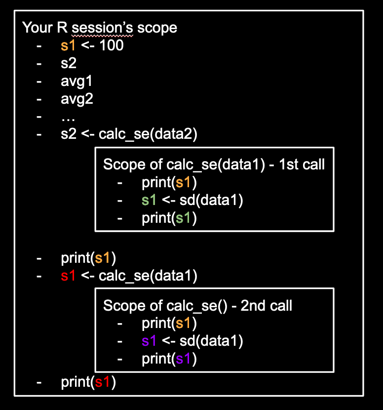

# Scope, Debugging, and the Importance of Naming

Let's say you wanted to validate all those calculations you did when
doing hypothesis testing with the 2 sample t-test.

In the 2 sample t-test, you need to calculate a few things,
like averages, standard deviations, then combining these things somehow.
To create fake data, you'll also need to specify some parameters as well.
It is very easy to get repeated names to conflict with one another.

We will use this to demonstrate an important concept in programming called "scope"
and also teach you how to debug. The code in this section will be intentionally written in an odd/incorrect
way to highlight these concepts.

#### Lightning review of hypothesis testing
A quick reminder, a hypothesis test is similar to a proof by contradiction
in mathematics but using data instead of logic. To disprove something,
we assume it's true, then collect some data. If
the assumption leads us to some improbably result in the data, we would then reject
the assumption.

In the 2 sample t-test, the assumption is often "the 2 groups have the same distribution"
and the result in the data is often the difference between the averages. Using our male vs female cops
example from our previous lesson, the distribution
can refer to the salaries between these two groups. Assume the two groups have the
same salary distribution would imply they have the same average salary. This allows us
to use the difference between the average salaries (of the groups) as a way to validate our assumption.

#### Recalling the 2 sample t-test
To validate whether hypothesis testing "works", you would likely replicate its
calculation in code first. The calculations goes as

```r
avg1 <- mean(data1)
avg2 <- mean(data2)

# Getting standard errors
sd1 <- sd(data1)
sd2 <- sd(data2)
s1 <- length(data1)
s2 <- length(data2)
se1 <- sd1 / sqrt(s1 - 1)
se2 <- sd2/ sqrt(s2 - 1)

test_stat <- (avg1 - avg2) / sqrt(se1^2 + se2^2)
```
- Notice that `data1` and `data2` are not defined so the code above won't run yet
- Notice there is a lot of redundant code
- We intentionally did not calculate a p-value to not distract from the main point

To fix the problems mentioned, we might revised the code as follows:
```r
# Create fake data
s1 <- 100
s2 <- 25
set.seed(1)
data1 <- rnorm(s1)
data2 <- rnorm(s2)

avg1 <- mean(data1)
avg2 <- mean(data2)

# Getting standard errors
calc_se <- function(data1){
    # The naming of s1 here is intentionally in conflict with our previous convention
    s1 <- sd(data1)
    ss1 <- length(data1) # ss = sample size
    return(s1 / sqrt(ss1 - 1))
}
s2 <- calc_se(data2)
# Here is yet another conflict of s1
s1 <- calc_se(data1)

test_stat <- (avg1 - avg2) / sqrt(s1^2 + s2^2)
```
- We created the fake data by choosing arbitrary sample sizes for the 2 samples
  then drew from the Standard Normal distribution. This simulation corresponds to the
  null hypothesis where "the distributions are the same between the 2 groups".
- We wrote a function to avoid the repetitive calculations with the Standard Error
- One major thing to notice is that the variable name `s1` is used at 3 different
  settings, we will elaborate on this issue.

#### The same variable name used at different places
From the example above, notice the 3 locations where `s1` is mentioned:
- as the sample size of the first sample with `s1 <- 100`
- as the sample standard deviation with  `s1 <- sd(data1)` within `calc_se()`
- as the standard error of the sample average with `s1 <- calc_se(data1)`

Recall that when we use the assignment operator, `<-`, the last one evaluated
will overwrite all the previous instances. But we have a twist because one
is defined within a function. So what order are each `s1 <-` actually evaluated?

More importantly, is the code with `calc_se()` equivalent to if we simply "copy/paste" the body
of the function outside? For example:

```r
# Create fake data
s1 <- 100
s2 <- 25
set.seed(1)
data1 <- rnorm(s1)
data2 <- rnorm(s2)

avg1 <- mean(data1)
avg2 <- mean(data2)

# Getting standard errors
# The code below replaces `s2 <- calc_se(data2)`
data1 <- data2
s1 <- sd(data1)
ss1 <- length(data1) # ss = sample size
s2 <- s1 / sqrt(ss1 - 1)
# The code below replaces `s1 <- calc_se(data1)`
data1 <- data1
s1 <- sd(data1)
ss1 <- length(data1) # ss = sample size
s1 <- s1 / sqrt(ss1 - 1)

test_stat <- (avg1 - avg2) / sqrt(s1^2 + s2^2)
```
- Notice we intentionally calculated the standard error for `data2` first to
  avoid overwriting the standard error for `data1`

#### Debugging 101 - Adding print statements
To understand the behavior of the code is the number 1 skill in debugging
code. At these times, people often inject `print()` statements at different
parts of the code to understand the order and context of the code. 

In the case where we "copy/pasted" the body of the function out, we
can simply add a `print()` statement before/after `s1` is redefined.
```r
# Create fake data
s1 <- 100
print(paste('s1 is now', s1))
s2 <- 25
set.seed(1)
data1 <- rnorm(s1)
data2 <- rnorm(s2)

avg1 <- mean(data1)
avg2 <- mean(data2)

# Getting standard errors
# The code below replaces `s2 <- calc_se(data2)`
data1 <- data2
s1 <- sd(data1)
print(paste('s1 is now', s1))
ss1 <- length(data1) # ss = sample size
s2 <- s1 / sqrt(ss1 - 1)
# The code below replaces `s1 <- calc_se(data1)`
data1 <- data1
s1 <- sd(data1)
print(paste('s1 is now', s1))
ss1 <- length(data1) # ss = sample size
s1 <- s1 / sqrt(ss1 - 1)
print(paste('s1 is now', s1))

test_stat <- (avg1 - avg2) / sqrt(s1^2 + s2^2)
```
The exercise above should be relatively straightforward since
we know the last assignment to `s1` will override all the previous
versions.

Now, let's try to add these print statements into the case with our function
`calc_se()` with a few additional print statements. Please **guess**
the value and order each of `print()` statements will return
below before running it:
```r
# Create fake data
s1 <- 100
print(paste('s1 is now', s1))
s2 <- 25
set.seed(1)
data1 <- rnorm(s1)
data2 <- rnorm(s2)

avg1 <- mean(data1)
avg2 <- mean(data2)

# Getting standard errors
calc_se <- function(data1){
    # The naming of s1 here is intentionally in conflict with our previous convention
    print(paste('inside the function: s1 is now', s1))
    s1 <- sd(data1)
    print(paste('inside the function: s1 is now', s1))
    ss1 <- length(data1) # ss = sample size
    return(s1 / sqrt(ss1 - 1))
}
print(paste('after calc_se definition s1 is now', s1))
s2 <- calc_se(data2)
print(paste('between calc_se calls, s1 is now', s1))
# Here is yet another conflict of s1
s1 <- calc_se(data1)
print(paste('finally, s1 is now', s1))

test_stat <- (avg1 - avg2) / sqrt(s1^2 + s2^2)
```

#### Order and Scope
If the code above was ran in order, you should have noticed 8
total messages from `print()`. We will explain each in order!

- The 1st should be `"s1 is now 100"` resulting from the sample size for `data1`
- The 2nd one should be the same `"after calc_se definition s1 is now 100"` from after the function.
  Although `calc_se()` defines `s1`
  in its code, the function was never called or executed but only **defined/assigned** (i.e.
  `calc_se <- function()`) so the print statement within
  the function did not print anything. It is imporatnt to know that functions in general
  are never executed when they are defined.
- The 3rd one should be `"inside the function: s1 is now 100"` which clearly is
  triggered by the line `s2 <- calc_se(data2)`. What is weird is that **within** the
  function, `s1` is not defined before the first `print()` so R will look for the
  value of `s1` outside the function! This is why this is equval to 100.
- The 4th one should be `"inside the function: s1 is now 1.24954405781837"`
  given that **within** the function, `s1` is now overwritten with the `sd(data2)`
- The 5th one should be `"between calc_se calls, s1 is now 100`. This is an important
  result because the assignment done in `calc_se()` did **NOT** affect the value
  of `s1` outside of the function. This implies running code within a function
  is **NOT** the same as simply copying the code out of the function (because in
  that case, `s1` would have been overwritten!).
- The 6th one should be `"inside the function: s1 is now 100"` which follows the
  same logic as the 3rd.
- The 7th one should be `"inside the function: s1 is now 1.09442278432299"` which
  follows the same logic as the 4th but because the data is different, the value is slightly
  different.
- The final one should be `"finally, s1 is now 0.109993628412588"`. This should be the
  value of the standard error for `data1` from our last call.

From the above explanation, there are 2 major concepts, order of code execution and
the concept of "scope".
- The order should be relatively straightforward once you know that function
  definition is different from function execution.
- The result from the 5th `print()` statement is due to what people call "scope" in programming.
  In essence, when the function is executing, it has its own set of variables available to
  its code and will not interfere with code executed outside the function.
  - There are exceptions to this rule of course but special code needs to be written
    for a function to influence variables outside of its "scope".
  - If you come from the CS background, R always copy by value so it is very rare for R
    to modify a global variable. 
- Warning, the behavior for a function to "look outside the function" is a R specific
  behavior. Some programming languages will simply throw an error saying `"s1 not found"`.

#### A graphical view of scope
To visualize the topic of scope, the following may help:


- Notice that during an assingment operation, the right hand side is evaluated first
  then the assignment happens.
- Notice that the two different calls to `calc_se()` will be in different scopes. This
  has implications about functions interacting with one another. In general, data is
  saved somewhere then different functions act on the saved data afterwards.

Exercise:
- What should happen if we re-calculate `s2 <- calc_se(data2)` right before `test_stat` is define? What would be printed?

#### Quick note on debugging and naming
In general, it's not a bad practice to add `print()` statements at different parts
of your code to make sure
- the class of the variable is what you expect (e.g. character vs numeric vs boolean when subsetting)
- the size of the data is what you expect (often people get 0 data when they expect lots of data)
- the value of the data (sometimes it's `NA` without you realizing it)

Notice that this potential confusion could be avoided if we named our variables better as well.
Better naming can really decrease the number of bugs in your code!


