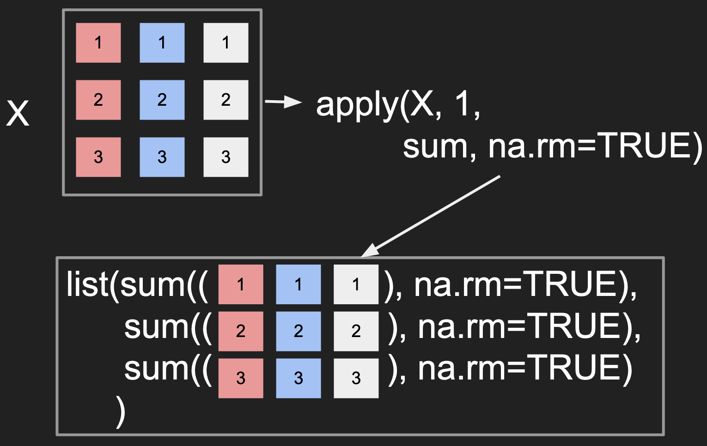
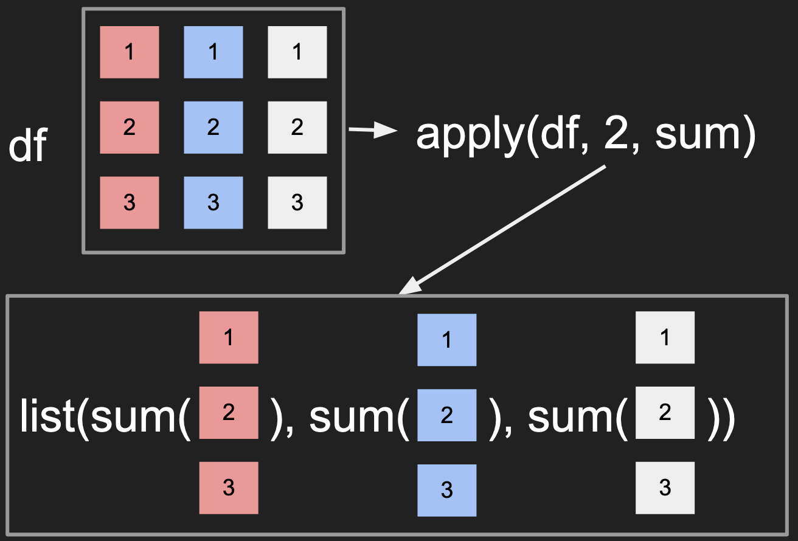
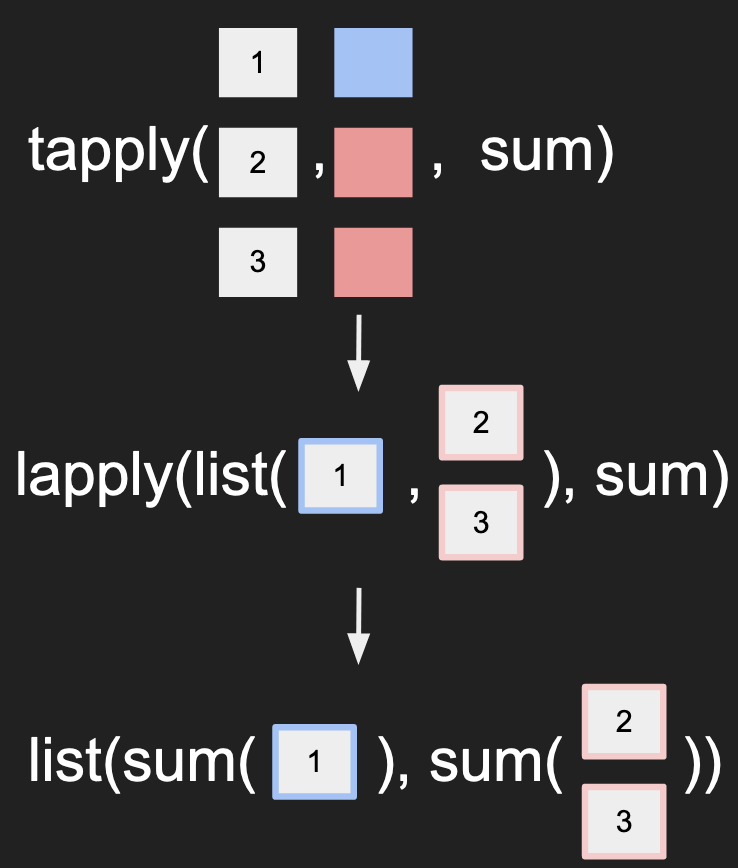

# Quickly summarizing data
Besides visualizing the data, we often want to summarize the data
across different dimensions as well.

To demonstrate this, we will re-introduce the classic [grain harvest data by Fisher](../data/fisher_1927_grain.csv).
This dataset contains the information
from a single year of harvest under different fertilizer treatments: amount,
timing, and type of fertilizer.

What's unique about this experiment is that Fisher also grouped the different
treatment plots into blocks on the field such that the different fertility
levels from different parts of the field would be controlled between treatments.


#### Exploring the dataset
```r
grain <- read.csv("fisher_1927_grian.csv")

dim(grain)

grain
```
What to notice?
- For each block, there are 4 control plots and 8 treatment plots, i.e. 12 plots per block
- The different treatment names are:
  - `top_dressing`: fertilizer amount, ranging from 0, 1, to 2.
  - `fertilizer_type`: main fertilizer chemical, sulphate or muriate
  - `timing`: the timing of applying the fertilizer, early or late
- The control plots have 0 fertilizer which is why their other treatments are blank.
- There are 8 different blocks.

#### Calculate summary statistics along different dimensions using apply()

To compare the different blocks, we could calculate the total yields
for each block. First try doing this with a for-loop:
```
block_columns <- paste0('block', 1:8)
block_totals <- rep(NA, length(block_columns))
for(block in seq_along(block_columns)){
    block_totals[i] <- sum(grain[, block])
}
names(block_totals) <- block_columns
block_totals
```
We used subsetting by character values to grab the different columns
from the data frame then changed the name of the vector to align with
the different columns.

Turns out we can do this in one line using `apply()`
```r
block_totals <- apply(grain[, block_columns], 2, sum)
block_totals
```
What to notice?
- The placeholder for the data is automatically generated in the background, this
  was somehow chosen to be a vector.
- `apply()` knew to apply the function, `sum`, through all the columns
- The names for the columns were passed down to the output

#### Elements of apply()
If you look at the documentation for `apply()`, you'll see something like `apply(X, MARGIN, FUNCTION, ...)`
- The data part
  - `X`: the main data that is often "rectangular" like a matrix or data frame.
  - `MARGIN`: the dimension(s) to preserve (as opposed to being aggregated by the function)
    or the dimension you are passing into the function as a "chunk" e.g. 1 corresponds to rows
    and 2 corresponds to columns
- The function part
  - `FUNCTION`: the function, e.g. `mean()`, `sd()` or a custom-defined function that will take in
    the different "chunks" of data as the first argument.
  - `...`: not literally typing in `...` into `apply()` but this represents you can pass in **arbitrary**
    number of arguments separated by `,` that will be passed to `FUNCTION` by name or order, e.g. `size` and `replace` in `sample()`.
    Since the chunk of data is the first argument, these arguments will be the second and on.

Below are 2 different visualizations for how `apply()` works:
Applying a function across the data in the rows


Applying a function across the data in the columns


- Notice how the `MARGIN` controls whether the columns or rows are passed to the function.
- The visualization suggests that the output should be a `list`, there is some extra logic
  that actually simplifies the output to a simple vector here.

[Exercise](../exercises/r_apply.md)

#### Apply a function on records that satisfy a condition
For the Fisher dataset, Fisher also wants to calculate the total yield from all the plots
that had "sulphate" vs "muriate". This way we can calculate the difference
to then derive the average treatment effect.

To accomplish this calculation, we can first calculate the row totals then perform a for-loop
```r
block_columns <- paste0('block', 1:8)
row_totals <- apply(grain[, block_columns], 1, sum)
fert_types <- unique(grain$fertilizer_type)
trt_totals <- rep(0, length(fert_types))
for(i in seq_along(fert_types)){
    condition <- grain$fertilizer_type == fert_types[i]
    trt_totals[i] <- sum(row_totals[condition])
}
names(trt_totals) <- fert_types
```
Notice that the "non-treatment" case also is captured.

Turns out this also can be done with one line.
```r
block_columns <- paste0('block', 1:8)
row_totals <- apply(grain[, block_columns], 1, sum)
trt_totals <- tapply(row_totals, grain$fertilizer_type, sum)
trt_totals
```
Similar to `apply()`, `tapply()` is a different function that applies the function to
a particular chunk of the data. It also passes the names from the conditions to
the final output.

You can also get the totals by cross multiple factors
```r
block_columns <- paste0('block', 1:8)
row_totals <- apply(grain[, block_columns], 1, sum)
trt_totals <- tapply(row_totals, list(grain$fertilizer_type,
                                      grain$timing), sum)
trt_totals
```

#### Elements of tapply()
If you look at the documentation for `tapply()`, you'll see something like `tapply(X, INDEX, FUNCTION, ...)`
- The data part
  - `X`: the data is a vector of length n
  - `INDEX`: this is a factor vector OR a list of factors. Each factor must be of length n (same as
    `X`) so the subsetting (as done in the for-loop) is possible.
- The function part
  - `FUNCTION`: the function, e.g. `mean()`, `sd()` or a custom-defined function that will take in
    the different "chunks" of data as the first argument.
  - `...`: not literally typing in `...` into `apply()` but this represents you can pass in **arbitrary**
    number of arguments separated by `,` that will be passed to `FUNCTION` by name or order, e.g. `size` and `replace` in `sample()`.
    Since the chunk of data is the first argument, these arguments will be the second and on.

Here's a way to visualize how `tapply()` works:


[Exercise](../exercises/r_tapply.md)

#### Working on multiple columns using aggregate()
Notice how `tapply()` required us to calcuate the row totals first but it's
possible that we wanted to perform the calculation on each block separately.

To accomplish this, we can use aggregate()
```r
block_columns <- paste0('block', 1:8)
block_trt_totals <- aggregate(grain[, block_columns], grain['fertilizer_type'], sum)
block_trt_totals
```
- You should replace `grain['fertilizer_type']` with `grain$fertilizer_type` and see what error gets returned.
  Given data frames are a special case of lists, does that explain the behavior above?
- Notice instead of the unique values becoming the names of the output, the
  values become a distinct column instead.

`aggregate()` is very similar to `tapply()` except that the data argument can be
a matrix or data frame with multiple columns instead of just a single vector.

You can also pass multiple factors as well, please notice how the output is different from `tapply()`
```r
block_columns <- paste0('block', 1:8)
block_trt_totals <- aggregate(grain[, block_columns],
                              grain[c('fertilizer_type', 'timing')],
                              sum)
block_trt_totals
```

#### Review
- Overall we introduced `apply()`, `tapply()`, and `aggregate()` as ways to apply
  functions onto different "chunks" of data that has a rectangular format.
- Relative to for-loops, these functions work more in a parallel fashion rather
  than a sequential manner like a for-loop. Understanding these functions will help you understand how
  big data methods (map/reduce) behave in the future.



