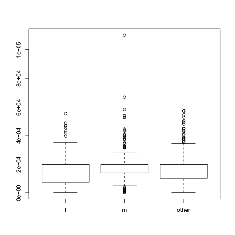
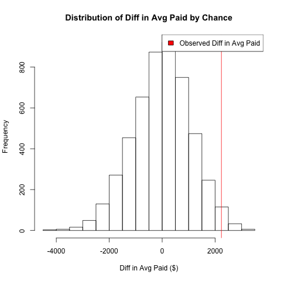

# Simulating statistical phenomena
The final problem is for us to see how our computational skills can allow us to
use a more diverse set of statistical techniques.

Rather than focusing on new functions and new types of data, the goal is to expose
you to "thinking backwards" through these problems.

#### Validating our calculations with simulation
Most probability calculations you've done are likely based on the fact
that each outcome is equally likely. For example, what is the probability
that you get 2 heads out of 4 (fair) coin tosses?

Each possible coin toss outcome has a chance of $$\frac{1}{2^4}$$ of appearing
and there are 4 choose 2 (i.e. $$\frac{4!}{2!(4-2)!} = 6$$) ways to have 2 heads appearing so
this results in a probability of $$0.375$$

How could we confirm this with a simulation? Recall that the probability
of an event is how frequent does it appear over repeated trials.
So to confirm this calculation, we need to simulate 4 coin tosses and see
what fraction result in 2 heads.


#### How to formulate the simulation?
This is where it's best to work backwards!

We want to measure the fraction of 4 coin tosses that have 2 heads exactly.
- The final step is to calculate the fraction of something equalling to 2.
  ```r
  mean(outcome == 2)
  ```
This immediately implies we need to define what `outcome` should be.
Outcome should be a container where each element contains the event of interest.
The event is just the number of heads out of 4 coin tosses, something we can code up as:
```r
coin <- c('head', 'tail')
tosses <- sample(coin, 4, replace=TRUE)
num_heads <- sum(tosses == 'head')
```

To link these two chunks of code, we know that `outcome` should contain the 
different realizations from repeating this event. Given this is quite repetitive,
hopefully you're thinking of using a for-loop to connect the pieces.
```r
B <- 10000
outcome <- rep(NA, B)
for(i in seq_len(B)){
    coin <- c('head', 'tail')
    tosses <- sample(coin, 4, replace=TRUE)
    num_heads <- sum(tosses == 'head')
    outcome[i] <- num_heads
}
mean(outcome == 2)
```
- The value should be quite close to $$0.375$$ (and should get closer if you increase `B`).
- We chose `outcome` to be initiated as a vector BECAUSE `num_heads` was a single number. 
  - If the outcome you chose could have a different length from loop to loop, you would want to
    set `outcome` as a `list()` since that's the only data type we taught that can hold data with
    varying lengths.
- Our example did not require us to perform the calculation, only required
  us to create the event repeatedly. We could get very close to the true answer
  without any mathematics. Many real life problems are modeled this way!

Exercise TBM

#### Testing pay inequality
There's a common belief that there's a pay-gap between men and women.
Let's see if we can detect it in the [NYC Payroll Information](https://data.cityofnewyork.us/City-Government/Citywide-Payroll-Data-Fiscal-Year-/k397-673e)
in 2019, for anyone who started in Jan 2019 under the Police Department.
I've also inferred the gender based on the first name to create a [dataset here](../data/processed_nyc_payroll_201901.csv).

Let's first look at the [dataset](../data/processed_nyc_payroll_201901.csv)
and create a variable that contains all the different types of payment called `total_paid`
```r
df <- read.csv("processed_nyc_payroll_201901.csv", stringsAsFactors=FALSE)
head(df, 3)
range(df$fiscal_year)
table(df$gender_from_name)
pay_types <- c("regular_gross_paid", "total_ot_paid", "total_other_pay")
df['total_paid'] <- apply(df[, pay_types], 1, sum)
boxplot(df$total_paid ~ df$gender_from_name)
```



#### Re-visiting Hypothesis Testing logic
To detect this inequality, we will assume the payroll distributions are equal, then
calculate statistics based on the data that demonstrate that the assumption is highly
implausible. This is the basic flow of hypothesis testing which is similar to a proof by
contradiction.

Given that we're assuming the pay between men and women are the same, i.e.
they have the same distribution, then the average pay must also be the same.
```r
avg_total_pays <- tapply(df$total_paid, df$gender_from_name, mean)
observed_diff <- avg_total_pays['m'] - avg_total_pays['f']
# 2236.717
```
Under our assumption, any difference we're observing must be due to chance.

To validate this statement, let's introduce chance into the data!
To do this, we can randomly assign the gender to the original values in `total_paid`
and re-calculate the average difference.
```r
permuted_gender <- sample(df$gender_from_name)
perm_avg_total_pays <- tapply(df$total_paid, permuted_gender, mean)
permuted_diff <- perm_avg_total_pays['m'] - perm_avg_total_pays['f']
permuted_diff
```
- You should get a different number each time you calculate that difference.
- `sample()` will give a random order to the provided values, the total number
  of men vs women vs others will remain the same.
- From a single difference, we cannot really see the distribution.

If we repeat this calculation, we can get a sense of what would the salary differences
look like if the salaries' relationship with gender were "random".
```r
B <- 5000
permuted_diffs <- rep(NA, B)
for(i in seq_len(B)){
    permuted_gender <- sample(df$gender_from_name)
    perm_avg_total_pays <- tapply(df$total_paid, permuted_gender, mean)
    permuted_diffs[i] <- perm_avg_total_pays['m'] - perm_avg_total_pays['f']
}
hist(permuted_diffs, xlab="Diff in Avg Paid ($)",
     main="Distribution of Diff in Avg Paid by Chance")
abline(v=observed_diff, col="red")
legend('topright', legend='Observed Diff in Avg Paid', fill='red')
```

- If the relationship between `total_paid` and gender is random, the distribution
  of the **difference** in average paid should center around 0 between men and women.
- The key is the contrast between the distribution and the actual difference from
  the original data. If the difference from the original data is an outlier, that would
  act against the assumption that the difference we've observed was due to chance.

To calculate a p-value (if you must), you can simply calculate how many randomized
differences were more extreme than the original difference.
```r
permutation_p_val <- mean(abs(permuted_diffs) >= abs(observed_diff))
permutation_p_val
```
We would then compare this value against our usual 5% significance level to see
if we would reject our null hypothesis.

Small reminder about hypothesis testing! Not rejecting, i.e. p-value greater than 5%
does not prove the null hypothesis.
The logic is similar to saying it's not sunny outside your window does
not does imply it's raining in your neighborhood.


#### Summary of permutation test 
What we did was called a permutation test. Intuitively, we compared a statistic based
on data vs the statistic based on a simulation that forced the gender and pay to be independent.
If they disagree, then we would reject the idea that the data is similar to the case
where gender and pay are independent.

If you want to align this with the t-test we taught you before, here are the logical steps:
- Our null hypothesis was that the variable of interest, e.g. total pay, have the same
  distribution between the two populations.
- If the distributions are the same, then the average from these distributions must be the same.
- If the averages are the same, their difference is expected to be 0. But due
  to chance, the actual difference is unlikely exactly 0.
- To simulate the behavior of "the difference due to chance", we permuted the popular labels,
  e.g. men vs women, and re-calculating the difference in average. This forcefully breaks
  any correlation between the variable of interest with the different populations.
- We repeated the above step many times to get the **distribution** of "the difference due to chance"
- By comparing the distribution vs the actual difference, we can assess how unlikely it
  was to observe the actual difference just by chance. 
- To formalize this comparison, we use the p-value by counting the number of simulated cases
  that are as extreme or the same as our actual difference.

WARNING: If the relationship is not random, there are many reasons why a difference can surface.
Sometimes we attribute the difference to a hypothesis we are rooting for (e.g. discrimination)
but the story is almost always more complicated than that.


