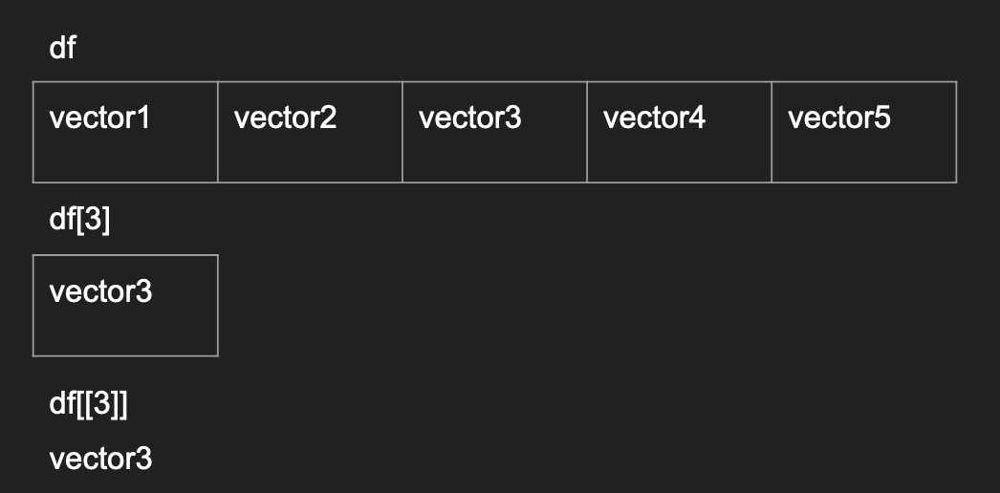

# Data Frames in R

#### Containers of data - Overview
A special class of data is a collection of other types of data. The main examples are

|Container Type|All elements the same type|Rectangular data|Flexibility|
|---|---|---|---|
|vector|Yes| NA|Low|
|matrix|Yes|Yes|Low|
|**data frame**| Only within column| Yes|Medium|
|list|No|No|High|

#### Containers - data frames
```r
df <- read.csv("~/Downloads/fisher_1927_straw.csv")
class(df)
```

The beginning of modern statistics: Fisher in 1927


#### Side Note - common mistakes when reading in data
- Your working directory is not where you think it is
  Be sure you know which folder R is operating from in your computer
  ```r
  getwd()
  list.files()
  ```
- Misspelling file names, case matters and copy/paste __can be__ your friend
  ```r
  df <- read.csv("~/Downloads/fIsher_1927_straw.csv")
  list.files()
  ```
- Actual format vs exntenion are not correct. We will talk about this in the future

#### Attributes and properties of data frames
- dimension
- data type of each column
- column/row names
- behaves like a list with structure (we will expand on this in the future)
```r
dim(df)
str(df)
names(df)
rownames(df)

num_grades <- c(99, 92, 60)
letter_grades <- c("A", "A", "C-")
grades <- data.frame(num_grades, letter_grades)
# Guess!
```

#### Subsetting data frames with `[ , ]` with indices
- Before the comma represents the **row**
- After the comma represents the **column**

```r
df[1, ]
df[, 2]
df[3, 3]
df[, c(1, 2, 3)]

df[c(1, 2), c(1, 2)]
# Guess?
```

#### Subsetting data frames with `[ , ]` with names
- Before the comma represents the **row**
- After the comma represents the **column**

```r
df[, "block5"]
treatments <- c("top_dressing", "fertilizer_type", "timing")
df[, treatments]

df[c("1", "3"), ]
```

#### Subsetting data frames with `[ , ]` with TRUE/FALSE
- Before the comma represents the **row**
- After the comma represents the **column**

```r
early <- df[, "timing"] == "early"
df[early, "block1"]
```

Notice we used `==` to compare equality between a vector and a single character value!

#### `[]` vs `[[]]` using a single index
- `[]` will return the same data type as before subsetting
- `[[]]` will return the element within the container (if allowed)



Run these to see how the data frame structure is preserved vs not
```r
df
df[3]
df[[3]]
```

#### Using `$` as a shorthand `[[]]` with column names in data frames
```r
df$block1

df[[paste0('block', 1)]]

df$paste0('block', 1) # this should fail!
```

Imagine trying to get all of the columns with the word "block" in them.

#### Common mistakes with data frames
- Misspelling names
  ```r
  df[['blcok1']]
  ```
- Expecting a data frame after subsetting but resulting in a vector
  ```r
  df[, 1]
  ```
- Manipulating data frames with different dimensions

#### Common EDA patterns with unknown data frames
- `head(df)` and `tail(df)`
- `dim(df)`
- `str(df)`
- You should resist the temptation to see all the records


#### Exercise - Aggregate data from different fertility treatments
Knowing the `summary()` function can give you the summary of a particular data type, try out the following:

```r
summary(df)
summary(df[, 1])
summary(df$block3)
```

How would you get the sum of all blocks with "early" treatment?
- hint: break up the steps and work backwards.
