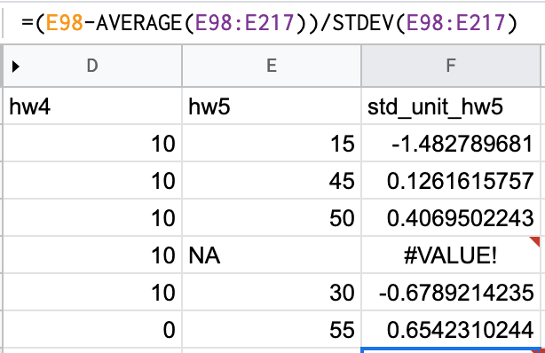

# Different types of data

#### Goal - Know about data types and their importance
- The source of many, many, many, many issues in industry and in classes
- Understanding data types is how you understand expected behavior of functions
- Constraints from the data will also constrain the possible errors
- Building block for more complex data structures

#### Basic data types - Overview
- numeric (Continuous or discrete)
- character
- factor (Categorical)
- boolean (TRUE/FALSE)
- Not Available (NA)

#### Basic data type - numerics
Most quantitative data.
```r
num_demo <- 1.2
class(num_demo)
num_demo + 2

tval <- 1.96
3 - tval * num_demo
# Guess the output!
(3 - tval) * num_demo
```

#### Basic data type - characters
Text data like news.
```r
char_demo <- "All is well! Missiles launched from Iran ..."
class(char_demo)
# [1] "character"

"Iran" %in% char_demo
# [1] TRUE
```

- How would you split the string by white spaces?

#### Basic data type - factors
Categorical data like membership to a group, e.g. male/female.
Useful for creating box-plots or splitting the data.
```r
fac_demo <- factor("male", levels=c("male", "female"))
class(fac_demo)
# [1] "factor"
fac_demo
# [1] male
# Levels: male female
```

#### Basic data type - booleans
TRUE/FALSE, usually intermediate data to filter data or control the program, e.g. if the data point is an outlier, remove it.

```r
bool_demo1 <- 1 > 2
bool_demo2 <- TRUE
class(bool_demo1)
# [1] "logical"

bool_demo1
# FALSE
bool_demo2
# TRUE
bool_demo1 + bool_demo2
bool_demo1 & bool_demo2
bool_demo1 | bool_demo2
# Guess!
```

#### Basic data type - Not Available (NA)
The main value for **missing data**
```r
na_demo <- NA
na_demo + 1
paste0(na_demo, "One")
class(na_demo)
```

#### How to deal with missing values depends on the problem
Example: 
Term Frequency Matrix (rows are different documents and columns are words)


Example: Calculating grade averages



#### Example - figuring out the data type of a variable
```r
var1 <- "1"
class(var1)
```

#### Example - R has a lot of built-in mathematical operations by default

Just like a normal calculator
```r
log(1)
sin(pi)
```

This is not true for Python


#### Example - constraint from data types will constrain the error
```r
var1 <- "1"
var2 <- 2
var1 + var2
# Error in var1 + var2 : non-numeric argument to binary operator
```

#### Common errors - "non-numeric argument to binary operator"
- Binary operators are functions that take in 2 inputs, one each from its left and right: e.g. `"*", "+", ">"`

Try out the following: the behavior may not be what you expect!
```r
1 * "12"
"a" > "A"
2 - TRUE
TRUE * FALSE
FALSE + FALSE
FALSE - TRUE
TRUE > FALSE
```

#### Common misunderstandings - truncation in R output vs numerical stability
Examples like 
```r
(1e-7 + 10) * 1e7
(1e-7 + 10) * 1e7 - 1e8
```

which is different from the underflow/overflow issue a.k.a. numerical stability issues
```r
1e-20 + 1e-8 - 1e-8
1e-20 * 1e-10
1e-20 * 1e-10 + 1e-8 - 1e-8
```

Key message:
- Computers are not perfect, different computers are also different. This is why people ask for your computer specifications when you report issues.
- This explains why we perform certain operations on data even though it does not change the problem mathematically, e.g. maximizing log(P(X)) vs maximizing P(X)
