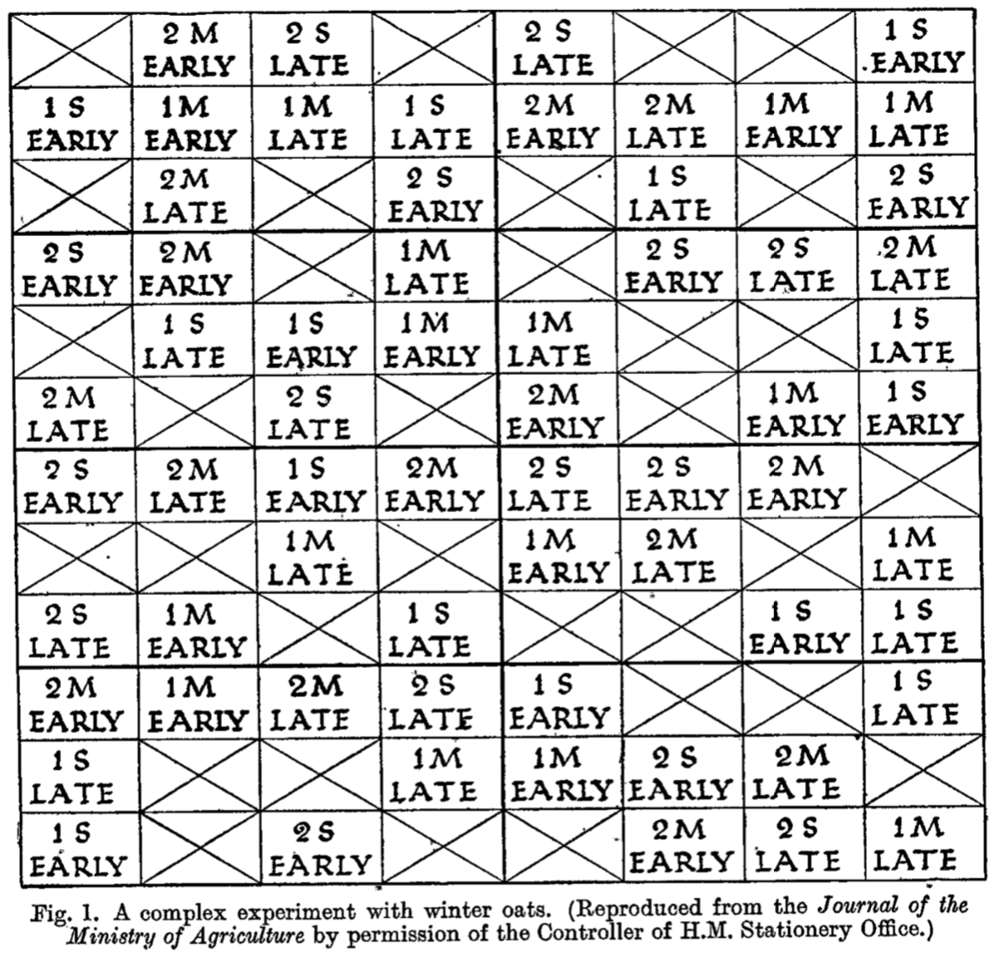
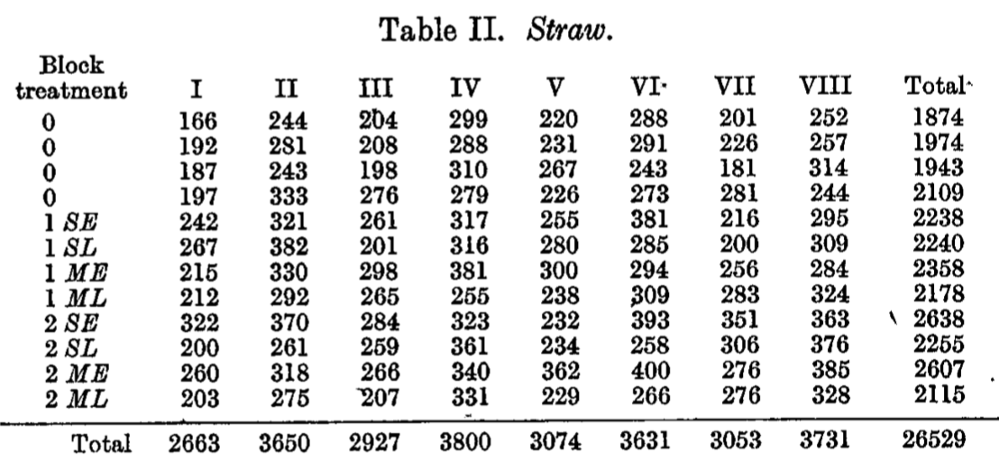
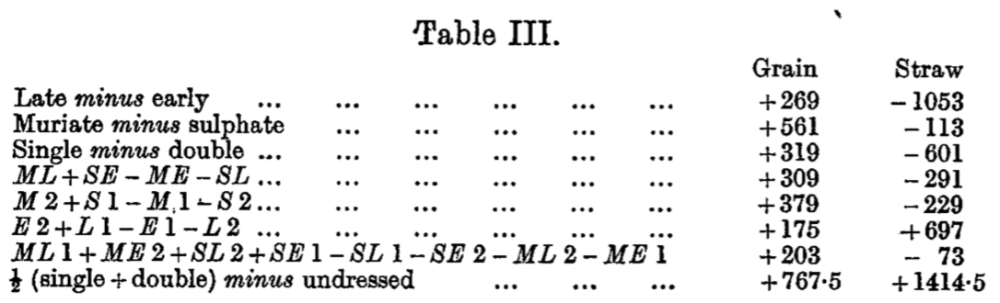

# Recreating Fisher's ANOVA experiment in Spreadsheets vs R

#### Learning objectives
- Breakdown steps required in standard computing
-

#### The first randomized controlled experiment with more than one treatment!
The beginning of modern statistics:
- Studies in crop variation: IV The experimental determination of the value of top dressing with cereals by T. Eden, R. A. Fisher, 1927, The Journal of Agricultural Science




#### Warm-up tasks, recreating historical calculations

- Task1: Try recreating Fisher's results with [his straw data (in 0.5 of pounds)](https://docs.google.com/spreadsheets/d/1sUbW8UlqfjmMN1U8F1y0-x4aM9W8UBePiQhje6LOGpg/edit?usp=sharing) and [grain data in 1/8 of pounds](https://docs.google.com/spreadsheets/d/1sUbW8UlqfjmMN1U8F1y0-x4aM9W8UBePiQhje6LOGpg/edit?usp=sharing) using Spreadsheets (i.e. Google Drive).

- Task2: Try recreating the first 3 differences for **grain**


#### Key programming skill: Working backwards from the specifications

Requirement:
- Reproduce the first 3 numbers behind Table III for grain.

Start with drawing a diagram going backwards from the desired final outcome.

#### Concepts required!
- **Aggregating** data
- **filtered** specific rows
- **subsetting** specific columns
- **repeating** similar calculations
- **reading** in data

#### Reading in the data
Place the downloaded data into your `Download` folder
```
df <- read.csv("~/Downloads/fisher_1927_grain.csv",          
               na.strings="")
```

Here we've already used several concepts:
- Created a variable called `df`
- Assigned the output from `read.csv()` to a variable called `df`
- Passed multiple inputs to the function `read.csv()`


#### Side Note - common mistakes when reading in data
- Your working directory (often abbreviated as "wd") is not where you think it is.
  Be sure you know which folder R is operating from in your computer
  ```
  getwd()
  list.files()
  # you can change the wd to the Desktop using the following
  setwd("~/Desktop")
  ```
- Misspelling file names, case matters and copy/paste __can be__ your friend
  ```
  df <- read.csv("~/Downloads/Fisher_1927_grain.csv")
  list.files()
  ```

#### How could you stress test this piece of code so far?
df often stands for "data frame"

```
df <- read.csv("~/Downloads/fisher_1927_grain.csv",
               na.strings="")
```

Notice what errors might be returned:
- double quotes to single quotes
- Not closing the parentheses
- Capitalization of the function name
- using `=` instead of `<-`
- Changing the variable name
- ...

#### How to examine a data frame
```
dim(df)
head(df)
colnames(df)
rownames(df)
```

Why not examine all the data?
```
df
print(df)
```

#### Properties of a data frame
- Rectangular, i.e. each column has the same number of rows
- Different columns can have different "types" of data
- Column names are often meaningful
- Rows often represent different records

#### Subsetting a column using a single value
Assume we're worknig with the `timing` column
- Using indices
  ```
  timing <- df[, 3]
  ```
- Using column names
  ```
  timing <- df[, "timing"]
  ```

Entered nothing before the comma implies "all rows", i.e. no filtering/subsetting.

Which method of subsetting is preferable?

#### Subsetting a row using a single value
Similarly, we can subset a row out of the data frame
- Using indices
  ```
  row <- df[1, ]
  ```
- Using column names
  ```
  rownames(df)
  row <- df["3", ]
  ```
Again, nothing after the comma implies "all columns"

#### Subsetting columns using multiple values (vectors)
We want to only work with the part under "blockX" in the data frame. To do this, we can subset using

- Column names (character vector)
```
block_cols <- c("block1", "block2", "block3", "block4",
                "block5", "block6", "block7", "block8")
yield <- df[, block_cols]
```
- Indices of the columns (numerical vector)
```
block_cols <- 4:11
yield <- df[, block_cols]
```
- TRUE/FALSE vectors (boolean vector)
```
block_cols <- grepl("block", colnames(df))
yield <- df[, block_cols]
```

- Note that `block_cols` is a vector of 3 different types of data in the 3 examples above

#### Properties of vectors
- One dimensional with finite elements, check the length using `length(VEC)`
- Can only have one type of data, check the type using `class(VEC)`
- Can be constructed using `c(1, 2, -5)`
- A convenient short hand for a vector of consecutive integers is `START:END`
- To insert values into a vector, you can
  ```
  place_holder <- c()
  place_holder[1] <- pi
  place_holder[3] <- -pi
  ```

#### How to stress test vector creation?
```
-5:2
2:-5
c("1", 2, 3)
(1, 2, 3)
demo_vec <- 1:3
length(demo_vec)
```

#### For-loop - avoid repetition in "blockX"?
For-loops are an easy way to repeat steps efficiently
```
block_cols <- c()
for(i in 1:8){
  block_cols[i] <- paste0('block', i)
}
block_cols
```

#### Exercise - getting the sum of row using a for-loop?
To get the sum of a collection of numbers, pass them into `sum()`

For example:
```
sum(1:100)
```

How would you get the sum of each row from Fisher's data now?
Hint:
- What happens when you try to subset the columns and rows together?
- Add up the numbers
- Repeat the process using for-loops
- Compare your results with your Spreadsheet results

#### Subsetting vectors
You can also subset vectors similarly as data frames using other vectors
```
vec_demo <- 1:5
vec_demo[3]
vec_demo[vec_demo > 3]
```

#### A single value is a vector of one value
Note that a single numeric value is just a vector of length 1
```
a <- 1
length(a)
a[1]
```
#### Overview of boolean operations

|Code|Operation| Example|
|---|---|---|
|`>`|greater|`vec_demo <- 1:5`<br>`vec_demo > 2`|
|`==`|equal|`vec_demo <- c("A", "B", "B")`<br>`vec_demo == "A"`|
|`>=`|greater or equal|`vec_demo <- 1:5`<br>`vec >= 2`|
|`!=`|Not equal|`vec_demo <- c("A", "B", "B")`<br>`vec_demo != "A"`|
|`&`|and|`vec_demo <- 1:5`<br> `(vec_demo > 2) & (vec_demo >= 2)`|
|`|`|or|`vec_demo <- 1:5`<br> `(vec_demo > 2) | (vec_demo >= 2)`|

#### Exercise - getting the different row sums
How can we add up the row sums corresponding to just the `early` treatments?
Now repeat it for the `late` treatments!

#### Try repeating the calculation over the other treatments
```
trts <- c("timing", "top_dressing", "fertilizer_type")
fertilized <- df[, "top_dressnig"] > 0
df_fert <- df[fertilized, ]
for(trt in trts){
   ????
}

```
No need to get sign correct, i.e. you simply need to get the absolute value correct!

Hint:
- You can get the different treatments via `levels(df[, "timing"])` then loop over those 2 values.

#### Writing functions to convert the units

The data is in 0.5 pounds if it's straw and 1/8 pounds if it's grain. To convert the units, we can write a function to do this for us.

```
unit_converter <- function(raw_data, scale=0.5){
  return(half_pound * scale)
}
```
- Function name
- Required inputs
- Optional units
- Returned values
