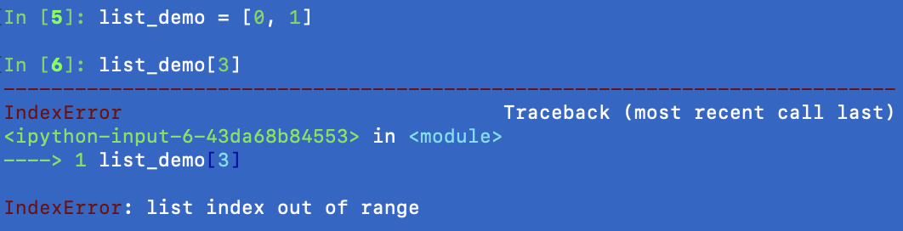
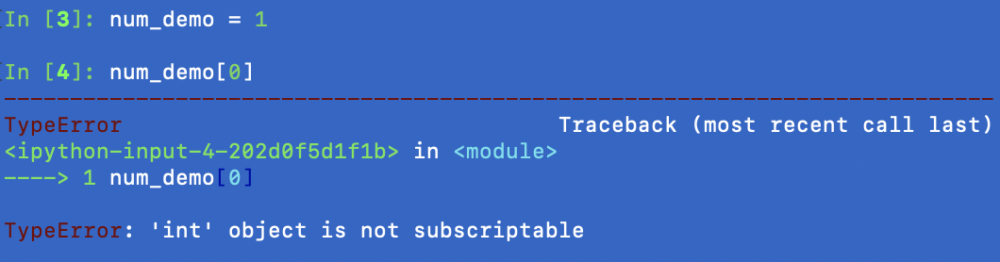

# Vectors in R

#### Containers of data - Overview
A special class of data is a collection of other types of data. The main examples are

|Container Type|All elements the same type|Rectangular data|Flexibility|
|---|---|---|---|
| **vector** |Yes| NA|Low|
|matrix|Yes|Yes|Low|
|data frame| Only within column| Yes|Medium|
|list|No|No|High|

#### Containers - vectors
```r
sec1_grades <- c(99, 92, 60)
sec2_grades <- c(50, 70, 80)

# c() also simplifies
c(sec1_grades, sec2_grades)
```

#### Attributes and properties of vectors
- Length
- Data type within the vector
- vectorized calculations

```r
num_vec <- c(2, 4, -1, 0.3)
char_vec <- c("statistical", "computing")

length(char_vec)
class(char_vec)
num_vec * -1

# A common trick with boolean vectors
bool_vec <- num_vec > 0
sum(bool_vec)
```

#### Subsetting vectors with `[]`
Subsetting vectors in **R** uses `[ ]` via
- integers vector (can be of different length)
- boolean vector (__should__ be of the same length)

```r
num_demo <- c(1, 2, 3, 4)

num_demo[c(3, 4)]
num_demo[num_demo >= 3]
```
What do I mean by "should"?

#### Vectorized operations
Notice how we compared a vector to a single value and R compared each element to the single value.

```r
num_demo <- c(1, 2, 3, 4)

num_demo >= 3
# [1] FALSE FALSE  TRUE  TRUE
num_demo * -1
# [1] -1 -2 -3 -4
num_demo * c(1, 2)
# ???
```

What else should you try?

#### Common mistakes with vectors - out of range
Subsetting values outside of range:
```r
num_vec <- c(3, 1)
num_vec[3]
# Guess?
```

In **Python**, an error will be thrown


#### `[ ]` vs `[[ ]]` in **R**
The python behavior is closer to `[[ ]]`
```r
num_vec <- c(3, 1, 2)
num_vec[3]
num_vec[[3]]
```
This difference will make more sense once we start talking about `list()` in **R**.

#### The Empty vector

This is common for creating a place holder for data.
```r
place_holder <- c()
for(j in 1:5){
    place_holder[j] <- j / 2
}
place_holder 
```

#### Common mistakes with vectors - mixing data types
```r
typo_vec <- c(1, "NA")
typo_vec - 1
# Guess?
```

Vectors can only have one data type!

#### Common mistakes with vectors - forgetting the function name

```r
demo_vec <- (1, 2)
# Error: unexpected ',' in "(1,"
```

#### Special note on R vectors
The single value data examples are actually length 1 vectors!
```r
num_demo <- 3.14
num_demo[1]
# [1] 3.14
```

In **Python**, this is NOT true!


In general, it's better to think about containers separately from the elements themselves.

#### Exercise - aggregation and filtering
For each line, identify the type and length of the vector
```r
pos_nums <- c(1, 1, 1, 1, 100, 1)
med <- median(pos_nums)
not_outlier <- pos_nums <= (2 * med)
num_not_outlier <- sum(not_outlier)
clean_nums <- pos_nums[not_outlier]
```
