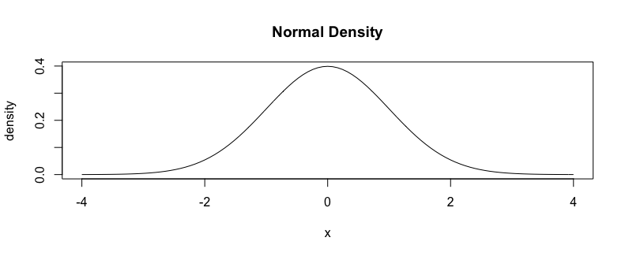

# Built-in Functions in R

#### Elements of a functions
```r
log(10, base=10)
```

- function name:
- required function arguments:
- optional function arguments:

#### Get the documentation of a function via `?FUN`
```r
?log
?summary
```
- Arguments
- Output
- Examples
- Might work on different data types

#### Error messages from functions
```r
log(-2)
log("2")
```
- Errors vs warnings
- Always read the error message
- Always check your understanding of the function against the documentation

#### Practice with `sample()`
`sample(c("HEAD", "TAIL"), 10, replace=FALSE)`

What are type of arguments are each of these and what is data type of the output?

What should `sample(c(1, 2, 3, 4, 5))` return?

#### Common optional argument in R
`mean(c(1, 2, NA))`

- Missing values in R are "contagious"
- How does the argument `na.rm=TRUE` change the output?

#### Where statistics gets fun: random variables as non-deterministic functions


- `rnorm()`
- `dnorm()`
- `pnorm()`
- `qnorm()`

#### How would you stress test the Normal functions?
Start with what you know then work backwards, what do you know mathematically about a standard normal?
  - Center
  - Spread
  - Specific percentiles?

#### Making non-deterministic functions deterministic
```r
set.seed(444)
rnorm(1)
rnorm(1)
rnorm(1)
set.seed(444)
rnorm(1)
rnorm(1)
set.seed(444)
# guess the output of
# rnorm(2)
```

#### Order matters when setting the seed
```r
set.seed(444)
sample(c(1, 2, 3, 4, 5))
rnorm(2)
```
