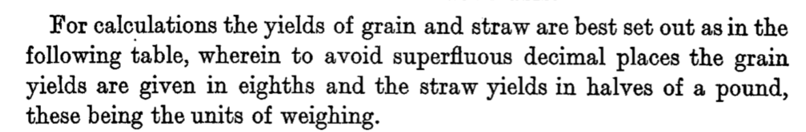
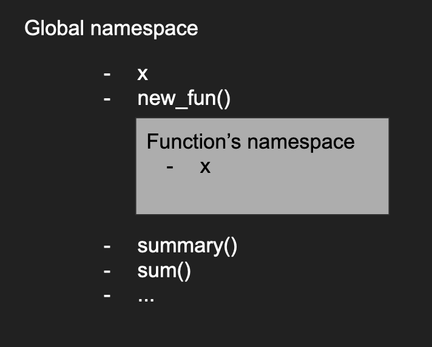

# Write your own functions in R

#### Elements of writing your own function
```r
scale_sum <- function(num1, num2, scale=1) {
  num_element_sum <- num1 + num2
  return(scale * num_element_sum)
}
```
- function name and arguments
- curly brackets
- function body
- return output


#### Practice
Fisher said his straw data was in a non-standard unit to preserve numerical accuracy, how do we get pounds back?



Please write the function that would take in the number from Fisher's data, then output the correct data in pounds.
- What would be a good name?
- What data type does your function expect?
- What data type should be returned?

```r
straw <- read.table("~/Downloads/fisher_1927_straw.csv")


```

#### Scope the environment in which the variable is defined
```r
outside_x <- 3
new_fun <- function(fun_x) {
  fun_x <- 3 * fun_x
  return(fun_x)
}
outside_x
```
Now what happens if we get rid of the prefix and name everything `x`?

#### Scope the environment in which the variable is defined
```r
x <- 3
new_fun <- function(x) {
  x <- 3 * x
  return(x)
}
x
```




#### Practice
Please explain what values in what order do you expect the following code to produce?

```r
z <- 1
print(z)
my_fun <- function(z){
  print(z)
  x = z + 1
  z = 2 * x
  print(z)
  return(z)
}
print(z)
z <- my_fun(10)
print(z)
```

#### Scope matters because it can hurt if you're not careful

It is common to forget that an identically-named variable is defined outside the function

```r
X <- 1.1
scale <- function(x) {
  return(x * X)
}
scale(2)
```

#### It's always better to pass the variable explicitly

```r
X <- 1.1
scale <- function(x, X) {
  return(x * X)
}
scale(2, 2)
```

#### Variables defined inside a function are not accessible outside of it

```r
f2c <- function(deg_f){
  deg_f_from_freeze <- deg_f - 32
  deg_c <- deg_f_from_freeze * 5 / 9
  return(deg_c)
}
f2c(60)
deg_c # deg_c was only defined within f2c
```


#### Common errors when writing your functions
- Referencing variables outside of your function
- Typos of variable names
- brackets are missing
- No `return()` statement
