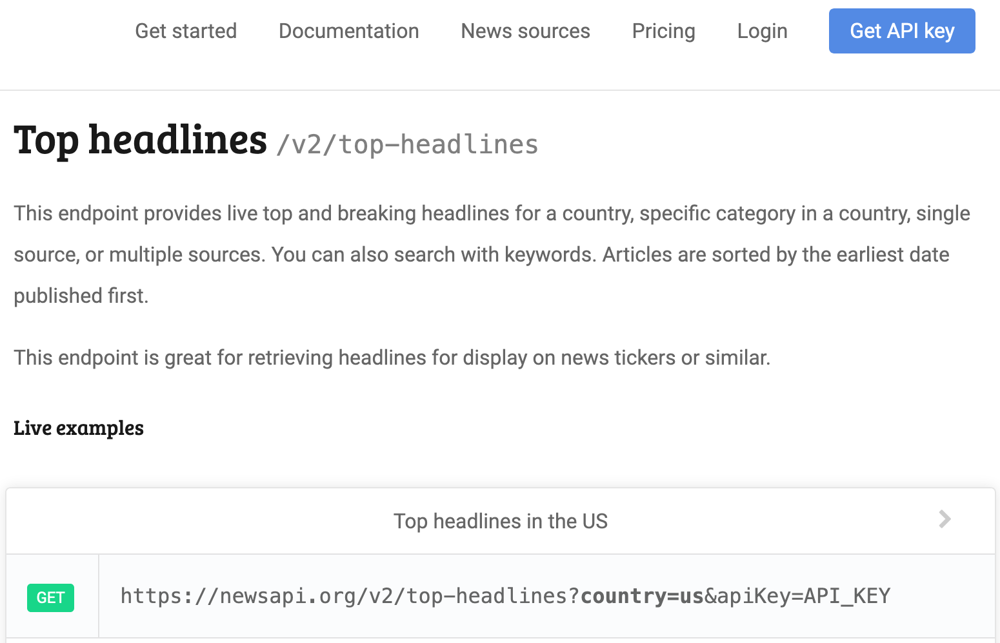
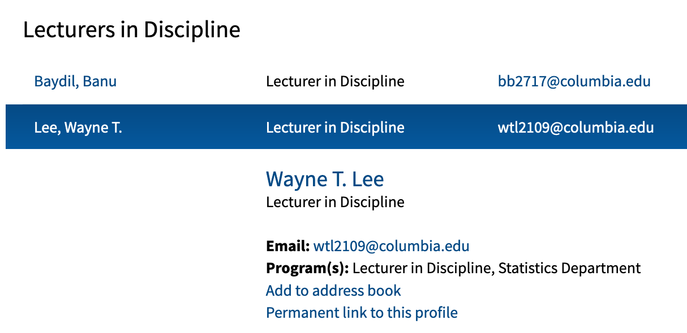
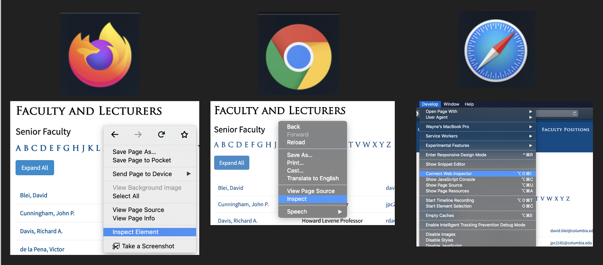
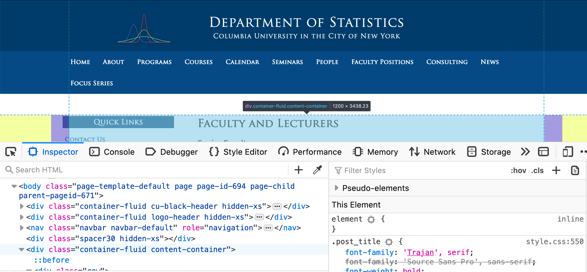
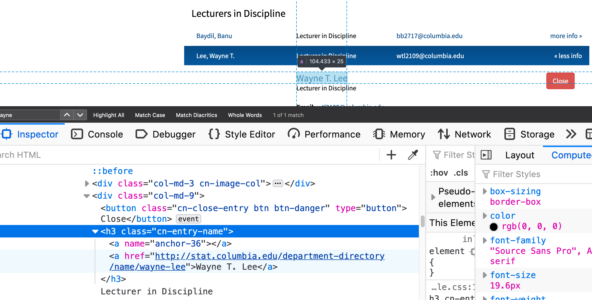
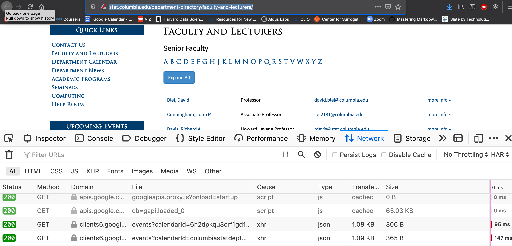

# APIs and Scraping

## APIs

Although many websites allow you to download data with a single click on
a browser, the ability to automatically query data without a single
click requires some special tooling.

This requires us to understand how to interact with APIs (Application
Programmable Interface). APIs allow people to interact programmatically with
services provided by companies and government agencies, a critical
component for automation.

The dominant python package for interacting with APIs is called `requests`.
But before we introduce requests, we need to cover some basics about APIs.

#### Elements of an API

The most common task is to query data from APIs. To do this, your program
needs to know: where to get the data and how to specify the data you want.

As an example, we will use the [newsapi.org](https://newsapi.org) as an example.
This is a website that aggregates different headlines from different papers. It gives you
a few "free" calls but will block you after a certain threshold (freemium business model).

If you look at the documentation for [NewsAPI.org](https://newsapi.org/docs), there are 3 different
urls, under "Endpoints", for 3 different applications: top headlines, everything, and
sources. If you click on "Top headlines", you'll see a link, `https://newsapi.org/v2/top-headlines?country=us&apiKey=API_KEY`
after the word "GET".


In this link, there are several components:
- The **url**: this is similar to the URL for your browser.
  - For our example it's the `https://newsapi.org/v2/top-headlines` which is everything before the `?`
- Parameters: these are like arguments to a function, allowing us to specify the type of data we want
  - This is sometimes referred as the "payload"
  - From the example, the parameters can be spotted after the `?`
  - In our example, the argument named `country` was assigned the value `us`
  - You can find more arguments under "Request parameters" to see the names and the possible values.
- Credentials:
  - Notice one of the parameters is `apiKey` that is required yet its value is not provided. This
    will contain the credentials that are unique to you. You'll need to apply for these by following the
    instructions on [Get API key](https://newsapi.org/register).
  - This application process is unique to each company. Twitter's process can go up to 2 weeks, we have chosen
    one that can be provided instantly.
  - Some government agencies will not require you to apply for credentials.
  - Credentials can be passed in like a parameter but sometimes we need to specify it in the `header`, this
    is another argument for `requests.get()`.

#### Using `requests` to call the APIs
Now we know the elements, we will use `requests.get()` to get the data similar to the example shown on
the [NewsAPI.org Top Headline endpoint](https://newsapi.org/docs/endpoints/top-headlines)

```r
import requests

URL = "https://newsapi.org/v2/top-headlines"
params = {
    'country': 'us',
    'apiKey': 'THE_KEY_YOU_GET'}
response = requests.get(url=URL, params=params)

response.url
response.status_code

newsapi_data = response.json()
type(newsapi_data)
newsapi_data.keys()
```
What to notice?
- We passed the URL to the `url` argument in `requests.get()`
- All other parameters were passed to the argument `params` as a dictionary.
  - The names used in the list are according to the parameters specified by NewsAPI.org.
  - Notice that we did **NOT** pass `country` and `apiKey` to `requests.get()` directly because these arguments
    are specified by NewsAPI.org. `requests.get()` only recognizes `params` in this example.
- Your status code should be 200 if you provided the correct credentials and everything.
  There are many [different types of statuses](https://en.wikipedia.org/wiki/List_of_HTTP_status_codes)
  that can sometimes help you debug your request. Another way is to examine the attribute `responses.text`
  in our example.
- Notice that the `url` in `response` was now formatted as shown in the documentation for us.
  - It is important that you let `requests.get()` handle the formatting because symbols like " " or "!"
    need to be encoded differently. Your code is also easier to read this way. You should avoid
    creating the url from scratch through basic text manipulation.
- The final data should be a dictionary that you know how to wrangle into a format that's easy to analyze.

#### Common errors in calling APIs
- A `non-200` status code. This often will have an informative error message. Try providing
  wrong credentials and see what happens.
- Passing the arguments meant for the API to the `requests.get()` function instead. For example:
  ```python
  # Bad
  requests.get(url=url, country="us", apiKey="YOUR_KEY")
  # correct
  requests.get(url=url, params={'country': 'us', 'apiKey': 'YOUR_KEY'})
  ```
- Spelling mistakes in the argument, try passing `APIKEY` instead of `apiKey` above, APIs
  tend to be case sensitive.
- Hitting your cap or not following the rules specified by the company. The APIs require
  servers to be running in the backend which cost money.
  Companies will often restrict the maximum number of calls you can perform for free. Reading
  the error message will help you resolve this.
- Using the wrong url. Try adding a typo, see what error surfaces!
- Some places have firewalls that prevent you from accessing some APIs, this is can be complicated.


## Scraping
Most people are familiar with websites displaying information to them via their browser.
To extract the information directly off the webpage is called scraping.
We will only cover the most basic case where we parse the text information from the HTML information.

For an example, we're going to obtain all the [faculty's names from Columbia's Statistics department](http://stat.columbia.edu/department-directory/faculty-and-lecturers/).


Specifically, we will try to get the bolded name like "Wayne T. Lee" and not the
"Lee, Wayne T." that is in an awkward ordering.

#### Using the inspector tool
As of 2020, most browsers have an inspector tool:


The Safari "Develop" tab to show up by default, please Google how to get it to surface.

The inspector tool allows us to see what part of the code correspond to what part of the webpage.
Try moving the curosr around different parts under "inspector", you should see different
parts of the webpage being highlighted.


At this point, we normally want to click into the different `<div>` tags (in Firefox, there are 
dropdown arrows next to the `<div>` tags that hide the details within the tag) until we see only the
text of interest in highlighted. These tags similar to the comma in a CSV file where
they format the data so the browser knows how to display the content.


The information from the navigation will inform us how to write the code later.

#### A quick note about HTML format
In a loose sense, HTML is a data format for webpages (look up XML for the
more proper data format) structure, i.e. heading, sidebars, tables, etc.

Here are a few quick facts you need to know
- Most values are enclosed by tags, here's an example using the `<p>` tag: `<p>Here is a paragraph</p>`
  - Notice how we need a closing tag like `</p>` 
  - In our Columbia example, you'll see a lot of `<a>` tags for hyperlinks
- Different tags have different purposes, for more information see [here](https://www.w3schools.com/tags/ref_byfunc.asp).
- HTML in general is hierarchical like nested lists because the webpage has different sections and
  sub-sections.
- The tags also have attributes, notice the `name` in our Columbia example in
  `<a name="anchor-36">` is an attribute with a value set to `"anchor-36"`

#### Calling the webpage using `requests` in Python
The HTML in the inspector tool can be obtained by using the `requests.get()` function.

```python
import requests
URL = "http://stat.columbia.edu/department-directory/faculty-and-lecturers/"
web_response = requests.get(url=URL)
type(web_response)
print(web_response.url)
print(web_response.headers)
print(web_response.status_code)
```
What to notice?
- The class of the output from `requests.get()` is not our usual data types.
- Various information associated with the call is attached to the output

To get the same text you saw in the inspector tool, you need to look at `web_response.text`
to help convert the binary data into text.
```python
page_html = web_response.text
```

#### Parsing the webpage using `beautifulsoup4`
The text is an extremely string. Its
format is HTML which is a close cousin to XML. Here we will need the package
`beautifulsoup4` to help us parse this string.

To install `beautifulsoup4`, you may need to specify a conda channel (here we
use `conda-forge`, a relatively popular one) to do so. This command should be
typed into the Terminal/Command Line/Anaconda Prompt.

```
conda install -c conda-forge beautifulsoup4
```

To use the package, it's oddly named `bs4` instead.
```python
from bs4 import BeautifulSoup
html_tree = BeautifulSoup(web_response.text, 'html.parser')
type(html_tree)
```
Again we have a special class of data. The HTML data is often thought of
as a "tree" where the most outer layer (e.g. `<body> ... </body>` in your
html) is the root node and you can dig into the child-nodes.

To get the names we will run the following:
```python
name_node = html_tree.find_all("h3", attrs={'class': "cn-entry-name"})
len(name_node)
name_node[0]
```
- This looked for all `<h3>` tags that had the attribute `class="cn-entry-name"`.
  Similar to our [screen shot when navigating the inspector](#using-the-inspector-tool).
  Notice that the dictiionary allows us to specify multiple attributes.
- The [documentation for BeautifulSoup4](https://beautiful-soup-4.readthedocs.io/en/latest/#searching-the-tree)
  is quite extensive with many examples. My recommendation is to pick one
  way to approach things then stick with it.
- Notice we did not use the `<a>` tag as our search because its attribute had
  faculty's name in it which was what we were trying to find.

To complete the task:
```python
names = [h3_node.get_text() for h3_node in name_node]
len(names)
print(names[:10])
```
- To get the names, notice the names are the only "text" here (the rest is all information in the
  html tags).
- Exploring different methods will quickly show you a few options to get the text
  from the descendants of each `h3_node`.

Side comment: scraping takes a lot of trial-and-error, do not worry if this
took awhile to do!


## The "Network" under Inspector and why scraping is discouraged
Return to the Inspector Tool, you should see a tab called "Network".
- Click on the "Network" tab
- Refresh the [faculty page](http://stat.columbia.edu/department-directory/faculty-and-lecturers/) while 
  keeping the inspector open.
- Notice the activities triggered from loading a single page!
  - Each of these line items is a "call" (e.g. how we ran `requests.get()` above is a single call) to somewhere on the internet
  - You should see the time to finish each task, the size of data, and the "type" of data passing between your browser and the web



Take-home messages:
- When you load a website, a lot of activity is triggered so scraping is very resource intensive
- You are often unaware of what is being sent to/from these APIs that are being called (this is
  how Ads track you)
  - If you click around, you'll notice that your browser, type of OS you're using, your language preference
    and sometimes your general location information is being sent.
- Notice how images take up a lot of bandwidth (knowing this will help you be careful when dealing with
  image data)

#### Some context on scraping
Here are some things to know about scraping:
- From the company's perspective, you scraping their website is wasteful to them.
- To us, scraping the data from their website is extremely unreliable (there are ways to make it
  much harder) because a simple change on the website will break our entire scraping algorithm (bad for automation).
  Also, the data may not be the data we want (imagine trying to get historical faculty members).
- You should always check if the company has APIs for you to call. You can sometimes discover 
  the APIs available by searching through the inspector's view (look for all the GET requests).
  Even if the company changes their website, the APIs will often behave the same way so automated
  pipelines that rely on these data sources will not crash as easily/frequently.


## Scheduling jobs with cron
Many types of data collection require you to constantly run a particular task over time. 
In our context, you may want to get the news articles from newsapi.org every day. You then
need to schedule your Python code to run at a particular time every day.

The most basic tool for this is called `cron` which exists across operating systems.

The overall flow is to edit a file (on Macs it's called `crontab`).
In this file you will specify the frequency, the program to run, and the script to run.
You need to be careful with the permissions around different scripts because `cron` will
be running the code as a user that is not the same as your login.



