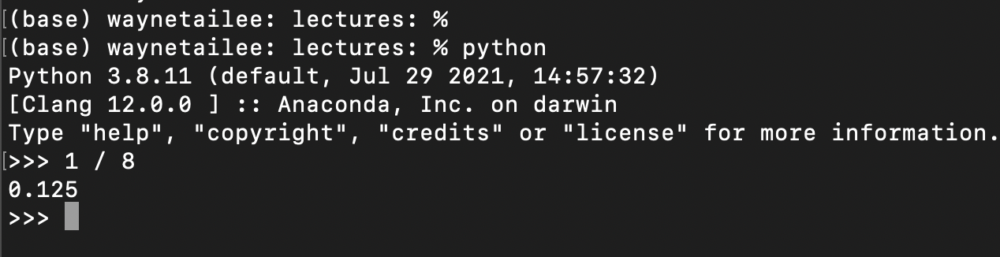

# Python Basic Syntax

## The different modes of working with Python
Python enables one to communicate commands to the
computer. You'll write commands, code, that Python can
interpret into commands for the computer to execute.

To interact with Python, there are several different modes that we
list below:
- Interacting with the REPL
- Writing script then executing them
- Notebooks (in between REPL and scripts)

#### Interacting with the REPL
The read-evaluate-print loop (REPL) is the interface that responds to
every command you type immediately.

The REPL is most commonly found by executing `python` in the command line.
You can directly type code into the REPL, i.e. the space after `>`.



**Flaws**:
- The commands in the REPL are not saved to a file so it is hard
  to reproduce the results and debug if there are errors in the code.
- Impossible to do large projects in this format
**Pros**:
- Minimal installation requirement
- Instant feedback is useful for exploration
- Can remedy the flaw by executing lines of code from a script


#### Writing script then executing them
This is the most programming coding pattern for software development.
You write your code into a script, e.g. save the following into
a file called `demo.py`.

```python
print(1 + 1)
print(1 + 2)
```

Then execute the commands by passing the script to Python for interpretation,
e.g. typing `python demo.py` into your command line in the directory where
`demo.py` is located.

Your code will be executed from top to bottom in order. Notice that the code
writing and code execution are two separate steps.

**Flaws**:
- Bugs often surface too late for beginners
- The lack of immediate feedback makes learning harder
**Pros**:
- There are simple code checkers called "linters" that check for style and
  basic syntax. These can often be installed into your IDE (e.g. Pycharm).
- Most serious coding is done this way
- Some IDEs offer the ability to run lines of code in a REPL

#### Notebooks (in between REPL and scripts)


## Using Python as a calculator
Python can perform all the functionalities that advanced calculators
can perform.

```python
1 + 1
100 * 2
10 ** 2  # exponentiate
```

A successful execution will often output


## Python cares about indentation at the front of the line
One unique characteristic about Python is that its syntax forces us to
write neater code. It enforces this by leveraging the empty spaces
in front of the commands as part of the command.

See which of the following will "break"
```python
1+1
1 + 1
1 +     1
    1 + 1
```

If you're using **iPython**, you may not see an error in any of the commands
above.

## Reading error messages
Python's error messages often have the word "Error" in them.
This means that Python encountered a problem that forced the code execution
to stop somewhere in the code but it may not be obvious what has and has
not been executed.

Below we have two examples where we try to add the number `1` to the
character `"1"`, notice how the errors are different!

```python
>>> 1 + "1"
Traceback (most recent call last):
  File "<stdin>", line 1, in <module>
TypeError: unsupported operand type(s) for +: 'int' and 'str'
>>> 
>>> 
>>> "1" + 1
Traceback (most recent call last):
  File "<stdin>", line 1, in <module>
TypeError: can only concatenate str (not "int") to str
```

As a beginner, you should focus on:
- the error type, e.g. "TypeError", which is 
- the error message, e.g. "unexpected indent"
- Python's best guess at where the error occurred, e.g. `line 1` will
  usually be the case for most REPL commands. This would be more helpful
  if your code were in a script.


## The print() function
Similar to how calculators can perform `log(1)`, Python has some built-in
functions ready to use. One of the most useful ones is `print()`.

It's most useful when you're not sure of the value of a variable.
In particular, `print()` will accept numeric **and** character values.
This may seem trivial for now but later you will see that most
functions are strict about the type of inputs it will accept. 

```python
print('hello world!')
x = 'hello universe!'
print(x)

x = 1.3
y = x * 3
z = x * y / 13
print(z)

print('hello', z)
```


