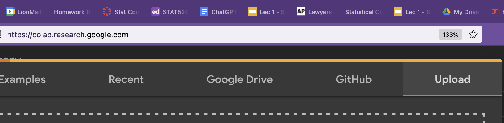
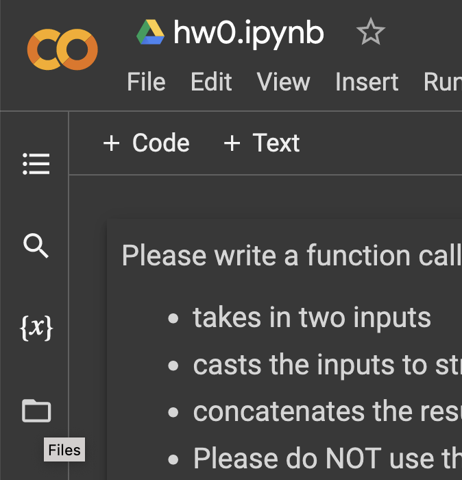
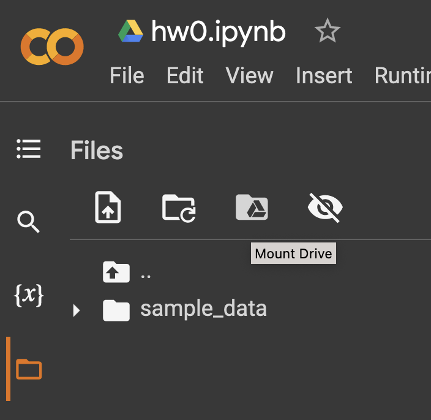
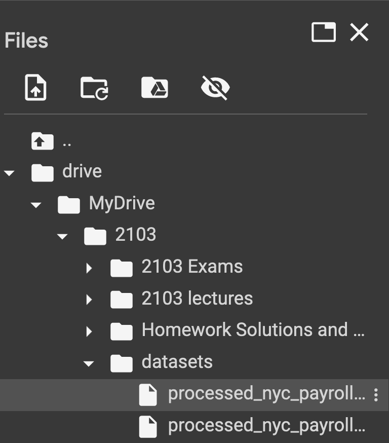
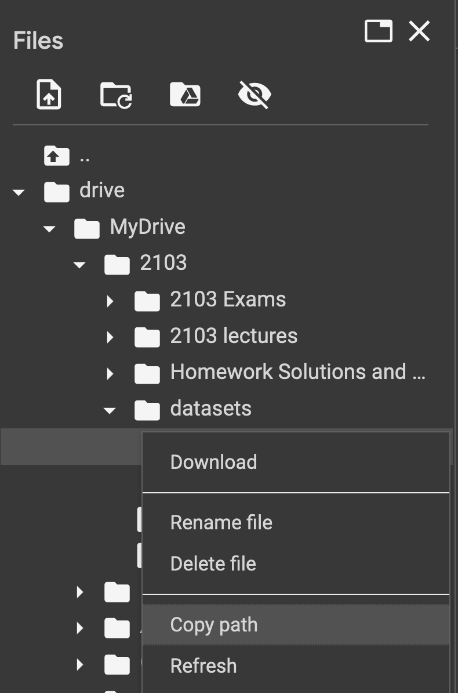
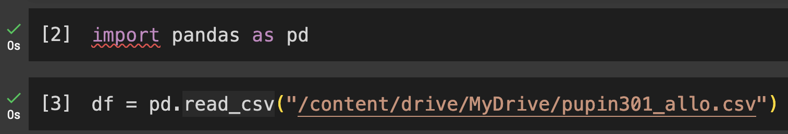

# How to use Google Colab?

## Using Google Colab with your notebooks

- Go to [colab.research.google.com](colab-upload-notebook.png)
  - Make sure you're logged into your school account
- You can upload your notebook from your computer (or start a new one):
  
- If you have data on Google Drive, there are two ways to mount your Google Drive:
  1. In a code cell:
     - Copy/paste the following
     ```python
     from google.colab import drive
     drive.mount('/content/drive')
     ```
     - Agree to giving permissions for Colab to read your entire Google Drive (This is why you should stick to your school account)
  2. Click through the browser:
     - Go to files
       
     - Click on Mount Drive (this occasionally will create a cell like above)
       
     - Agree to giving permissions for Colab to read your entire Google Drive (This is why you should stick to your school account)
- To locate the file through Colab
  - Go to files (you may need to hit the refresh button)
    
  - Click through the "right arrows" so they point down to see what's in each folder. It should be under `drive/MyDrive/...`
    
  - Once you located your file, click on the triple dot icon on the far right, a menu should appear to click on "Copy Path"
    
- You should be able to read in this file using this copied path, for example if you had a Comma Separated Values (CSV) file, then it'll look like the below
  
 
    

```python
```
