# How to work with somoene else on a coding project? - Minimum GitHub Setup

This page is meant for students who need the absolute minimum amount of Git
commands to be using Git rather than truly understanding version control.

## Overview
To collaborate on coding projects, students tend to email each other code
which is suboptimal because:
- it's difficult to focus on the changes
- people lose track of the agreed version of code

The industry standard is to use version control software to facilitate
collaborative code bases. The most popular one being Git which is strongly
supported by the company [GitHub](https://github.com) (private company).
However, given class projects often have smaller groups limited amount
of code, students often don't understand the value of version control and
realistically do not need all of the functionalities.

This document will simply go over:
- How to add your existing code to a repository on GitHub using the GitHub Desktop Application
- How to invite your teammaate
- The recommended workflow of how to collaborate on coding projects

## Initial Setup

- Create an account with GitHub who will host your code online, make sure you're logged in during the following steps for your default browser.
- Please download the [GitHub Desktop Application](https://desktop.github.com).
- Please have some initial code you wouldn't mind sharing with your teammate, my will be called `test.Rmd`
- If you open the GitHub Desktop App, you should see something like
  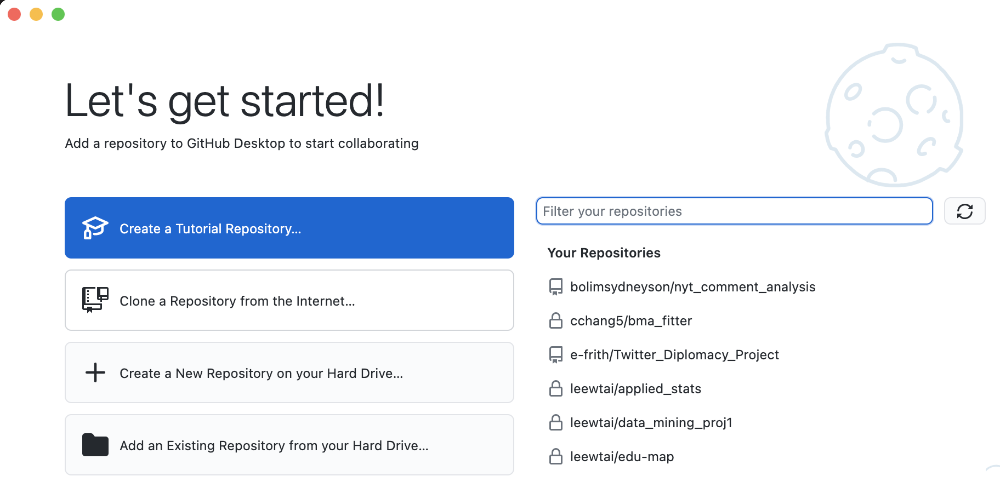
- Please choose "Create a New Repository on your Hard Drive"
  - A repository is like a folder for all the code related to this project
- You should choose a folder to place your code in with a reasonable name, this likely is different from your class folder (or a sub-folder of your class folder) because everything in this folder will be shared with your teammate.
  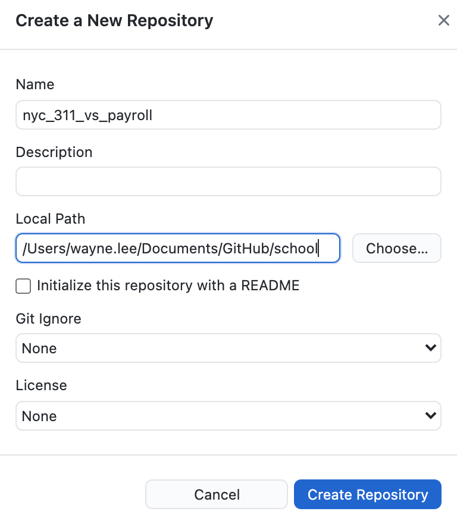
- Move your code into this folder
  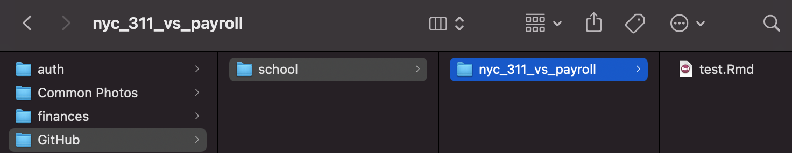
- You should notice that your GitHub Desktop has recognized the new file
  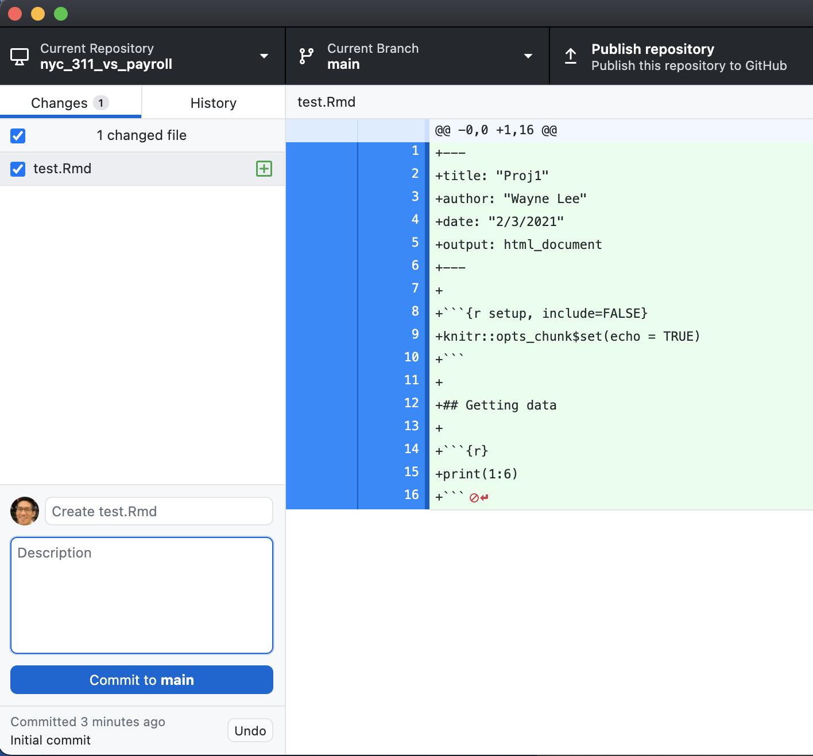
- At the left bottom corner, you must type in a comment that will inform your teammate what this new code is about. 
  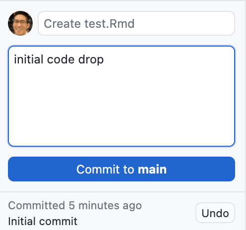
- Then hit "Commit to Main", this is like a "Save" button for Git on your computer, i.e. Git will keep track of these changes now and the record is tracked on your computer, not on the internet yet.
- Then choose "Publish Repository", this is the "Save" button for the Git on GitHub.
  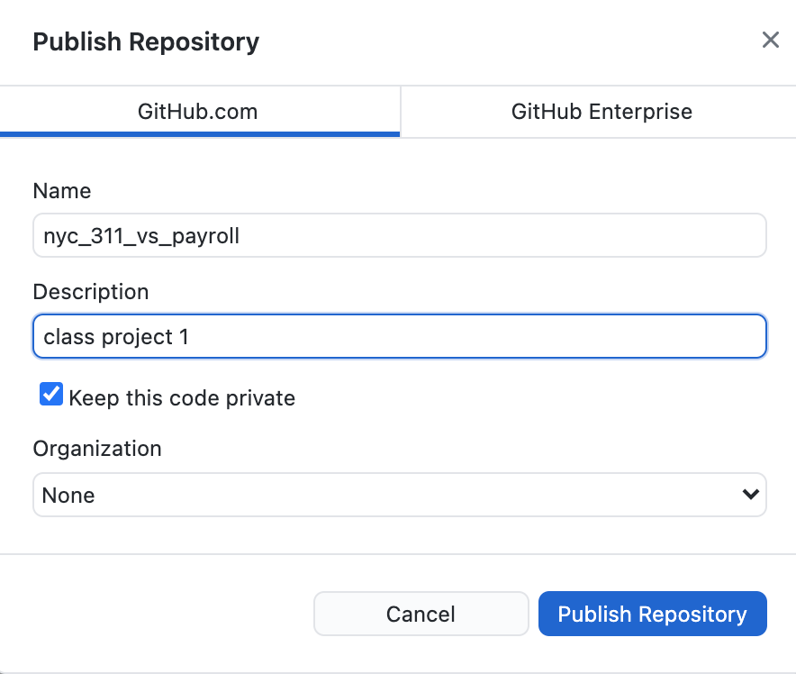
- On your GitHub Homepage, you should see your repository on the left
  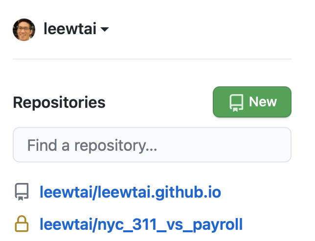
- Click on the repository, then look for settings on the top right
  
- Then choose "Manage Access" (which may ask you to type in your password again) then find "Invite a Collaborator" to enter your teammate's email or GitHub username.
- Your teammate should be able to grab your code by going back to the repository homepage and look for the green "Download Code" button. There should be a "Open with GitHub Desktop" Option. This is important so Git knows which folders on your computer is linked to which folder on your teammate's computer.
  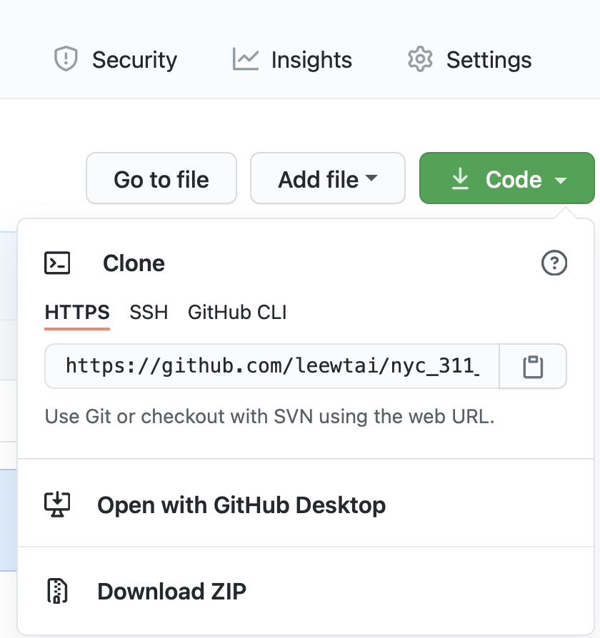
- Your teammate should be able to choose where the code will be downloaded on their computer by specifying the "Local Path". Remember that a folder named after the repository will be created where you choose. This is called "cloning"
  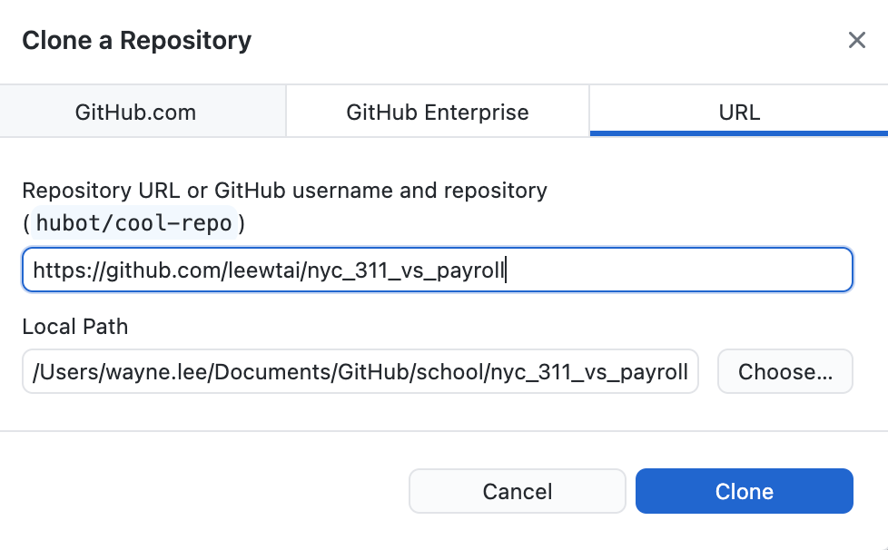
- The folder named after your repo should appear along with the file `test.Rmd` within it.
- You can now edit this file using RStudio or whatever editor you normally use for coding.
- Now if any one of you makes a change to the file that Git is tracking, saving the change to the file should trigger GitHub Desktop to mark the exact changes you made.
- Now look at GitHub Desktop, it should have marked the changes you made.
  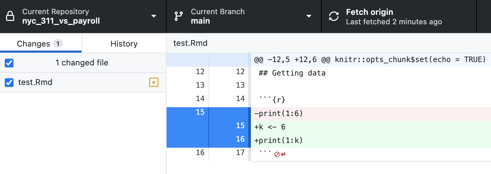
- Now for the other teammate to see this change, a similar process to before, you'll need to leave a comment first, commit the change, then publish the change to GitHub (this publish is now called "Push Origin").
  - Origin just means the cloud copy of your git records on GitHub.
  - The previous publish is now a push because your repository already exists.
- For your teammate to grab the changes. They should use the "Fetch origin" button on the right top on their GitHub Desktop. GitHub Desktop will warn you if changes have be committed by your teammate and ask if you want to download those changes, choosing "Pull Origin" should do the trick.
- So overall, you can pull each other's changes easily if none of you have made changes at the same time to the same file. Looking at the "History" can also make the evolution of the code clear if there are errors.
  - The biggest mistake at this point is being too careful with your commits, i.e. you want the code to be perfect. While that is a state you want to achieve, this isn't helpful early on because it encourages you to push large amounts of changes in one go which makes things hard to follow.
  - You may choose to work on different files and that is not a bad start. This way you're really using GitHub just like Dropbox at this point.

## Editing the same file
- The true power of Git appears when your team is editing the same file. A warning will appear if my teammate edited the file and pushed their changes to GitHub **before** I was able to push my changes.
  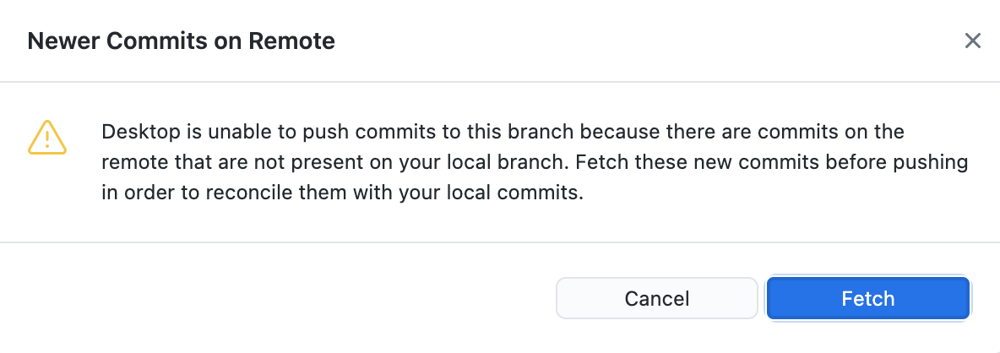
- You should fetch the changes made by your teammate.
  - Git will try to "merge" your code automatically first. So if you were editing different lines of code, Git should know what to do.
  - If you happen to edit the same lines, then a **conflict** has happened and humans are needed to resolve the issue. If you look back at the file, you may see some notes from Git on your file. Simply remove the markers and combine the two changes that is most sensible. THIS is why you do not want to wait until you've made drastic changes to commit your code. Incremental changes are much easier to follow.
    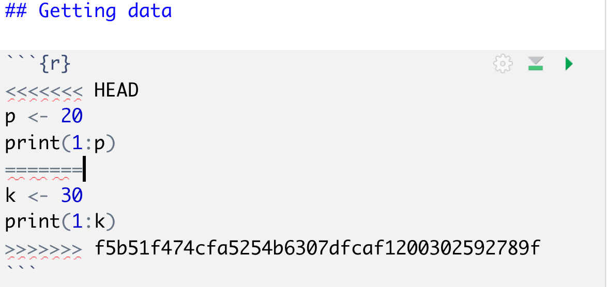
    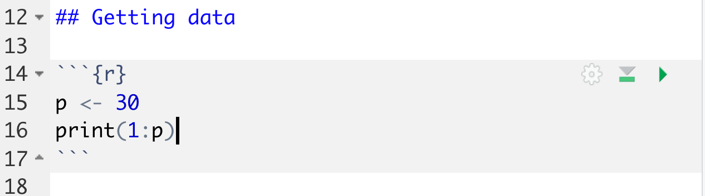
- Removing the markers should trigger your GitHub Desktop to notice that conflicts have been resolved.
  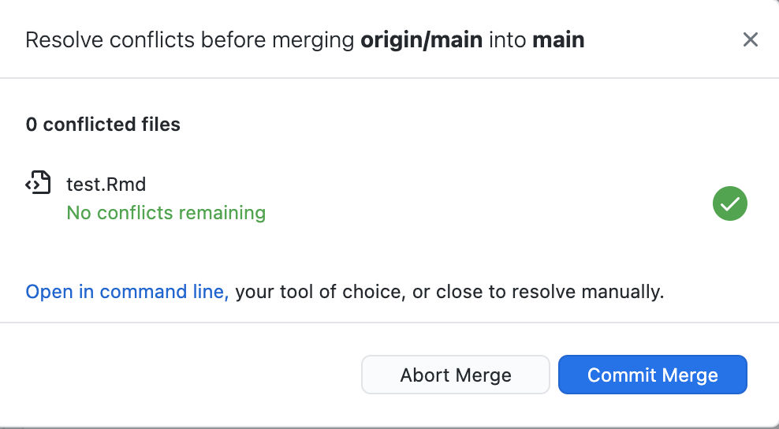
- Don't forget to "Push Origin" so GitHub will have a copy of the resolution you came up with. Your teammate will be able to see that when they next fetch for changes.

## Best Practice
- Before you start working, **fetch** for new code!
- Before taking a break, always push your code.
  - If this is your first time, you can have bugs in your code. Simply leave a comment about it or comment out the buggy code so your teammate knows something is wrong there. The bigger mistake is definitely waiting too long before making your next Push.
