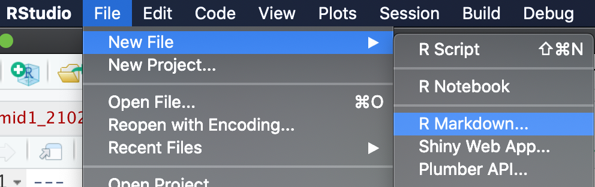
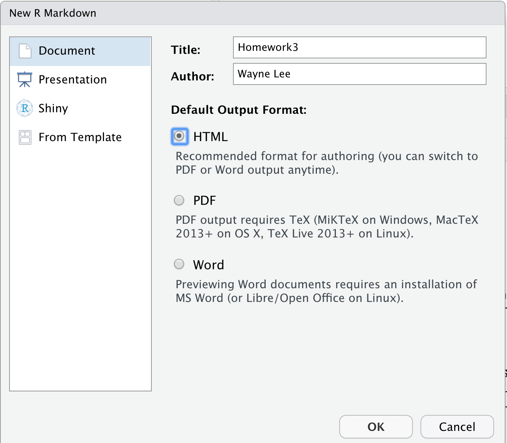
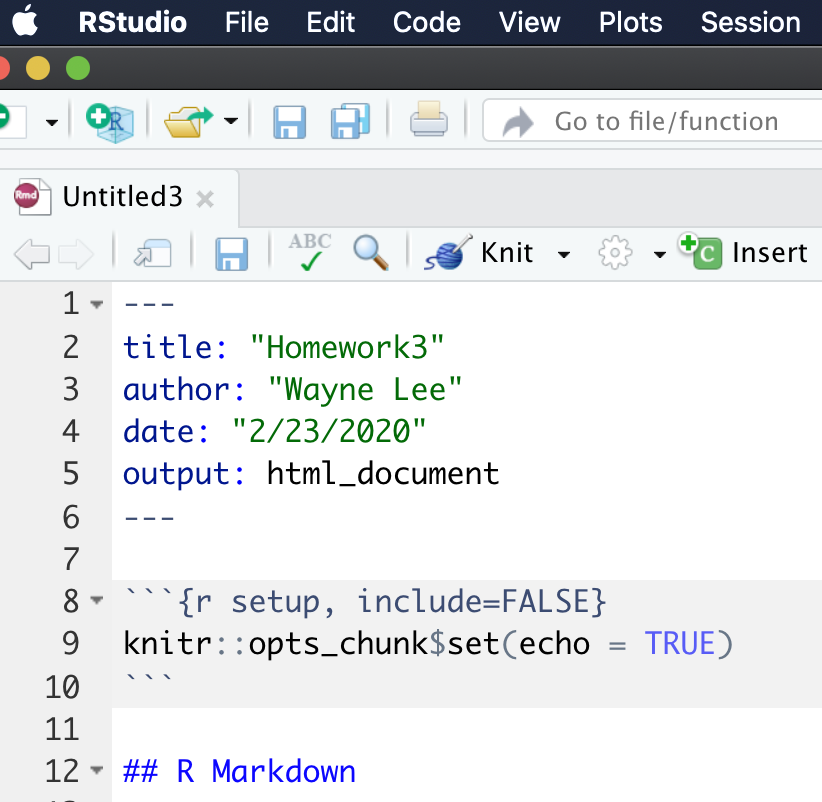
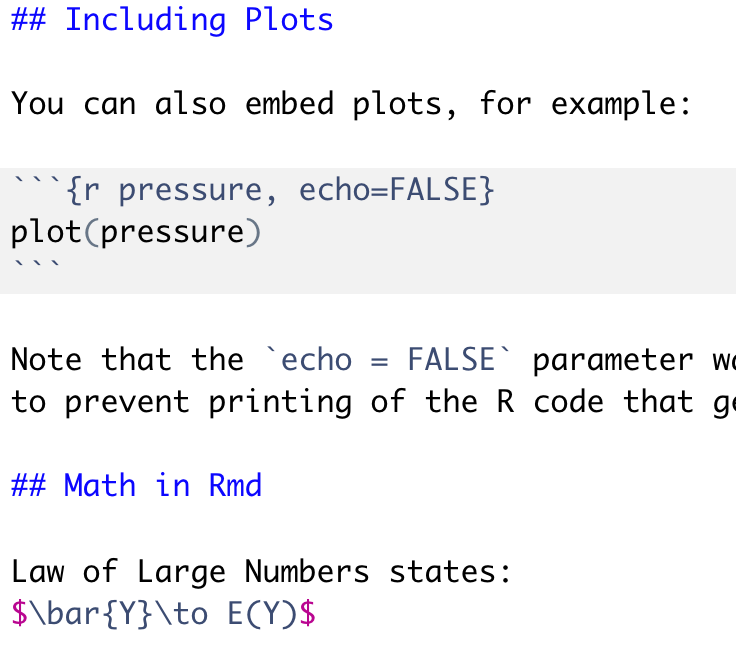
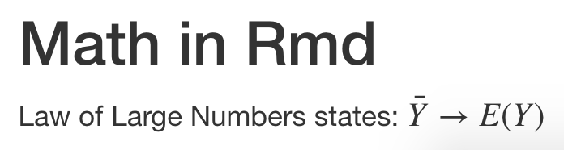
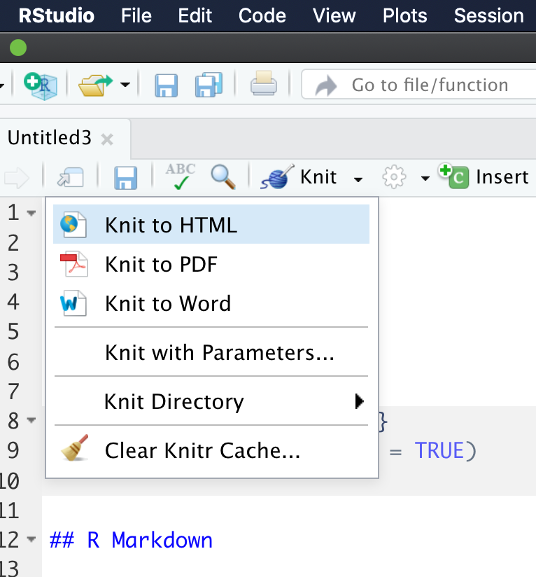
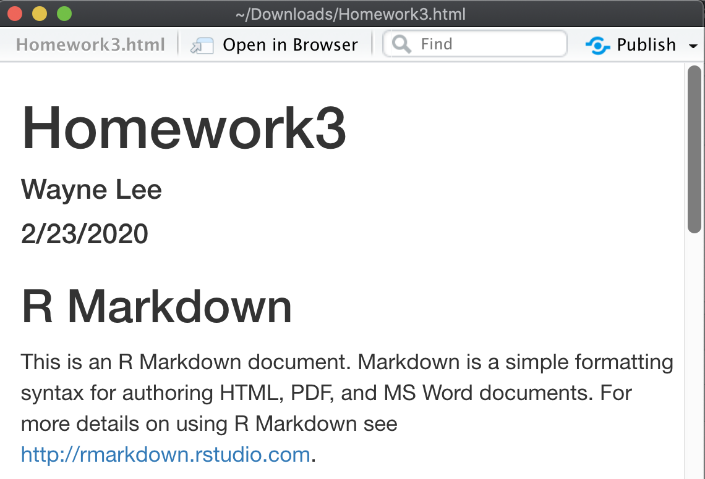

# Typesetting equations and code using Rstudio/RMarkdown

## RMarkdown within Rstudio
When you launch Rstudio, besides source files, you could
also create '.Rmd' files.

This would launch a prompt that asks a default output, just choose HTML
to minimize dependencies on other software.

This should create a template file for you to easily
enter code vs LaTeX.

The only piece that is missing is the mathematical equations.
In the usual text area, you can type in LaTeX code surrounded by
dollar signs `$` like `$\bar{Y}\to E(Y)$` to type out equations.

If you render the code, the math will look nice:

To tell Rstudio to output an HTML file, you have to `Knit` the
Rmd file to an HTML file. This will ask you where should the
Rmd and HTML file be saved.

It usually takes a few second for the HTML file to appear.
You should see your Rstudio console do some work. The resulting
HTML file should be easily exported to a PDF file using your
Printer capabilities.

