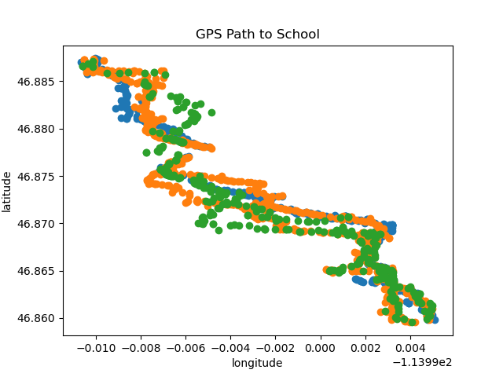

# Assasination Classroom


Image sourced from Wikipedia.

[Assassination classroom by Yusei Matsui](https://en.wikipedia.org/wiki/Assassination_Classroom) is the inspiration for the project! In this comic, a teacher is training students to assassinate himself.

Similarly, your challenge is to use 2 weeks of my phone GPS data to "bomb" me on my usual path in the 3rd week. You'll have 2 attempts!

### Project deliverables
At the end of the project, you need to submit:
- A bomb plan, which is an algorithm that takes in the initial location and timestamp of my travel and will predict:
  - The day of the week
  - The time of explosion (see rules below)
  - The longitude and latitude of my location (see rules below).
- Your code on GitHub. A classmate will be using your code to validate your attempts on the 3rd week. Make sure your code can run and has enough comments for someone to install the necessary dependencies.
- A written report on how you solved the problem. This should be written for a classmate who is not enrolled in this course. This report (2-5 pages, not including graphs) should include:
  - An introduction
  - A description of the data with visualizations
  - A description of your final approach/model
  - A description of your level of confidence, i.e. model validation
  - A conclusion (at most one paragraph)


### Data
Data is collected on my Android phone using the [GPSLogger](https://play.google.com/store/apps/details?id=com.mendhak.gpslogger&hl=en_US) application which is free but lacking in precision.

The data is available on Canvas under `gps.zip`.

The data is in a GEOJSON format which is similar to a JSON format. Here's some sample code to
help load in the data. If you are unfamiliar with JSON data, just ask for help! They are like
nested named lists in R or dictionaries in Python.

```r
library(jsonlite)

dat <- read_json('data/20200819132607.geojson')
head(dat[['features']], 1)
```

```python
import json

dat = json.load(open('data/20200819132607.geojson', 'r'))
dat['features'][:2]
```

A single record from the GPS looks like this
```
{"type": "Feature",
 "properties": {"time": "2020-08-20T21:13:09.831Z",
                "provider": "gps",
                "time_long": 1597957989831,
                "accuracy": 19.296001,
                "altitude": 965.132568359375,
                "bearing": 208.8,
                "speed": 2.02},
 "geometry": {"type": "Point",
              "coordinates": [-114.00013904, 46.88713864]}
}
```
If you plot the data over time across different days, you should see some patterns:



#### Special notes on the data
- The distances are in meters and times are in seconds
- The timestamps did not capture the time zone correctly.
- Each file is a different day
- Data loss is common with GPSLogger
- The data was cleaned (we will discuss this topic in class)
- To get distances in meters from longitude and latitude data, you can
  use the [great circle distance](https://www.rdocumentation.org/packages/fields/versions/10.3/topics/rdist.earth)
  or [UTM projections (zone=12)](https://pypi.org/project/utm/)

### Rules
To succeed, your bomb must be placed within 5 meters and 10 seconds to my position in the 3rd week.

For the 3rd week, GPSLogger values will be taken as "truth". If there is data
loss, it will be treated as if I disappeared from the planet during those times, i.e.
I cannot be bombed.

There are 2 exceptions: I can only be bombed in transit and you cannot bomb me in the first 5 minutes of
transit. If I am stationary for over 2 minutes, you should consider
that I am sheltered and safe. On the otherhand, since my summer schedule was irregular,
my departure time each day varied wildly.
You'll be given the timestamps and locations when I start moving each day (to and fro). Given this, you cannot bomb me in the
first 5 minutes of my travel.

I look forward to your assassination attempts!


**In addition** to the requirements listed above, please also answer the following questions:
- Does the target walk faster or slower when the temperature is colder?
    - You'll need to get temperature data from an external source.
- Please visualize the unertainty in the target's position over time and space.
    - You do not need to cover the duration of the entire trip but this graph should
      help support your decision on the best time/location for assassinating the target.
    - You should not plot individual data points on this graph.
- Please highlight at least one data quality issues and how this impacts your conclusions.
