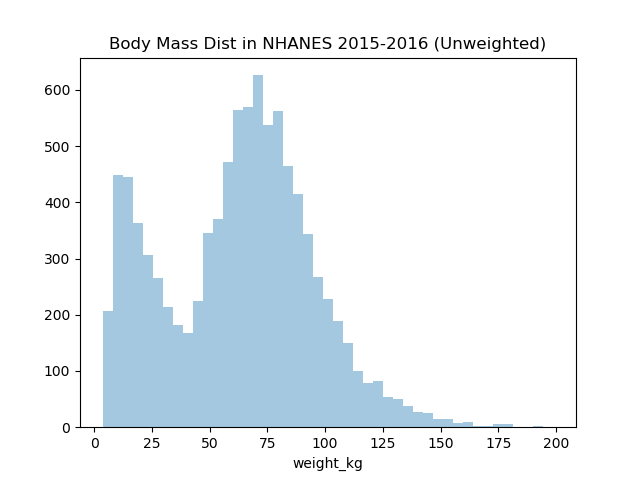
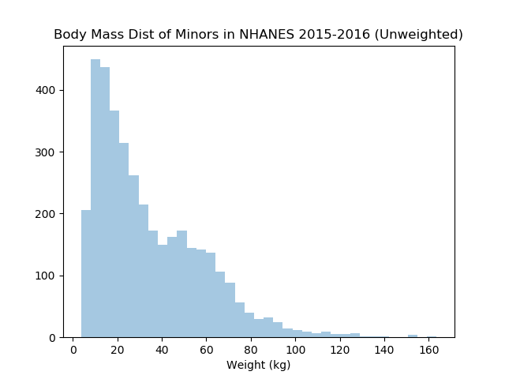
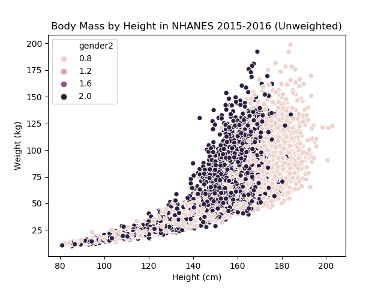
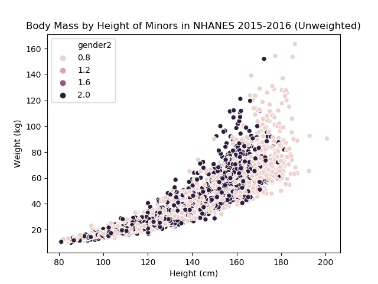

# National Health and Nutrition Examination Survey

#### Summary
This is a 4 stage representative sample for the US population.
It has data related to body measurements from real individuals.
Any inference about the population would need to use the sample weights with caution.

We recommend starting with these values:
  - File source: National Health and Nutrition Examination Survey (NHANES 2015-2016)
  - [Body Measure File](https://wwwn.cdc.gov/nchs/nhanes/search/datapage.aspx?Component=Examination&CycleBeginYear=2015)
  - [Demographic File](https://wwwn.cdc.gov/nchs/nhanes/search/datapage.aspx?Component=Demographics&CycleBeginYear=2015)
  - [File documentation](https://wwwn.cdc.gov/Nchs/Nhanes/2015-2016/BMX_I.htm)
  - [Intro on sampling weights](https://www.cdc.gov/nchs/tutorials/NHANES/SurveyDesign/Weighting/intro.htm)

#### Education Intent
- This dataset is easily relatable to most students
- This dataset touches on "joins" for data from 2 data sources
- This data touches on "sampling weights"
- This data has continuous and categorical data
  - continuous: weight, height, and age
  - discrete: ethnicity and gender
- The raw data has a bimodal distribution because of minors vs adults

#### Quick Visualizations

