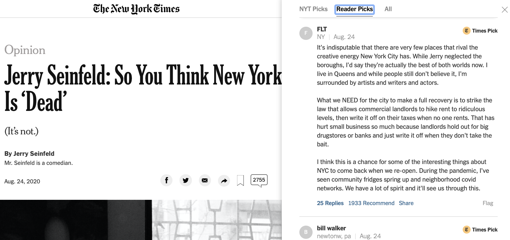

# Can you detect a pattern in the comments on NYTimes?

NYTimes articles sometimes enable readers to leave comments. The Times also
endorses certain comments to highlight the diverse set of ideas around a
topic.

The code here uses the [NYTimes community API](https://developer.nytimes.com/docs/community-api-product/1/overview)
to obtain the comments data from NYTimes.

Special notes:
- Not every article has a comment
- You need the article url to obtain its comments
