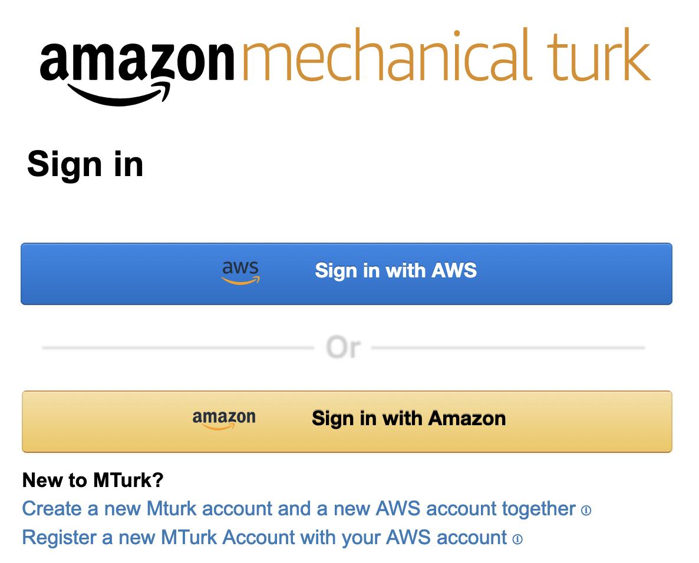
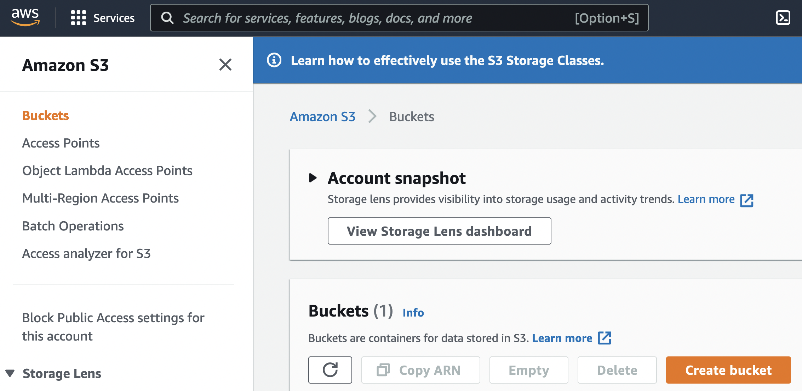
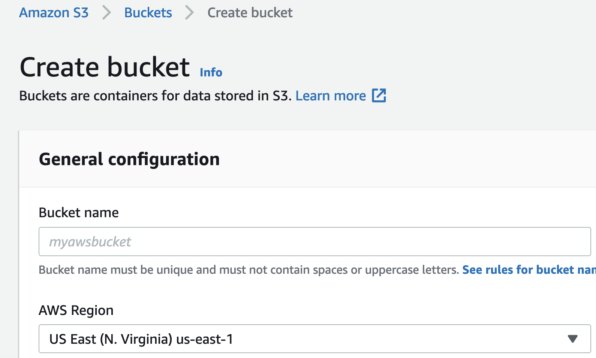
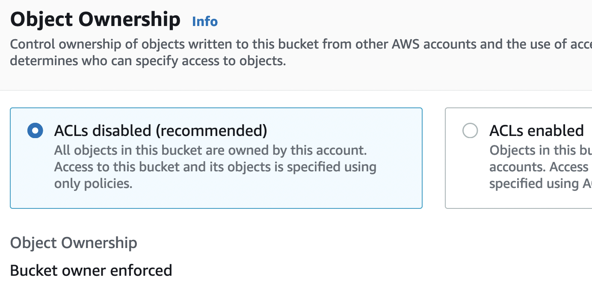
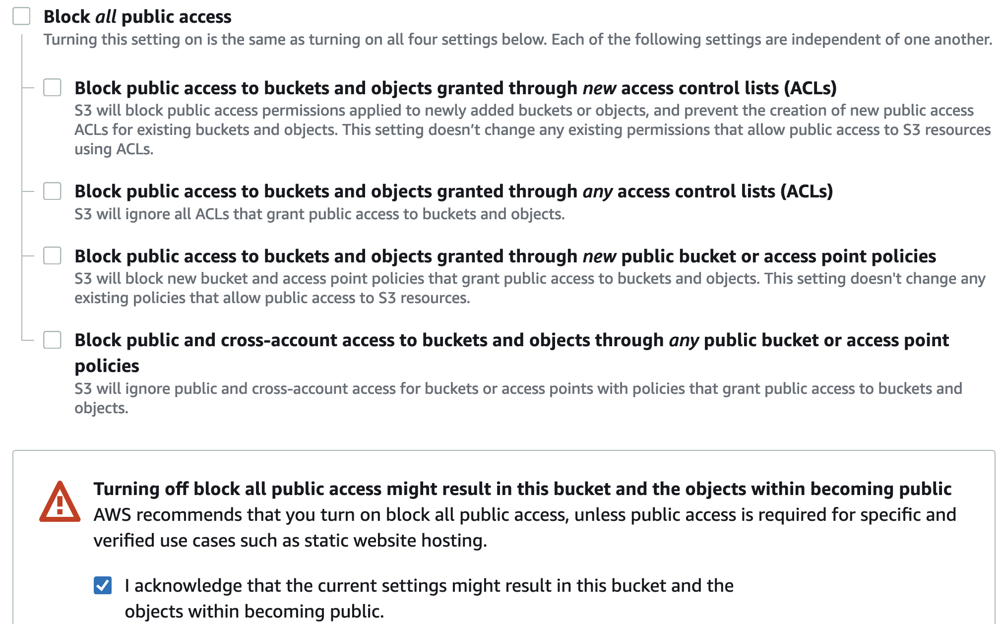
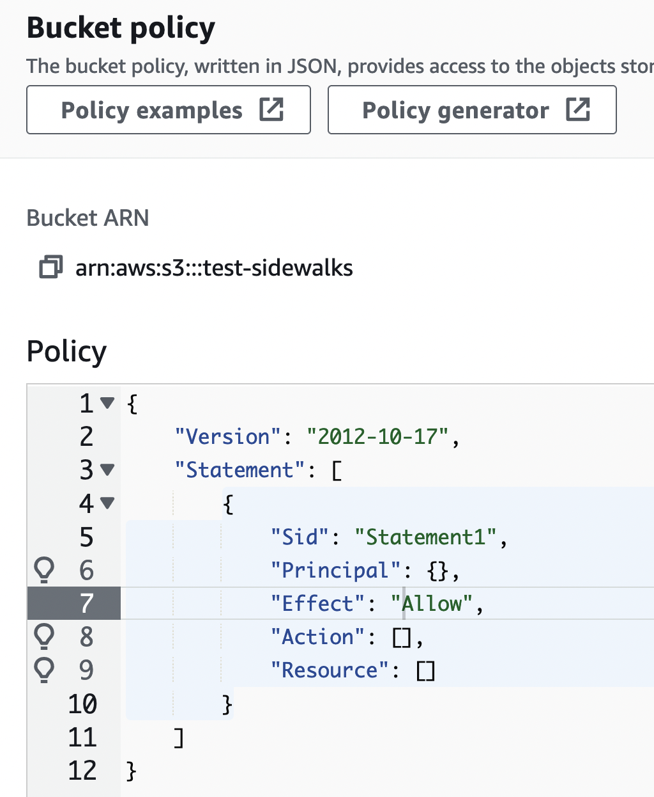
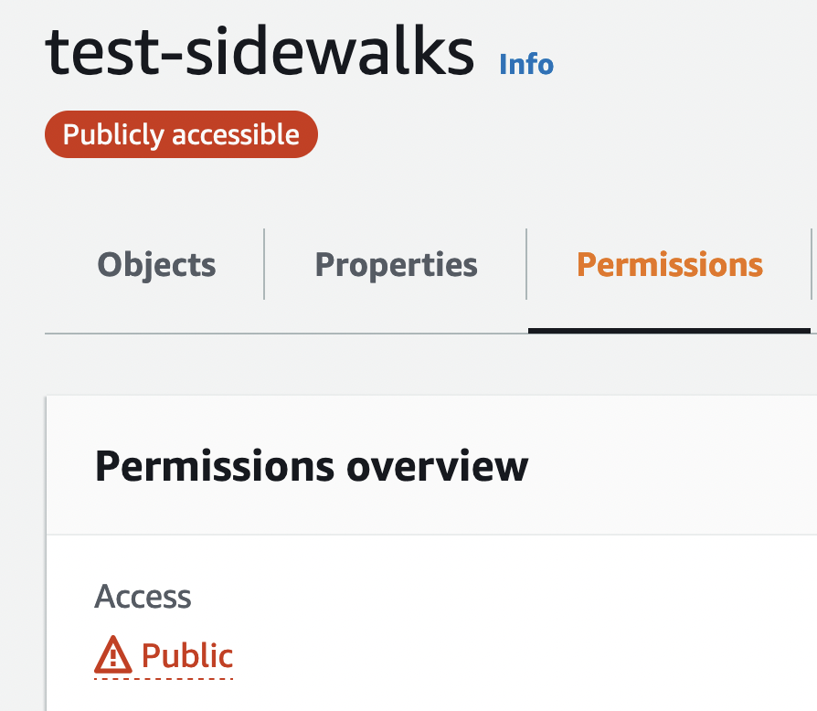
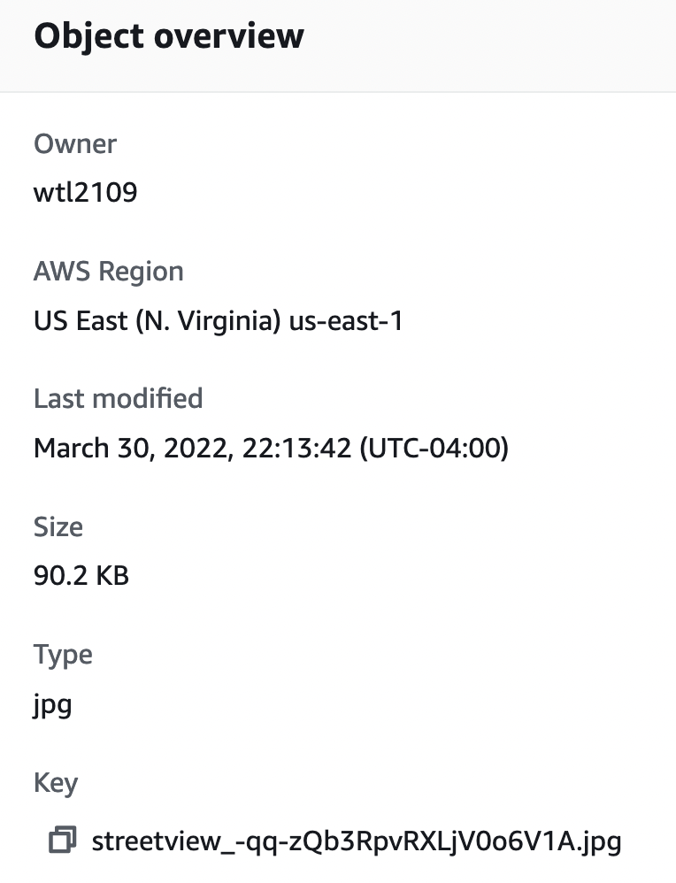

# Setting up a mechanical turk for image labeling

[Amazon's mechanical turk, mturk.com](https://www.mturk.com/), is a platform to setup a mechanical turk, i.e.
crowdsourcing low-cost labor to perform tasks easy for humans
and difficult for algorithms.

This document is an updated version of the [walk-through](https://blog.mturk.com/tutorial-how-to-label-thousands-of-images-using-the-crowd-bea164ccbefc) on Amazon's
own blog describing how to **label images**.

## Overall flow
- Setup an account with AWS and mturk.com
  - AWS handles billing + storage for the images
  - mturk.com handles the coordination around the HITs
- Upload the necessary images on [AWS s3](https://s3.console.aws.amazon.com)
  - Setting the permissions on those images
- Setting up the project and HITs
- Getting the assignments from the HITs

## Key terms
- HIT: human intelligence task, the task we want crowdsourcing to perform on
- requester, the one setting up the mechanical turk
- worker, those performing the HITs.
- assignment, a submission on a particular HIT

## Setting up an account with AWS and mturk
Although both owned by Amazon, mturk.com is separate from AWS.
There is a bug with setting up a non-root user with mturk.com so 
you need to create a root AWS account through AWS then login with
that account into mturk.com as a **requester**. Follow the [steps here](https://requester.mturk.com/signin_options) should be straight forward.



## Uploading images to s3

- The images for the workers need to be hosted on AWS s3. Login to AWS then search for the s3 console

  
- At the landing page for s3, look for **Create Bucket**

  
- Create a bucket with the correct setup that allows public access (e.g. the workers)
  - Have a reasonable name, the public will see this in the URL. The region doesn't matter as long as it's physically close.

    
  - Make sure ACL is disabled (we will use "bucket policies" to control permissions)

    
  - Make sure public access is possible

    
  - The remaining default setting should be fine
- Upload files or folder to the bucket, keep all default settings
- Edit the bucket permissions under the **Permissions** tab, you should see "objects can be public"

  
  - Click on `Edit` for bucket policy and look for the `Policy examples`

    
  - Look for the section titled "[Granting read-only permission to an anonymous user](https://docs.aws.amazon.com/AmazonS3/latest/userguide/example-bucket-policies.html)"
    ```json
    {
    "Version": "2022-03-30",
    "Statement": [
        {
            "Sid": "PublicRead",
            "Effect": "Allow",
            "Principal": "*",
            "Action": [
                "s3:GetObject",
                "s3:GetObjectVersion"
            ],
            "Resource": [
                "arn:aws:s3:::DOC-EXAMPLE-BUCKET/*"
                ]
            }
        ]
    }
    ```
  - Use the policy generator to make your policy similar to the read-only example above. Your Bucket ARN should be listed under the `Policy examples` and `Policy generator` buttons. Don't forget the `/*` to indicate objects under bucket. Save these.

    
- Verify that you can access the images
  - You should see a warning images after saving the policy

    

  - here are ways to [access a s3 bucket](https://docs.aws.amazon.com/AmazonS3/latest/userguide/access-bucket-intro.html). I recommend the "Virtual-hosted-style access"
    `https://{bucket-name}.s3.{Region}.amazonaws.com/{key-name}`
    - `{bucket-name}` in our case is `test-sidewalks`
    - `{Region}` in our case is `us-east-1`, this can be found under **Properties for your bucket** under `AWS Region`
    - `{key-name}` in our case is `streetview_-qq-zQb3RpvRXLjV0o6V1A.jpg` which can be found under **Properties for your object**. If you uploaded a folder, the folder name should precede the file name.
      
 
## Setup your project and HITs
